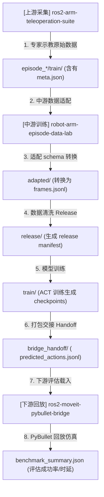

# 闭环仿真智能体系统规范 (AGENTS.md) - V2.1

Canonical 三仓 Agent 总览。各仓实现映射见：

- 上游：`ros2-arm-teleoperation-suite/docs/AGENTS.md`
- 下游：`ros2-moveit-pybullet-bridge/docs/AGENTS.md`
- 闭环跑法：`docs/CLOSED_LOOP_RUNBOOK.md`

---

## 1. 三仓边界与 Agent 分布

| 仓库 | 实时 Agent | 离线 Agent |
|------|------------|------------|
| **上游** | Task / Motion / Evaluation | — |
| **中游** | — | Data Adapter / Inspector / Training / Handoff |
| **下游（本仓）** | Replay / Risk / Sensor Fusion | Handoff Loader |

**Legacy 分流**：本仓 `agents/`、`core/` 为 PyBullet/KUKA 历史 Agent，**不得**与 Panda training release 混用。索引见 [archive/README.md](archive/README.md)。

---

## 2. 上游实时 Agent（摘要）

### Task Planning Agent
- **位置**：`batch_generator` 或 L0 `teleop_input`
- **FSM**：Hover → Descend → Close → Lift → Transport → Place → Release

### Motion Planning & Control Agent
- **位置**：L2 `moveit_servo` + L3 `cartesian_impedance_controller`
- **行为**：笛卡尔伺服 + 阻抗力矩（仿真 `500 Hz` / 真机路径 `1 kHz`，见上游 `control_rate_{sim,real}.yaml`）；**不含** RRT（RRT 在 legacy/下游）

### Evaluation Agent（双轨）
| 轨道 | 实现 | 批采默认 |
|------|------|----------|
| **主轨** | `batch_generator._validate_episode` → `discard` / `stop_success` | 启用 |
| **辅轨** | `grasp_monitor` → `/grasp/status` | `enable_grasp_monitor:=true` |

**硬约束**：训练数据必须 `grasp_assist_enabled:=false`。

---

## 3. 中游离线 Agent（本仓）

| Agent | 实现 | 职责 | 不做 |
|-------|------|------|------|
| **Data Adapter** | `training/adapters/upstream_m6.py` | state[7+1]、action 语义转换 | 物理 lift/place 判定 |
| **Dataset Inspector** | `training/scripts/inspect_dataset.py` | schema + training split | 重复 object_pose 物理判定 |
| **Release** | `prepare_dataset_release.py` | 不可变 release manifest | ROS 运行时 |
| **Training** | `train_act_smoke.py` / `train_act_lerobot.py` | smoke / ACT 训练 | 仿真控制 |
| **Handoff** | `prepare_bridge_handoff.py` | JSONL + manifest 打包 | PyBullet 执行 |

---

## 4. 下游运行时 Agent（摘要）

| Agent | 实现 | 职责 |
|-------|------|------|
| **Handoff Loader** | `learning/panda_handoff.py` | 静态校验 handoff bundle |
| **Replay / Policy** | `PolicyRunner` + `PandaActionAdapter` | JSONL → PyBullet 关节命令 |
| **Risk / Monitor** | `dist_monitor` + `risk_engine` | 漂移、E-stop、Hold |
| **Sensor Fusion** | `sensor_fusion_node`（**experimental**） | 多源对齐、接触估计；相机像素未用 | 任务成功 / Sim2Real 证据 |

---

## 5. Gate 协议（清洗边界）

### 上游 episode meta (`episode_*/meta.json`)
```yaml
upstream_gate: batch_generator | teleop
success: true
```

### 中游 adapted / release manifest
```yaml
upstream_gate: batch_generator
filter_scope: training_split_only   # 物理门禁已在上游
physical_validation_applied: true
action_type: ee_delta_gripper
```

**规则**：
- `filter_scope=training_split_only` 时，中游只校验 schema 与 `success`/`safety_estop`/`drive_fault` 训练 split。
- 中游**不得**从 `observation.object_pose` 重新推导 lift/place 成败。

---

## 6. 话题与交接（Panda 主线）

| 阶段 | 关键产物 |
|------|----------|
| 上游采集 | `episode_*/train/` + `meta.json` |
| 中游 release | `frames.jsonl` + `manifest.json` |
| 中游 handoff | `bridge_handoff/` + `predicted_actions.jsonl` |
| 下游 replay | `benchmark_summary.json` |

一键 midstream 链：`scripts/run_three_repo_closed_loop.sh`

---

## 7. 与 V2.0 的差异（V2.1 修订）

1. 明确 Evaluation **双轨**（batch_generator 主轨 + grasp_monitor 辅轨）
2. Motion Agent 去掉「Servo 做 RRT」表述
3. 新增中游 / 下游 Agent 表
4. 新增 `upstream_gate` / `filter_scope` 边界
5. Legacy PyBullet Agent 与 Panda 主线分离

---

## 8. Codex / AI 项目事实检索规则

### 8.1 基本原则

涉及本项目实际实现、三仓数据流、接口协议、训练流程、评估、handoff 或故障排查的问题时，不得仅依据通用机器人、机器学习或软件工程经验回答。

回答前必须优先检索当前项目中的代码、配置、测试和文档。

项目事实的证据优先级如下：

1. 自动化测试及实际运行产物
2. 当前代码实现
3. 配置文件与数据 schema
4. 当前版本技术文档
5. README 与作品集描述
6. 行业通用经验

当代码、测试与文档不一致时，应优先采用测试和代码，并明确指出冲突。

### 8.2 RAG 调用条件

当用户问题涉及以下内容时，回答前必须调用项目 RAG：

- 三仓之间的数据流与职责边界
- Panda episode、state、observation、action 的真实字段
- Data Adapter、Inspector、Release、Training、Replay、Handoff
- MLP BC、ACT、离线评估与模型输出
- Gate、schema、manifest 和训练数据筛选
- 上游采集、中游训练、下游执行之间的接口
- 当前项目是否已经实现某项功能
- 故障排查、接口不一致或文档与代码冲突

调用方式：

```bash
python3 -m project_knowledge.cli query --mode auto --no-llm --query "<用户原始问题>"
```

兼容入口仍可使用：

```bash
python3 scripts/rag_assistant.py --query "<用户原始问题>"
```

也可以使用：

```bash
bin/ask-project "<用户原始问题>"
```

只读知识源审计与 Git 影响分析：

```bash
python3 -m project_knowledge.cli audit --json-out /tmp/project-audit.json --markdown-out /tmp/project-audit.md
python3 -m project_knowledge.cli impact --base HEAD~1 --head HEAD
```

### 8.3 检索范围

项目 RAG 应覆盖以下三个仓库：

- `../ros2-arm-teleoperation-suite`
- `.`
- `../ros2-moveit-pybullet-bridge`

优先检索：

- `README.md`
- `AGENTS.md`
- `docs/**/*.md`
- `scripts/**/*.py`
- `training/**/*.py`
- `configs/**/*.yaml`
- `tests/**/*.py`
- 相关 ROS 2 launch、节点 and 接口定义

不得索引或引用：

- `.git/`
- `.venv/`
- `build/`
- `install/`
- `log/`
- `node_modules/`
- `dataset/`
- `checkpoints/`
- 二进制文件及大型生成产物

### 8.4 回答格式

回答项目问题时，必须明确区分以下四类内容：

#### 已实现

存在直接代码、配置或测试证据，可以确认当前仓库已经实现。

#### 文档声明，代码未确认

文档中提到或规划了该能力，但当前检索结果未能找到充分的代码或测试证据。

#### 基于证据的推断

可以根据调用关系或数据流作出合理判断，但不存在直接实现证据。

#### 通用背景知识

属于机器人、机器学习或软件工程的一般规律，不代表当前项目已经采用。

每次回答至少包含：

- 直接结论
- 仓库名
- 相对文件路径
- 相关函数、类、配置字段或章节
- 行号或代码位置
- 当前证据是否充分

如果证据不足，应明确回答：

> 当前项目证据不足，无法确认。

禁止通过行业惯例补全项目现状。

#### 8.4.1 面试知识库固化机制

当用户提问关于运动控制、总线通信、安全限位、DDS优化或节点编排等底层原理性/系统架构性问题，以及高频 Linux/ROS 2 系统级调试与日志诊断命令时，Agent 在完成解答后，必须主动将该问题以 FAQ 形式追加到下游仓库的面试知识库文档中：[docs/portfolio/INTERVIEW_PREP.md](file:///home/ina/ros2_ws/src/ros2-moveit-pybullet-bridge/docs/portfolio/INTERVIEW_PREP.md)。

固化要求：
1. FAQ 必须条理清晰，至少包含“核心原理解析/常用命令”与“对应项目代码事实”。
2. 涉及到的具体代码、配置文件路径，必须使用包含 `file://` 协议的绝对路径超链接，确保用户可以直接点击跳转代码行。
3. FAQ 的内容口径必须与 AGENTS.md 中的项目现状（8.6）严格一致，区分“已实现”和“设计规划”。

### 8.5 修改代码前的要求

修改涉及三仓接口、schema、action 语义、release、handoff 或训练流程的代码前，必须：

1. 检索三个仓库中的相关实现；
2. 确认当前调用链和数据格式；
3. 检查对应测试；
4. 说明将修改哪个仓库以及为什么；
5. 避免在多个仓库重复实现同一职责；
6. 不得破坏以下既定边界：

- 上游负责遥操作、仿真交互、任务执行和数据采集；
- 中游负责数据适配、检查、release、训练、评估和 handoff；
- 下游负责 handoff 加载、回放执行和风险验证。

### 8.6 项目范围约束

当前项目应描述为：

> Panda 机械臂的多仓数据、训练、离线评估与 Sim2Sim / Sim2Real-readiness 验证闭环。

当前不得默认声称：

- 已完成真实机械臂部署；
- 已完成真实 Sim2Real；
- 已实现稳定在线自主抓取；
- 离线 loss 提升等同于任务成功率提升；
- 文档中出现的规划功能已经全部实现；
- LingBot-VLA 为本仓第一后训练策略或已完成 Gate V1；
- SmolVLA 已适配 Panda / 已完成 VLA 抓取 / 已验证任务成功；
- SmolVLA S2 接口 Pass 等同于可进入 Isaac 或 S3 LoRA；
- SmolVLA **S3 Ready** / **S3 Hold** 等同于任务成功 / 可自行进 Isaac（Recovery v3 的 LoRA 已完成，但 Ready/Hold 标签本身不代表成功）；
- SmolVLA Recovery v3 的 **open-loop Pass**、有界 Isaac S4 的 **interface 5/5** 或 `ran_isaac=true` 等同于任务成功 / 在线自主抓取 / Sim2Real / 真机；
- 有界 S4 首轮近黑场景的 reach 3/5 · grasp 1/5 为权威或「部分成功」（修光复测已证伪，标注 Superseded）。

**VLA / 评测接力硬禁止（防 Codex 误推进）**：

- 不得自动恢复 LingBot Gate V1；
- 不得下载 LingBot 6B 权重；
- 不得把 55-D 通道切片视为 Panda 执行映射；
- 不得因 SmolVLA S2 接口 Pass、S3 Ready、S3 Hold 或 Recovery v3 open-loop Pass 而进入 Isaac；已执行的有界 S4（≤5 seeds）为**一次性人工批准**，不得据此自动再跑 Isaac、扩种子或重训；
- SmolVLA S3 任何继续修复 / 重训需要显式人工批准和外部 GPU；`max_data_fix_retries: 1` **已用尽**；未过 open-loop Pass 不得进 S4；
- ACT 保持冻结诊断基线，不继续盲目训练；
- 当前状态（2026-07-25 P0 收口）：SmolVLA Recovery v3 离线 open-loop **Pass**（`eval_gate_v3`）；人工批准的有界 Isaac S4 seeds 1–5 **已跑**（`ran_isaac=true`），interface 5/5、GT lift **0/5** → **Hold**。
  权威 S4 证据：中游 `evidence/smolvla_s4_bounded5_relight_20260724T151711Z/s4_gate.json`（修光后复测）；首轮 `evidence/smolvla_s4_bounded5_20260724T203700Z/` 为 **Superseded / historical**。
  收口入口：中游 `docs/portfolio/FINAL_PROJECT_SUMMARY.md`、`docs/portfolio/BADCASE_ATTRIBUTION_SUMMARY.md`、`docs/FUTURE_WORK_ROADMAP.md`（**P1 / P2 仅登记，不得自动执行**）。
  中游 `docs/SMOLVLA_GATE_S3_READY.md` 已标注 **Historical / Superseded**，其「S3 Hold / 不得进 Isaac」为 v1 阶段口径。**默认停止**：不扩种子、不重训、不新增采集。

权威路线表：中游 `robot-arm-episode-data-lab/docs/portfolio/THREE_REPO_CANONICAL_FACTS.md`「VLA 候选路线状态」。

Legacy PyBullet/KUKA 实现不得与 Panda 主线混用。

### 8.7 调试与测试运行的物理收尾规则

Agent 在使用 `run_command` 工具调试、执行 ROS 2 节点、MuJoCo 仿真器或录制任务时，必须严格遵守以下“物理收尾”铁律，防止后台僵尸进程残留造成系统过载或下一次冲突：

1. **生命周期必须显式受限**：
   严禁运行无时限的常驻后台命令。对于拉起仿真或录制的测试任务，必须带有自动退出的参数（例如 `auto_record_seconds`）或者在 Bash 中加上强制超时前缀（如 `timeout 60s ros2 launch ...`）。
2. **退出前的物理扫尾责任（Nuke On Done）**：
   在向用户汇报测试结果、或者结束当前 Turn 之前，**Agent 必须主动发起一次强杀命令**，强行把刚刚拉起的所有相关后台进程杀死并确认退干净。推荐清理指令：
   ```bash
   pkill -9 -f "teleop_bringup" || true
   pkill -9 -f "mujoco_sim" || true
   pkill -9 -f "lerobot_recorder" || true
   pkill -9 -f "servo_node" || true
   pkill -9 -f "ros2_control" || true
   ```
3. **禁止将“清理工作”推卸给用户**。

---

## 9. 三仓联合开发拓扑与核心指令集

为了防止多仓联合开发时接口混乱、定位不清，以下梳理了完整的数据流拓扑与开发常用指令集。

### 9.1 数据流生命周期拓扑 (Embodied Data Loop)



### 9.2 开发核心指令集速查 (Developer Cheat Sheet)

#### 9.2.1 上游：编译与数据采集
* **路径**：`~/dev/ros2-arm-teleoperation-suite` （系统 Python 环境编译）
* **一键编译**：
  ```bash
  colcon build --symlink-install --packages-select lerobot_recorder teleop_bringup mujoco_sim
  ```
* **一键启动多模态采集（带优化参数，限制 CPU 负荷）**：
  ```bash
  source install/setup.bash
  ros2 launch teleop_bringup full_system.launch.py \
    record:=true \
    capture_mode:=portfolio \
    camera_rate:=10.0 \
    camera_width:=320 \
    camera_height:=240 \
    sync_slop:=0.2 \
    auto_record_seconds:=15.0 \
    auto_record_delay_s:=22.0
  ```

#### 9.2.2 中游：数据转换与模型训练
* **路径**：`~/robot-sim-lab/robot-arm-episode-data-lab` （Conda 虚拟环境运行）
* **一键运行三仓闭环数据流水线（Adapted -> Release -> Smoke Train -> Handoff）**：
  ```bash
  # 运行离线数据闭环，生成 handoff 压缩包
  ./scripts/run_three_repo_closed_loop.sh
  ```
* **手动运行数据集适配器**：
  ```bash
  python3 training/scripts/adapt_upstream_panda_dataset.py \
    --input ./data/episodes \
    --output ./data/adapted \
    --schema ./configs/robot_schemas/panda.yaml
  ```

#### 9.2.3 下游：Handoff 部署与回放评估
* **路径**：`~/ros2_ws` （系统 ROS 2 环境编译）
* **一键编译下游桥梁**：
  ```bash
  colcon build --symlink-install --packages-select pybullet_bridge
  ```
* **一键跑通 Handoff 回放评估 Benchmark**：
  ```bash
  source install/setup.bash
  python3 src/ros2-moveit-pybullet-bridge/scripts/benchmark_system.py \
    --strategy panda_jsonl_replay \
    --panda-handoff-path /tmp/three_repo_closed_loop_xxx/train/bridge_handoff \
    --episodes 1 \
    --duration-sec 10.0 \
    --launch-stack
  ```
* **运行物理清理（防后台残留冲突，本仓 Agent 必须主动调用）**：
  ```bash
  pkill -9 -f "teleop_bringup" || true
  pkill -9 -f "mujoco_sim" || true
  pkill -9 -f "lerobot_recorder" || true
  pkill -9 -f "servo_node" || true
  pkill -9 -f "ros2_control" || true
  ```
