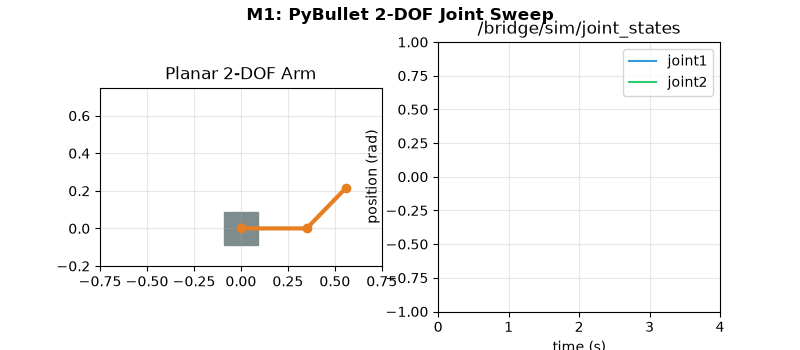
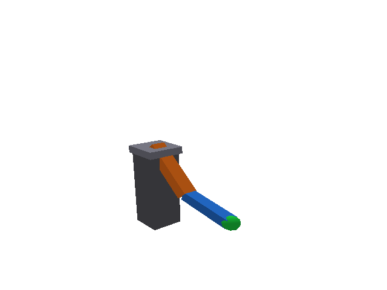
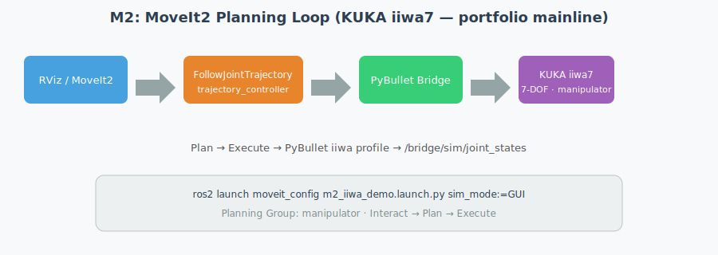
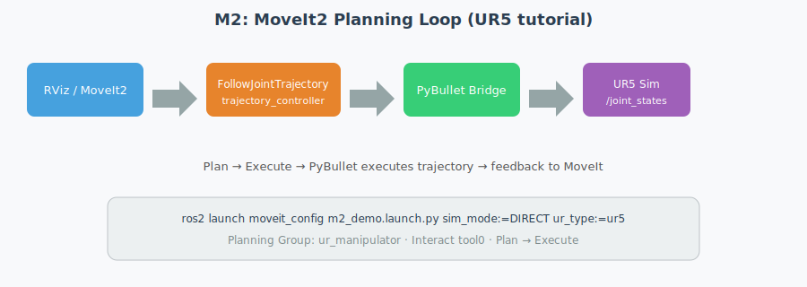
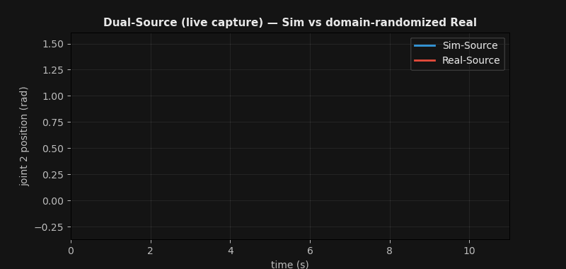
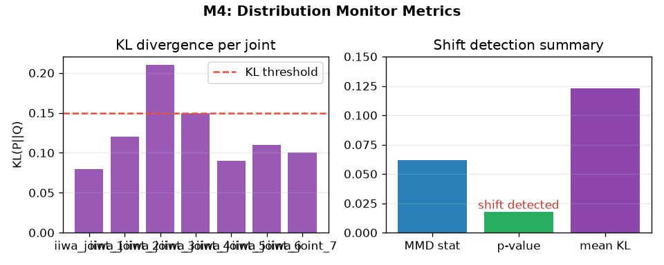
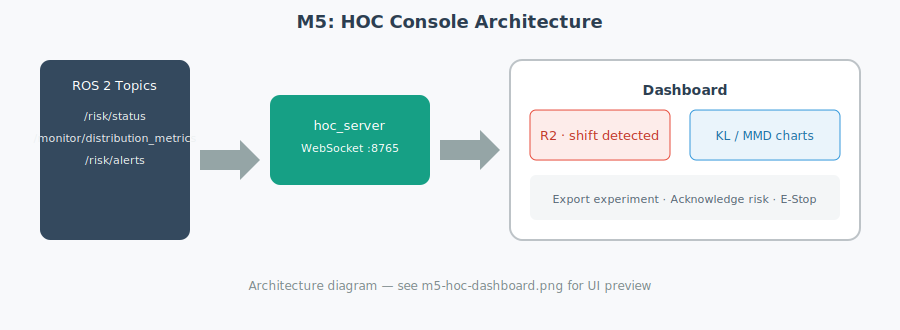
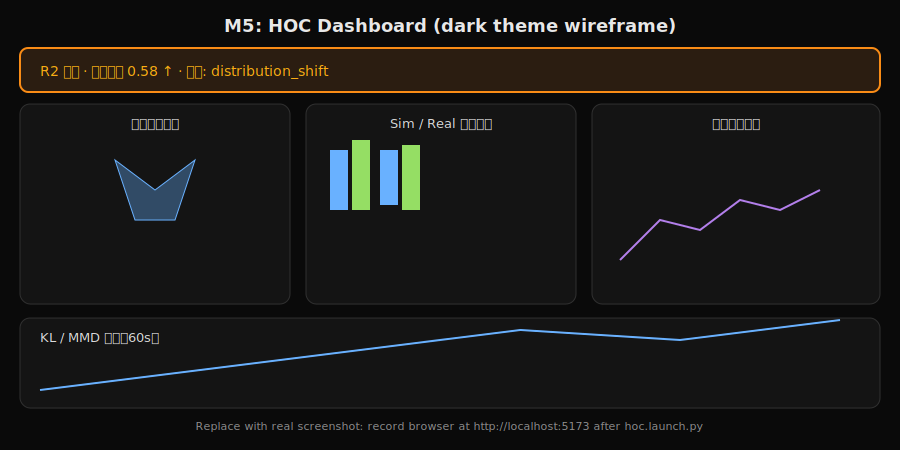

# ROS2 + MoveIt2 + PyBullet Sim2Real Bridge

虚实映射与分布监控系统 — ROS 2 Jazzy 工作区。

## 包结构

| 包 | 说明 |
|----|------|
| `bridge_monitor_msgs` | 自定义消息/服务/Action |
| `pybullet_bridge` | PyBullet 双源仿真桥接 |
| `dist_monitor` | KL/MMD 分布偏移监控 |
| `risk_engine` | 多维风险态势聚合 |
| `hoc_console` | 人机运维控制台后端 |
| `moveit_config` | MoveIt2 配置（2-DOF 占位 + KUKA iiwa7 作品集） |

设计文档见 [`docs/design/`](docs/design/README.md)。

## 快速开始

```bash
# 1. 环境
source setup.sh

# 2. 安装 Python 依赖
pip install -r requirements.txt

# 3. 编译（conda 用户请先执行下一行，确保消息包绑定 Python 3.12）
# export PATH="/usr/bin:/bin:/opt/ros/jazzy/bin:$PATH" && unset CONDA_PREFIX
cd ~/ros2_ws
colcon build --packages-select bridge_monitor_msgs pybullet_bridge dist_monitor risk_engine hoc_console moveit_config --symlink-install
source install/setup.bash

# 4. 启动完整系统（默认 KUKA iiwa7 作品集主线）
ros2 launch pybullet_bridge full_system.launch.py

# CI / M1 快速验证仍用 2-DOF
ros2 launch pybullet_bridge m1_demo.launch.py robot:=planar_2dof

# 求职作品集一键演示（iiwa + 双源 + 监控 + 运动）
ros2 launch pybullet_bridge portfolio_demo.launch.py sim_mode:=GUI
```

## 测试

三层测试覆盖：**单元测试**（纯算法）→ **节点测试**（rclpy 单节点）→ **集成测试**（launch_testing 启动完整 launch）。

```bash
# 一键运行全部测试（需先 colcon build + source install）
./scripts/run_tests.sh

# 仅单元 + 节点测试（较快）
cd dist_monitor && python3 -m pytest test/ -v -m "not launch_test"

# 仅 M1 / 全系统集成测试
cd pybullet_bridge && python3 -m pytest test/ -v -m launch_test
```

| 层级 | 包 | 测试文件 | 验证内容 |
|------|-----|---------|---------|
| 单元 | 全部 Python 包 | `test/test_*.py` | KL/MMD、风险聚合、轨迹插值等 |
| 节点 | 全部 Python 包 | `test/test_*_node.py` | 单节点话题发布/订阅 |
| 节点 | `hoc_console` | `test/test_ws_hub.py` | WebSocket 广播、消息 JSON 化 |
| 集成 | `pybullet_bridge` | `test/test_m1_launch.py` | M1 demo 关节运动 |
| 集成 | `pybullet_bridge` | `test/test_full_system_launch.py` | bridge → monitor → risk 链路 |

生成 README 里程碑配图与样例报告：

```bash
python3 scripts/generate_milestone_assets.py
python3 scripts/generate_sample_report.py
```

## 里程碑

| 里程碑 | 状态 | 说明 |
|--------|------|------|
| **M1** | ✅ | PyBullet 单实例 + 关节轨迹控制 + `/joint_states` 反馈 |
| **M2** | ✅ | MoveIt2 规划闭环 — iiwa7 作品集主线 + UR5 教程可选 |
| **M3** | ✅ | 双源域随机化 |
| **M4** | ✅ | 分布监控标定（KL/MMD） |
| **M5** | ✅ | HOC 前端 + 实验报告 |

## 机器人平台（方案 C）

| Profile | 用途 | 启动 |
|---------|------|------|
| `planar_2dof` | CI、M1 冒烟 | `ros2 launch pybullet_bridge m1_demo.launch.py` |
| `iiwa7` | **作品集主线**、episode-data-lab 联动 | `ros2 launch pybullet_bridge portfolio_demo.launch.py` |

```bash
# 作品集录屏（iiwa7 + 双源 + 监控 + 运动）
ros2 launch pybullet_bridge portfolio_demo.launch.py sim_mode:=GUI

# 与 episode-data-lab LeRobot 离线对比
ros2 run dist_monitor offline_compare \
  --real-dataset ~/robot-sim-lab/robot-arm-episode-data-lab/dataset/v1/lerobot_export \
  --sim-dataset ~/robot-sim-lab/robot-arm-episode-data-lab/dataset/v1/lerobot_export

./scripts/verify_portfolio.sh
python3 scripts/check_iiwa_joint_consistency.py
```

详设：[`docs/design/06-robot-platform-selection.md`](docs/design/06-robot-platform-selection.md)

### M1 — PyBullet 桥接 + 关节轨迹





- PyBullet 加载 2-DOF 平面臂，接收 `/bridge/command` 轨迹
- 发布 `/bridge/sim/joint_states` 供监控与验证
- 集成测试：`test_m1_launch.py` · 一键验证：`./scripts/verify_m1.sh`

```bash
cd ~/ros2_ws/src/ros2-moveit-pybullet-bridge
./scripts/verify_m1.sh
```

看到 `[PASS] M1 验证通过` 即表示桥接与关节反馈正常。

**手动三步验证**（需先 `source setup.sh`，且不要同时运行 M2）：

```bash
# 终端 1：启动 M1 全套（bridge + 3s 后自动发轨迹）
ros2 launch pybullet_bridge m1_demo.launch.py

# 终端 2：观察桥接输出的关节状态（勿用 /joint_states，避免与 M2 冲突）
ros2 topic echo /bridge/sim/joint_states --spin-time 2
```

### M2 — MoveIt2 规划闭环

**作品集主线（KUKA iiwa7）**



**UR5 教程（可选）**



> 配图为架构示意。真实 RViz 录屏可保存为 `docs/assets/m2-iiwa-rviz.gif`。

**作品集主线（KUKA iiwa7）** — 与 episode-data-lab / PyBullet 同构 URDF：

```bash
source ~/ros2_ws/install/setup.bash
ros2 launch moveit_config m2_iiwa_demo.launch.py sim_mode:=DIRECT
# 录屏用 GUI
ros2 launch moveit_config m2_iiwa_demo.launch.py sim_mode:=GUI
```

RViz：**Planning Group** 选 **`manipulator`** → Interact 拖动末端 → **Plan** → **Execute**

关节一致性检查：`python3 scripts/check_iiwa_joint_consistency.py`

一键冒烟：`./scripts/verify_m2_iiwa.sh`

**UR5 教程演示**（可选，需 `ur_description`）：

```bash
cd ~/ros2_ws/src
git clone --depth 1 --branch jazzy https://github.com/UniversalRobots/Universal_Robots_ROS2_Description.git
git clone --depth 1 --branch jazzy https://github.com/UniversalRobots/Universal_Robots_ROS2_Driver.git /tmp/ur_driver
cp -r /tmp/ur_driver/ur_moveit_config .
# 或: sudo apt install ros-jazzy-ur-description ros-jazzy-ur-moveit-config
```

```bash
source setup.sh
cd ~/ros2_ws && colcon build --packages-select ur_description ur_moveit_config pybullet_bridge moveit_config --symlink-install
source install/setup.bash

ros2 launch moveit_config m2_demo.launch.py sim_mode:=DIRECT ur_type:=ur5
```

**RViz 操作**：

1. 左侧面板 **MotionPlanning**
2. **Planning Group** 选 **`ur_manipulator`**（不是 manipulator）
3. 工具栏 **Interact**，拖动末端 **tool0** 上的交互 marker
4. **Plan** → **Execute**

> M2 截图/GIF：iiwa 主线录屏保存到 `docs/assets/m2-iiwa-rviz.gif`；UR5 教程同理。

### M3 — 双源域随机化



> 配图为合成示意（Sim vs Real 漂移曲线）；真实双源请用 `portfolio_demo.launch.py` 录屏替换。

- Sim-Source：理想物理参数
- Real-Source：噪声 + 域随机化（阻尼、摩擦、负载等）
- 话题：`/bridge/sim/joint_states` vs `/bridge/real/joint_states`

### M4 — 分布监控标定



> 配图为 iiwa 7 关节合成指标（`generate_milestone_assets.py`）；在线数据请从 `/monitor/distribution_metrics` 导出替换。

- KL 散度 + MMD 置换检验检测 Sim/Real 偏移
- 发布 `/monitor/distribution_metrics` 与 `/monitor/tracking_error`
- 节点测试：`dist_monitor/test/test_monitor_node.py`

### M5 — HOC 人机运维控制台

**架构**



**Dashboard 线框（暗色主题，接近实机布局）**



**样例实验报告（HTML）**：[docs/samples/sample-experiment-report.html](docs/samples/sample-experiment-report.html)

- React + ECharts 一屏态势感知：风险雷达、Sim/Real 分布对比、KL/MMD 时序
- `hoc_server` WebSocket (8765) 推送 `/risk/status`、`/monitor/distribution_metrics`
- 实验控制：场景运行、录制 rosbag、HTML 报告导出、域随机化 / 偏移注入
- **开发**：`ros2 launch hoc_console hoc.launch.py` → http://localhost:5173
- **生产**：`cd hoc_console/frontend && npm run build` → `ros2 launch hoc_console hoc_prod.launch.py` → http://localhost:8080
- 3 分钟演示脚本：`./scripts/hoc_demo_3min.sh`

---

**常见问题**

| 现象 | 处理 |
|------|------|
| `package 'pybullet_bridge' not found` | `cd ~/ros2_ws && colcon build ... && source install/setup.bash` |
| `PyBullet init failed` | `pip install -r requirements.txt` 后重新 `source setup.sh` |
| 测试 skip / PyBullet init failed | 先 `colcon build` 并 `source install/setup.bash` |
| `UnsupportedTypeSupport` / Python 报错 | conda 用户编译前：`export PATH="/usr/bin:/bin:/opt/ros/jazzy/bin:$PATH" && unset CONDA_PREFIX` |
| echo 显示 UR5 关节名 | 有 M2 残留进程，`pkill -f bridge_node` 后重试，或用 `m1_demo.launch.py` |
| echo 无输出/卡住 | 改用 `/bridge/sim/joint_states`，或运行 `./scripts/verify_m1.sh` |
