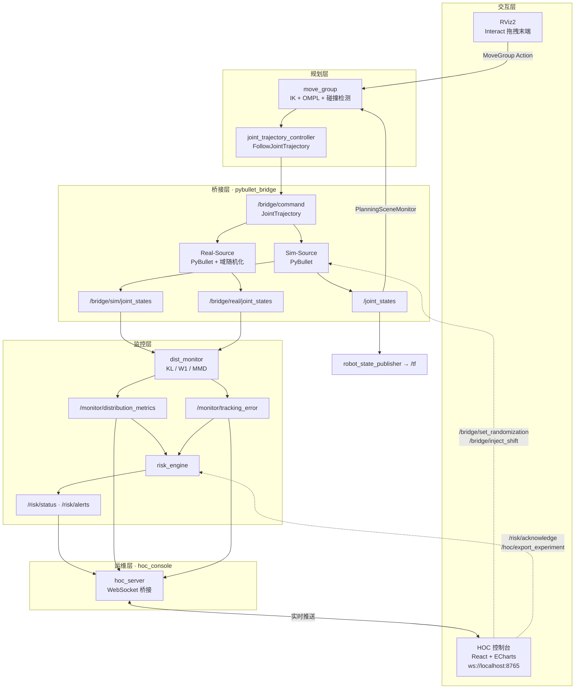
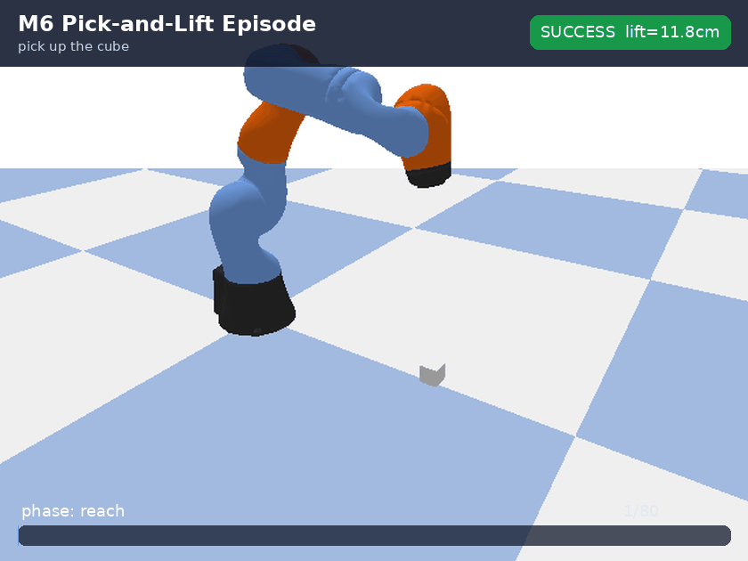
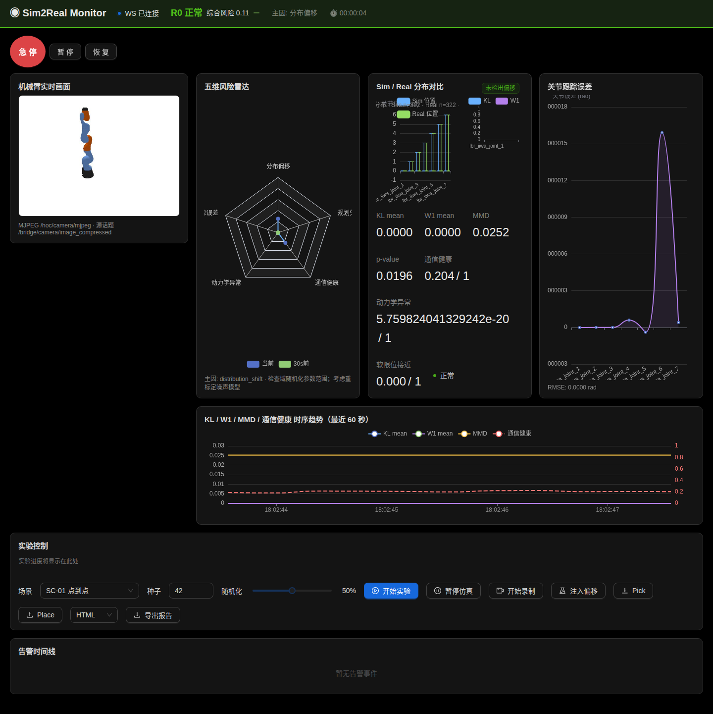
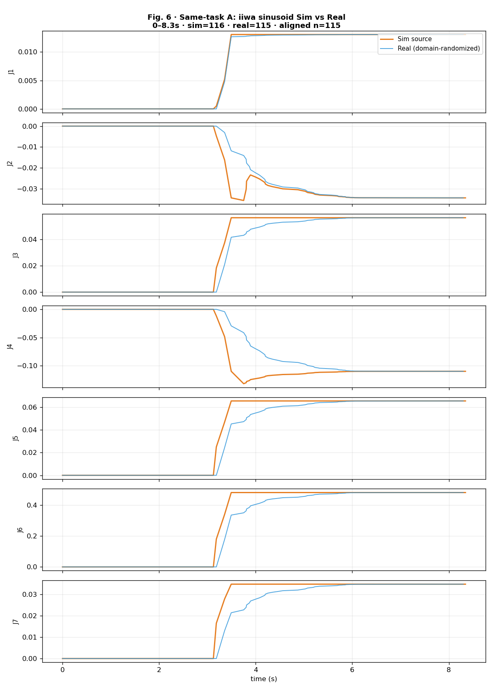
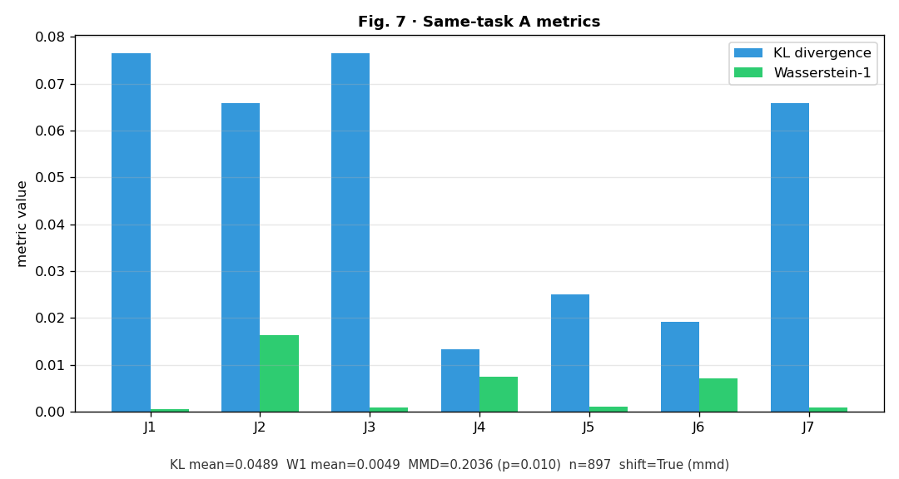
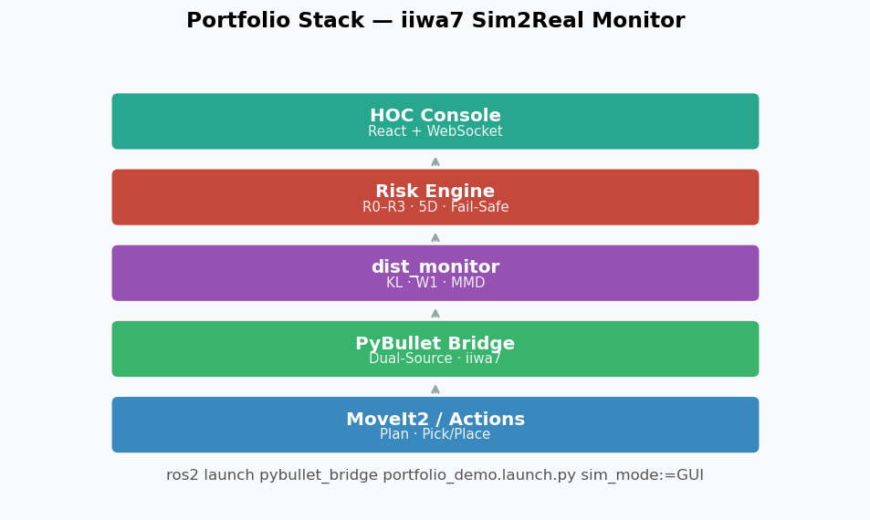

# ros2-moveit-pybullet-bridge

> **MoveIt 2 与 PyBullet 闭环仿真桥接，内置 Sim/Real 分布偏移监控与运维控制台。**

[](https://github.com/inayina/ros2-moveit-pybullet-bridge/actions/workflows/ci.yml)


---

## 招聘作品集定位

这是一个面向 **机器人集成 / ROS 2 / 仿真验证 / 机器人平台工程** 岗位的端到端作品集项目。它展示的不只是单个 demo，而是从 MoveIt 2 规划、PyBullet 物理执行、Sim2Real 偏移监控、风险闭环到 Web 运维控制台和实验报告的完整工程链路。

**我在项目中实现的核心能力：**

| 能力维度 | 作品集证据 |
|----------|------------|
| ROS 2 系统集成 | 自定义 msg/srv/action，跨包 topic/service/action 契约，launch 组合与 `launch_testing` |
| 运动规划闭环 | MoveIt 2 / RViz Plan & Execute 通过 `FollowJointTrajectory` 驱动 PyBullet |
| 仿真与 Sim2Real | KUKA iiwa7 双源 PyBullet，domain randomization，LeRobot 跨仓库回放 |
| 监控算法 | KL / W1 / MMD、滑动窗口、时间对齐、离线与在线对比 |
| 风险与运维 | 五维风险聚合、急停/确认服务、React + ECharts HOC Dashboard |
| 工程交付 | Docker/CI 配置、三层测试脚本、HTML 报告、README 资产生成与可复现实验脚本 |

### 当前状态与交付边界

| 范围 | 当前状态 | 说明 |
|------|----------|------|
| 核心 Demo 链路 | 本机 smoke 已通过 | `portfolio_demo.launch.py` 拉起 iiwa7 双源 PyBullet、监控、风险引擎与运动 demo |
| HOC 控制台 | 有单独入口和组合入口 | 单独运行 `hoc.launch.py` / `hoc_prod.launch.py`，或用 `hoc_experiment.launch.py` 组合 portfolio demo + HOC |
| MoveIt 闭环 | 可演示 | `m2_iiwa_demo.launch.py` 通过 `FollowJointTrajectory` relay 驱动 PyBullet |
| 双仓 LeRobot 联动 | 本机 offline compare 已通过 | 依赖 `EPISODE_DATA_LAB_ROOT` 和导出的 LeRobot 数据集；完整双仓流程仍需按目标环境复验 |
| 展示材料 M6 | 打磨中 | README 已有 pick-and-lift 抓取 GIF、HOC 浏览器截图与双仓报告；RViz 录屏作为可选本地演示证据，仍建议补完整 Demo 视频 |

**本版本交付边界**：仿真预集成 + 分布监控 + 风险闭环 + HOC 运维控制台。真机 `real_source:=ros2`、完整 `ros2_control` 硬件接口、episode-data-lab `Ros2Robot` HAL、`/clock` + `use_sim_time` 全链路属于 Phase-2+，不作为当前面试 Demo 的阻塞项。

---

## 解决的核心痛点

- **规划与仿真脱节**：MoveIt 2 规划结果无法直接驱动物理仿真，Sim2Real 验证链路断裂。
- **偏移不可观测**：Sim 与 Real 关节分布漂移缺乏量化指标，问题只能在实机暴露。
- **运维缺乏统一视图**：风险态势、分布曲线、实验录制分散在 CLI，难以快速决策。

---

## 系统架构



**关键接口速查**

| 类型 | 名称 | 说明 |
|------|------|------|
| Topic | `/bridge/command` | 轨迹指令入口（MoveIt → PyBullet） |
| Topic | `/joint_states` | 仿真反馈（PyBullet → MoveIt / TF） |
| Topic | `/bridge/sim/joint_states` · `/bridge/real/joint_states` | 双源关节状态 |
| Topic | `/monitor/distribution_metrics` | KL / W1 / MMD 指标 |
| Topic | `/risk/status` | 综合风险等级 |
| Service | `/bridge/set_randomization` · `/bridge/inject_shift` | 域随机化 / 偏移注入 |
| Service | `/monitor/reset_baseline` | 重置监控基线 |
| Service | `/risk/acknowledge` · `/risk/force_e_stop` | 风险确认 / 急停 |
| Action | `/move_action` | MoveIt MoveGroup |
| Action | `/arm_controller/follow_joint_trajectory` | 轨迹执行 |
| WebSocket | `ws://localhost:8765` | HOC 仪表盘实时数据 |

完整接口规格：[docs/design/05-ros2-node-interface-and-dataflow-spec.md](docs/design/05-ros2-node-interface-and-dataflow-spec.md)

---

## 快速开始

### 1. 准备依赖（二选一）

**Docker（推荐）**

```bash
export EPISODE_DATA_LAB_ROOT=~/robot-sim-lab/robot-arm-episode-data-lab
docker compose build
docker compose run --rm verify
```

Docker 默认用于 headless 验证和演示；需要 PyBullet GUI / RViz 时建议使用源码编译流程，或自行配置 X11 转发。

**源码编译**

```bash
python3 -m venv .venv
source .venv/bin/activate
pip install -r requirements.txt
source /opt/ros/jazzy/setup.bash
cd ~/ros2_ws && colcon build --symlink-install && source install/setup.bash
cd ~/ros2_ws/src/ros2-moveit-pybullet-bridge && source setup.sh
```

### 2. 启动演示

核心链路（不含浏览器 HOC）：

```bash
ros2 launch pybullet_bridge portfolio_demo.launch.py sim_mode:=GUI
```

启动后约 3 s 自动运行 iiwa7 运动 demo，同时拉起双源监控与风险引擎。HOC 控制台不会由该 launch 自动启动；需要另开终端执行 `ros2 launch hoc_console hoc.launch.py`，或直接使用下面的组合入口：

```bash
ros2 launch hoc_console hoc_experiment.launch.py sim_mode:=DIRECT
```

Docker headless：

```bash
docker compose run --rm portfolio-demo
```

### 3. 启动 HOC 控制台（可选）

前端开发模式需要 Node.js / npm；`hoc.launch.py` 会在 `hoc_console/frontend` 下自动执行 `npm install && npm run dev`。

```bash
# 开发模式（Vite 热更新）
ros2 launch hoc_console hoc.launch.py
# → http://localhost:5173

# 生产模式
cd hoc_console/frontend && npm run build
ros2 launch hoc_console hoc_prod.launch.py
# → http://localhost:8080
```

### 4. MoveIt + RViz 闭环（可选）

```bash
ros2 launch moveit_config m2_iiwa_demo.launch.py sim_mode:=GUI
```

RViz 中选择 **Planning Group → manipulator**，Interact 拖动末端 → **Plan** → **Execute**。

### 5. 验证

```bash
./scripts/run_tests.sh
```

> 完整安装步骤、Launch 参数与阈值配置见 **[docs/SETUP.md](docs/SETUP.md)**。

---

## 面试演示路线

如果只有 3–5 分钟展示项目，建议按这条路径讲：

1. **端到端闭环**：运行 `portfolio_demo.launch.py`，展示 iiwa7 轨迹进入 PyBullet，Sim/Real 双源同时发布。
2. **规划接入仿真**：打开 `m2_iiwa_demo.launch.py`，在 RViz 中 Plan & Execute，说明 MoveIt 输出如何经 `FollowJointTrajectory` 到 `/bridge/command`。
3. **偏移监控与风险**：展示 HOC Dashboard，解释 KL / W1 / MMD 如何进入 `/risk/status`，以及急停、确认、报告导出如何闭环。
4. **工程验证**：展示 `./scripts/run_tests.sh`、Docker verify 配置、HTML 实验报告和 README 资产来源；最新提交是否通过以本机/CI 复验为准。

详细学习路线见 [docs/PROJECT_LEARNING_GUIDE.md](docs/PROJECT_LEARNING_GUIDE.md)，完整系统设计材料见 [docs/portfolio/](docs/portfolio/README.md)。

---

## 功能亮点

### 🔗 MoveIt 2 ⇄ PyBullet 双向桥接

`/bridge/command` 接收 `JointTrajectory`，240 Hz 物理步进 + 100 Hz 状态发布；`/joint_states` 闭环反馈 MoveIt PlanningSceneMonitor，支持 KUKA iiwa7 与 2-DOF 占位臂。

### 📊 KL / MMD / W1 分布偏移监控

`dist_monitor` 对齐 Sim / Real 双源关节流，在线计算 KL 散度、Wasserstein-1 与 MMD 置换检验，发布 `/monitor/distribution_metrics` 与 `/monitor/tracking_error`。

### 🖥️ React + ECharts 运维控制台

HOC 一屏展示风险雷达、Sim/Real 分布对比与 KL/MMD 时序曲线；`hoc_server` 经 WebSocket（`:8765`）实时推送，支持 rosbag 录制、HTML 报告导出与域随机化控制。

### ✅ 三层自动化测试

单元测试（纯算法）→ 节点测试（rclpy 单节点）→ 集成测试（`launch_testing` 全链路），CI 于 `ros:jazzy-ros-base` 容器内自动执行。

> 发布或面试前建议复跑 `./scripts/run_tests.sh`、`./scripts/verify_portfolio.sh`、`./scripts/verify_risk_complete.sh`，并以 GitHub Actions 最新绿勾作为最终验收记录。
> 最近复验（2026-06-20）：`./scripts/run_tests.sh`、`./scripts/verify_portfolio.sh`、`./scripts/verify_risk_complete.sh`、`python3 scripts/check_iiwa_joint_consistency.py` 均通过；`docker compose run --rm verify` 在挂载 episode-data-lab 后通过。

---

## 截图展示

> 配图由 `./scripts/capture_readme_assets.sh` 与 `python3 scripts/capture_pick_lift_asset.py` 从**真实运行数据**生成（pick-and-lift episode、dual-source NPZ、HOC 浏览器截图）。
> 抓取 GIF 来自 `robot-arm-episode-data-lab` 的成功 episode；RViz/MoveIt 录屏保留为本地演示证据，不再作为 README 主图。
> README 仅保留最能证明工程能力的核心图片；完整实验图表集中在 [docs/EXPERIMENTS.md](docs/EXPERIMENTS.md) 与 [docs/assets/](docs/assets/README.md)。

### Pick-and-Lift 任务 Episode



**证明点**：采集仓库生成成功 `pick_and_lift` episode（语言指令、阶段标签、constraint grasp、物体抬升量），本仓库消费同一套 episode / LeRobot 数据做 Sim2Real 监控、双源对齐和报告展示。

### HOC 运维控制台



**证明点**：具备机器人运行态势可视化、风险闭环和实验运维能力。HOC 将 `/risk/status`、`/monitor/distribution_metrics`、`/monitor/tracking_error` 聚合到一屏，并支持域随机化、急停、录制与报告导出。

### 双源监控证据





**证明点**：同一条 JointTrajectory 下，Sim-Source 与 domain-randomized Real-Source 的 7-DOF 关节轨迹可以对齐比较，并输出 KL / W1 / MMD 指标；这比单个动画更能说明“偏移可量化、可复验”。

### 一键展示链路



**证明点**：`portfolio_demo.launch.py` 负责启动 iiwa7 双源 PyBullet、分布监控、风险引擎与运动 demo；需要同时展示浏览器 HOC 时使用 `hoc_experiment.launch.py`，或另开 `hoc.launch.py`。本图用于说明演示链路，完整公开视频仍按作品集收尾项补充。

重新捕获 README 展示图：`./scripts/capture_readme_assets.sh`。更多实验配图：[docs/assets/](docs/assets/README.md)

> README 引用的图片、报告与示例数据均存放在 `docs/assets/` 与 `docs/samples/`；更新截图或报告时需一并提交这些产物，避免 GitHub 页面断图或断链。

---

## 实验与报告

与 [robot-arm-episode-data-lab](https://github.com/inayina/robot-arm-episode-data-lab) 联调后，可一键生成 HTML 实验报告：

| 实验 | 命令 | 报告 |
|------|------|------|
| 双仓库联调（连通性 + online LeRobot smoke + 跨源 MMD） | `./scripts/run_dual_repo_integration.sh` | [dual-repo-integration-report.html](docs/samples/dual-repo-integration-report.html) · [正式解读](docs/samples/dual-repo-experiment-report.html) |
| 同任务校准（双源同命令，KL/W1 可解释） | `./scripts/run_same_task_calibration.sh` | [same-task-calibration-report.html](docs/samples/same-task-calibration-report.html) |

```bash
export EPISODE_DATA_LAB_ROOT=~/robot-sim-lab/robot-arm-episode-data-lab
export LEROBOT_EXPORT=$EPISODE_DATA_LAB_ROOT/dataset/v1/lerobot_export
./scripts/run_dual_repo_integration.sh
./scripts/run_same_task_calibration.sh
```

实验设计、指标解读与图表对照：[docs/EXPERIMENTS.md](docs/EXPERIMENTS.md) · 产物索引：[docs/samples/](docs/samples/README.md)

最近本机双仓复验：episode-data-lab `validate_dataset.py` 通过（20 episodes，20/20 success）；online `real_source:=lerobot` smoke 样本 `sim=421` / `real=421`；same-task LeRobot replay 样本 `sim=1543` / `real=1542`。

---

## 环境变量与配置

| 变量 / 参数 | 默认值 | 说明 |
|-------------|--------|------|
| `EPISODE_DATA_LAB_ROOT` | 自动解析 | episode-data-lab 仓库根（LeRobot 联动） |
| `LEROBOT_EXPORT` | `$EPISODE_DATA_LAB_ROOT/dataset/v1/lerobot_export` | Real 源数据集路径 |
| `websocket_port`（HOC） | `8765` | WebSocket 推送端口，对应 `hoc_config.yaml` |
| `real_source`（launch） | `topic` | Real 源：`topic`（双 PyBullet）或 `lerobot` |
| `motion_source`（launch） | `iiwa` | 演示轨迹：`iiwa` / `lerobot`（episode 回放）/ `none` |
| `/bridge/sim/joint_states` | — | Sim 源话题（监控输入） |
| `/bridge/real/joint_states` | — | Real 源话题（监控输入） |
| `HOC_FRONTEND_DIR` | 自动解析 | HOC 生产模式前端静态目录 |

其余阈值、标定、机器人 Profile 等配置见 **[docs/SETUP.md](docs/SETUP.md)** 与 `dist_monitor/config/`、`pybullet_bridge/config/`。

---

## 测试与 CI

```bash
# 全量测试（单元 + 节点 + 集成）
./scripts/run_tests.sh

# 仅单元 / 节点（较快）
cd dist_monitor && python3 -m pytest test/ -v -m "not launch_test"

# 仅集成测试
cd pybullet_bridge && python3 -m pytest test/ -v -m launch_test
```

| 层级 | 包 | 验证内容 |
|------|-----|---------|
| 单元 | 全部 Python 包 | KL/MMD 算法、风险聚合、轨迹插值 |
| 节点 | 全部 Python 包 | 话题发布/订阅、WebSocket 广播 |
| 集成 | `pybullet_bridge` | M1 demo、bridge → monitor → risk 全链路 |

[](https://github.com/inayina/ros2-moveit-pybullet-bridge/actions/workflows/ci.yml)

---

## 目录结构

```
ros2-moveit-pybullet-bridge/
├── bridge_monitor_msgs/   # 自定义消息、服务与 Action 定义
├── pybullet_bridge/       # PyBullet 双源仿真桥接核心
├── dist_monitor/          # KL / W1 / MMD 分布偏移监控
├── risk_engine/           # 多维风险态势聚合与急停联动
├── manipulation_actions/  # Pick/Place 高层 Action Server
├── hoc_console/           # HOC 运维控制台（ROS 后端 + React 前端）
├── moveit_config/         # MoveIt 2 配置（iiwa7 主线 + UR5 可选）
├── docs/                  # 设计文档、集成指南、实验报告与资源
├── docker/                # Docker 镜像与 compose 配置
└── scripts/               # 验证、测试与演示脚本
```

---

## 引用与致谢

- [ROS 2 Jazzy](https://docs.ros.org/en/jazzy/) · [MoveIt 2](https://moveit.ai/) · [PyBullet](https://pybullet.org/)
- 跨仓库数据侧：[robot-arm-episode-data-lab](https://github.com/inayina/robot-arm-episode-data-lab)（LeRobot 导出与离线采集）
- 设计文档：[docs/design/](docs/design/README.md)

---

## License

本项目采用 [Apache License 2.0](LICENSE) 开源，与各 ROS 2 包的 `package.xml` 声明一致。

Copyright © 2026 [inayina](https://github.com/inayina)
