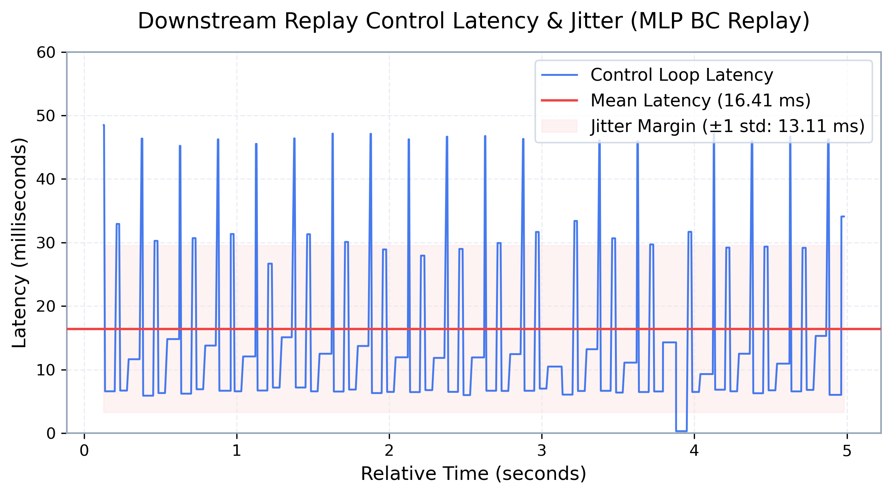
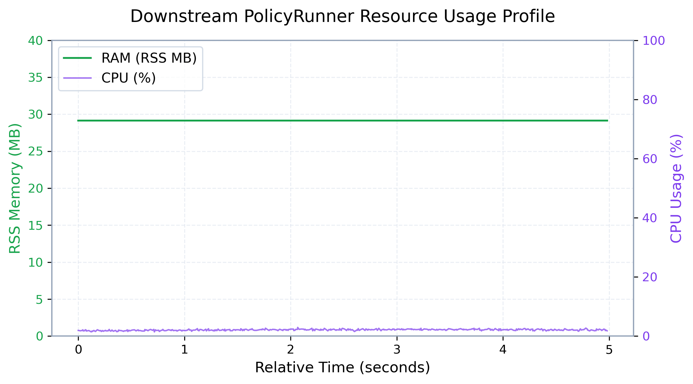
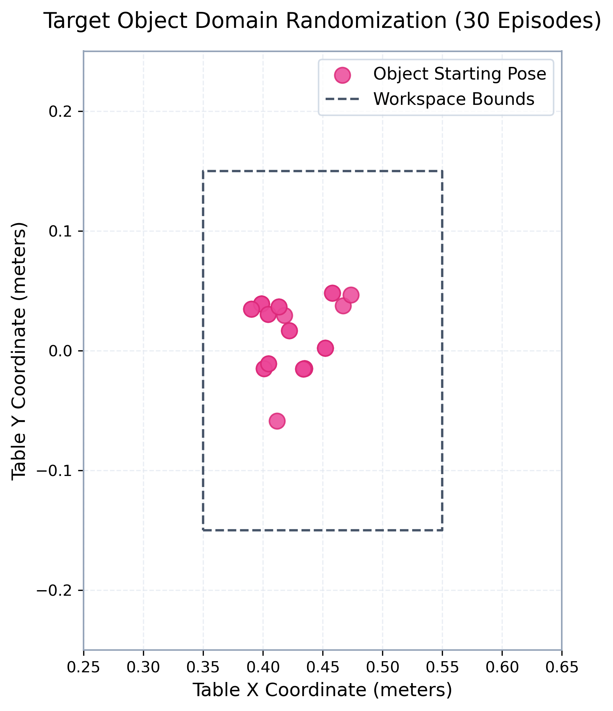
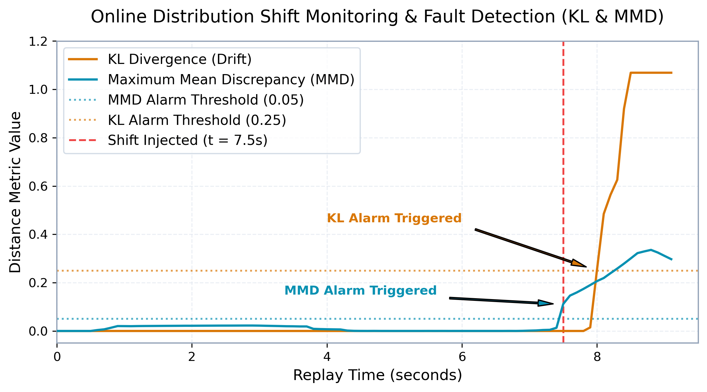
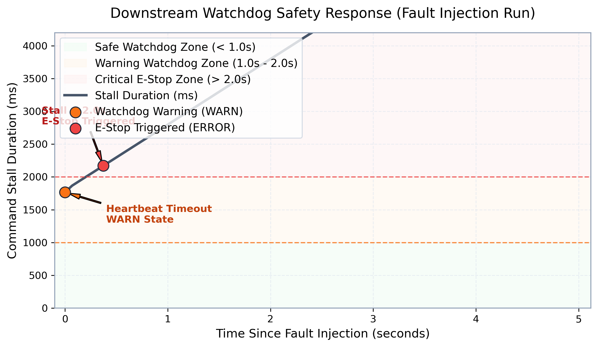
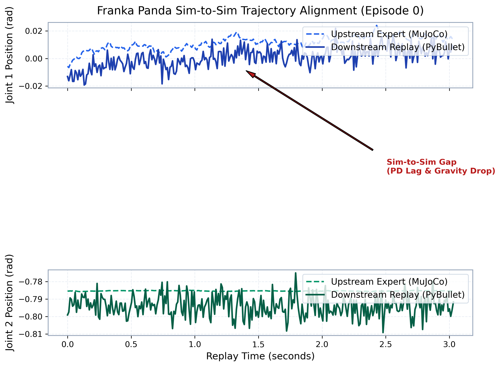
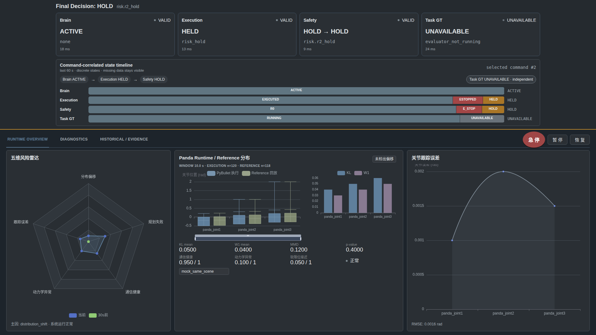

# ros2-moveit-pybullet-bridge

`ros2-moveit-pybullet-bridge` 是三仓 Panda 闭环的**下游执行验证面**：消费中游
`bridge_handoff`，在 PyBullet 中做 JSONL 重放，并输出 tracking / 分布监控 / risk readiness。

本仓输入是中游 handoff bundle；输出是 replay benchmark 与 risk 对照产物。
不采集 raw episode，不清洗数据，不训练模型，不执行真机，也不用 risk 判定抓取成败。

> **在系统中的位置**：小脑执行后的 **Sim2Sim readiness 验证**——证明动作包可重放、漂移可观测、
> 风险可聚合；任务真值（lift/place）仍归上游 continuous GT / Isaac evaluator。

## Position In The Three-Repo Loop


| 仓库 | 职责 |
| --- | --- |
| 上游：`ros2-arm-teleoperation-suite` | ROS 2/MuJoCo 采集、物理门禁、Isaac 执行与任务真值 |
| 中游：`robot-arm-episode-data-lab` | schema / release / 训练交付 / 统一评测信封 / handoff |
| 下游：本仓 | handoff 校验、JSONL replay、dist_monitor、risk readiness |

统一事实源见中游 `docs/portfolio/THREE_REPO_CANONICAL_FACTS.md`。
本仓证据索引见 [docs/portfolio/EVIDENCE_INDEX.md](docs/portfolio/EVIDENCE_INDEX.md)。

## Verified Capabilities

| 能力 | 当前状态 | 证据 |
| --- | --- | --- |
| Handoff bundle 静态校验 | `implemented_and_verified` | `learning/panda_handoff.py` + tests |
| JSONL open-loop replay | `implemented_and_verified` | `jsonl_action_replay_policy.py` |
| Panda `ee_delta_gripper[7]` adapter | `implemented_and_verified` | `panda_action_adapter.py` + tests |
| PyBullet replay benchmark CLI | `implemented_and_verified` | `scripts/benchmark_system.py` |
| `--launch-stack` 拉起 bridge + dist_monitor + risk_engine | `implemented_and_verified`（集成 launch） | `pybullet_bridge/launch/test_monitoring.launch.py` |
| Offline RiskAggregator readiness 对照 | `implemented_and_verified`（1-ep smoke） | `scripts/run_offline_risk_readiness.py`、`risk_engine/offline_readiness.py` |
| Offline risk → 中游 unified envelope appendix | `implemented_and_verified`（契约挂载） | 中游 `appendix.risk_readiness`；见下方对接 |
| 四泳道 HOC（Brain / Execution / Safety / Task GT） | `implemented_and_verified` | `hoc_console` backend/frontend tests；缺源 fail-closed |
| Risk→Safety bridge | `implemented_and_verified`（默认 dry-run） | R2 Hold / R3 TriggerEstop 状态机与 ROS tests |
| M5 PolicyCommand trace replay | `implemented_and_verified`（offline） | 五轨 bundle、absolute EEF8 adapter、strict loader |
| M6 bounded ROS/DDS wiring | `implemented_and_verified`（mock policy） | 三命令关联、实际 Hold/E-stop、HOC export、clean exit |
| 全量 canonical 故障注入 / 多 episode risk 回归 | `implemented_not_fully_verified` | 仍缺完整 campaign 证据 |
| Real Panda / completed Sim2Real | `not_supported` | — |

## Risk 对接（与中游评测信封）

下游 risk 有两条路径，**都不覆盖任务 go/no-go**：

```text
A) 在线路径（ROS）
   benchmark_system.py --launch-stack
     → test_monitoring.launch.py
     → bridge_node + dist_monitor + risk_engine
     → /risk/status（可触发 E-stop / Hold）

B) 离线路径（portfolio readiness）
   PolicyRunner timeseries (+ 可选 S4 trial reports)
     → run_offline_risk_readiness.py
     → risk_offline_readiness_v0 JSON
     → 中游 normalize_unified_eval_report.py --risk-readiness
     → unified_eval_report bundle 的 appendix.risk_readiness
```

| 硬约束 | 含义 |
| --- | --- |
| `use_as_task_go_no_go=false` | R-level / composite **不能**当抓取成功门禁 |
| `overrides_failure_lane=false` | 不得改写中游/上游 `failure_lane` |
| `claims_task_success=false` | 永远不声明任务成功 / Sim2Real |

权威对照产物（中游归档）：

- Replay smoke：`evidence/downstream/smolvla_v3_ep0_benchmark_summary.json`
- Offline risk：`evidence/downstream/smolvla_v3_ep0_risk_offline_20260724T215900Z.json`
- 挂载后的统一信封：中游 `evidence/smolvla_v3_eval_framework_relight_20260725/`
  说明：[中游 UNIFIED_EVAL_REPORT](https://github.com/inayina/robot-arm-episode-data-lab/blob/main/docs/portfolio/UNIFIED_EVAL_REPORT.md)

### 本地生成 offline risk 对照

```bash
# 在本仓根目录；需要 PolicyRunner 产出的 timeseries CSV
PYTHONPATH=risk_engine python3 scripts/run_offline_risk_readiness.py \
  --timeseries /path/to/benchmark_timeseries.csv \
  --summary /path/to/benchmark_summary.json \
  --out /tmp/risk_offline_readiness.json
```

然后在中游把该 JSON 传给 `--risk-readiness`（见中游 README）。

## Current Verified Evidence

历史 MLP 30-ep handoff 与部分 archived smoke **不一定是同一次 run**；引用时分开写。

| Fact | Value |
| --- | --- |
| 主线 action | `ee_delta_gripper[7]`（VLA handoff 亦可经中游导出后重放） |
| Replay strategy | `panda_jsonl_replay` + `pybullet_ik` |
| M5 PolicyCommand replay | `panda_policy_command_replay` + 独立 absolute EEF8 adapter；五轨 SHA/sequence/parent 关联 fail-closed；仅离线、非任务成功证据 |
| Policy Runtime M6 bounded wiring | mock PolicyBackend + 真实 ROS/DDS；QoS、R2 HOLD、R3 E_STOP、HOC trace 与 cleanup Pass；未启动仿真或切 SmolVLA authoritative；[结果](https://github.com/inayina/robot-arm-episode-data-lab/blob/main/docs/portfolio/POLICY_RUNTIME_M6_WIRING_RESULTS.md) |
| SmolVLA v3 1-ep PolicyRunner smoke | 1/1 completed；1,105 telemetry rows，其中 1,084 条含 latency 值；mean/max latency ≈ `18.0 / 357.7 ms`；`is_closed_loop=false` |
| Offline risk readiness（同 smoke） | R0 量级对照；`use_as_task_go_no_go=false` |
| 早期 archived smoke（独立 run） | 1/1 completed，mean/max `9.79 / 34.218 ms` |

## Core Evidence

| Evidence | What it shows | What it does not show |
| --- | --- | --- |
| `test_panda_handoff.py` / `test_panda_action_adapter.py` | bundle 与 adapter 契约 | 物理抓取成功 |
| midstream `smolvla_v3_ep0_benchmark_summary.json` | handoff→PolicyRunner interface smoke | closed-loop grasp / Sim2Real |
| midstream `smolvla_v3_ep0_risk_offline_*.json` | offline 六维 readiness 对照 | 任务 go/no-go |
| `docs/assets/panda_replay_*.png` | 可视化辅助 | 未绑定 JSON 前不作 headline 数字 |
| `docs/assets/hoc-runtime-four-lane-dashboard.png` | 当前 React HOC：最终裁决、原因链、四泳道状态时间线与连续诊断 | frontend fixture 截图，不冒充 live wiring 或策略任务表现 |

### 可用实验图片

| 图片 | 解释 | 边界 |
| --- | --- | --- |
|  | replay 控制延迟可视化 | 非真机 latency SLA |
|  | 资源占用可视化 | 非长期容量证明 |
|  | 目标位姿分布 | 非泛化/Sim2Real |
|  | KL/W1/MMD 展示 | 非 completed Sim2Real |
|  | fault/watchdog 展示 | 原始 JSON 未绑定前不作 headline |
|  | 轨迹对齐展示 | 非真机对齐 |
|  | 一级 Runtime Overview 在 1920×1080 一屏内同时给出 Final Decision、原因链、四泳道状态时间线、风险雷达、Runtime/Reference 分布与跟踪误差；Diagnostics 和 Historical / Evidence 通过标签页下钻。石墨灰为常态，琥珀/红色只编码 Hold/E-stop 等异常，缺源始终显式显示 `UNAVAILABLE`。 | 可复现的 Playwright frontend fixture，不是 M6 live 截屏；画面中的 HOLD 与指标值用于验证 UI 状态表达，不证明 SmolVLA、任务成功或 Sim2Real。 |

### Historical HOC visual

`docs/assets/m5-hoc-dashboard.png` 是 **Historical（M3 四泳道改版前）** 的 MLP/五维风险界面。
它只用于说明 UI 演进，不再作为当前 Policy Runtime、Safety feedback 或 HOC command correlation 证据。

## Quick Verification

```bash
pytest pybullet_bridge/test/test_panda_handoff.py \
       pybullet_bridge/test/test_panda_action_adapter.py

python3 scripts/benchmark_system.py \
  --strategy panda_jsonl_replay \
  --panda-handoff-path /path/to/bridge_handoff \
  --episodes 1 \
  --duration-sec 5.0 \
  --launch-stack \
  --panda-command-mode pybullet_ik
```

```bash
bin/ask-project "下游 risk 如何接到中游 unified eval？"
bin/project-evidence impact --base HEAD~1 --head HEAD
```

Set `EPISODE_DATA_LAB_ROOT` when the midstream checkout is not in a configured fallback.

## Code Map

| Path | Purpose |
| --- | --- |
| `pybullet_bridge/.../panda_handoff.py` | handoff 校验 |
| `pybullet_bridge/.../jsonl_action_replay_policy.py` | JSONL 重放 |
| `pybullet_bridge/.../panda_action_adapter.py` | 动作→关节命令 |
| `scripts/benchmark_system.py` | replay benchmark（`--launch-stack` 含 risk） |
| `scripts/run_offline_risk_readiness.py` | offline readiness 对照入口 |
| `risk_engine/offline_readiness.py` | RiskAggregator 离线聚合 |
| `dist_monitor/` | KL/W1/MMD |
| `risk_engine/` | 在线 risk_node + 聚合 |
| `risk_engine/risk_engine/risk_to_safety_bridge.py` | R2 Hold / R3 E-stop ROS bridge |
| `hoc_console/` | 四泳道 HOC、command correlation、五轨导出与 M6 probe |

## Boundaries

Do not claim from this repo:

- raw episode collection / cleaning / training;
- continuous task GT go/no-go（那是上游/Isaac evaluator）;
- risk R-level = 抓取成功;
- ACT/VLA online runtime as task success;
- real Panda driver / completed Sim2Real.

## Legacy

KUKA iiwa7、旧双仓图与 M3 改版前的 HOC 截图保留为 Historical / Legacy，不是当前 Panda runtime 主线。

## Key Documents

- [docs/AGENTS.md](docs/AGENTS.md)
- [docs/INTER_REPO_CONTRACTS.md](docs/INTER_REPO_CONTRACTS.md)
- [docs/CURRENT_STATUS.md](docs/CURRENT_STATUS.md)
- [docs/portfolio/EVIDENCE_INDEX.md](docs/portfolio/EVIDENCE_INDEX.md)

## English Brief

Downstream Panda **execution-validation and safety-observability** surface: load midstream
handoffs, replay actions in PyBullet, run distribution monitoring and risk aggregation, and
correlate Brain / Execution / Safety / Task GT in HOC. M6 verifies real ROS/DDS wiring with a
mock PolicyBackend; it does not enable authoritative SmolVLA or prove task success.
Online risk comes up with `--launch-stack`; offline RiskAggregator readiness can be
attached to the midstream `unified_eval_report` as `appendix.risk_readiness` only —
never as task go/no-go. This repo does not collect data, train policies, drive a real
Panda, or prove Sim2Real.
