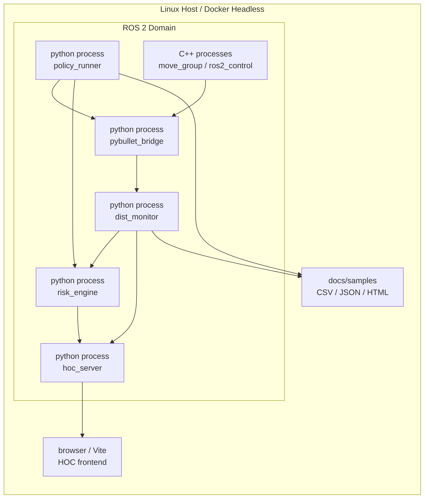

# 系统架构说明

**范围**：ROS 2 Jazzy + MoveIt 2 + PyBullet 桥接、策略运行、分布监控、风险闭环与系统 benchmark。

---

## 逻辑架构

```mermaid
flowchart TB
    subgraph UI["交互与运维层"]
        RViz["RViz2 / MoveIt Motion Planning"]
        HOC["HOC Console<br/>React + ECharts"]
        REPORT["HTML / CSV Reports"]
    end

    subgraph Planning["规划层"]
        MG["move_group<br/>IK / OMPL / Collision"]
        JTC["joint_trajectory_controller<br/>FollowJointTrajectory"]
    end

    subgraph Policy["策略层"]
        PR["policy_runner<br/>Replay / SineWave / Future Model"]
        POL["BasePolicy Contract"]
    end

    subgraph Bridge["仿真桥接层"]
        CMD["/bridge/command"]
        PB["pybullet_bridge<br/>240 Hz physics step"]
        SIM["/bridge/sim/joint_states"]
        REAL["/bridge/real/joint_states"]
    end

    subgraph Monitor["监控层"]
        DM["dist_monitor<br/>KL / W1 / MMD"]
        MET["/monitor/distribution_metrics"]
        CH["/monitor/comm_health"]
    end

    subgraph Risk["风险与健康层"]
        SYS["/system_health"]
        RE["risk_engine"]
        RISK["/risk/status / /risk/alerts"]
    end

    RViz --> MG
    MG --> JTC
    JTC --> CMD
    PR --> CMD
    POL --> PR
    CMD --> PB
    PB --> SIM
    PB --> REAL
    SIM --> MG
    SIM --> PR
    SIM --> DM
    REAL --> DM
    DM --> MET
    DM --> CH
    MET --> RE
    CH --> RE
    PR --> SYS
    SYS --> RE
    RE --> RISK
    MET --> HOC
    RISK --> HOC
    HOC --> REPORT
```

## 物理部署

## QoS 策略

| Topic | QoS | 选择原因 |
|-------|-----|----------|
| `/bridge/sim/joint_states` | BestEffort / SensorDataQoS | 高频状态流允许丢旧帧；避免 reliable 反压影响 PyBullet 步进。 |
| `/bridge/real/joint_states` | BestEffort / SensorDataQoS | 与 sim 流保持一致，优先保留实时性。 |
| `/bridge/command` | Reliable, depth 10 | 控制命令不能静默丢失；低频事件对带宽压力小。 |
| `/monitor/distribution_metrics` | Reliable, depth 10 | KL / W1 / MMD 是低频诊断数据，需要可追溯。 |
| `/monitor/comm_health` | Reliable, depth 10 | 健康指标用于风险聚合，不应因短暂拥塞丢失关键状态。 |
| `/system_health` | Reliable, optional transient local | 故障注入和策略卡顿报警需要可靠送达；transient local 可让后启动工具看到最近状态。 |

## 设计取舍

- 策略层只输出关节目标，不直接访问 PyBullet 或 MoveIt 内部对象，保证后续 PyTorch 模型能按 `BasePolicy` 接口替换。
- Policy inference 使用 ROS Timer，与 bridge physics timer 解耦；策略慢不会直接阻塞 PyBullet step，但会通过 `/system_health` 暴露。
- 分布偏移指标继续由 `dist_monitor` 统一计算，避免在策略节点中出现第二套 KL / W1 / MMD 逻辑。
- 风险闭环保持集中：`risk_engine` 聚合分布、通信、规划、策略健康等信号，bridge 只执行降级或停机动作。
