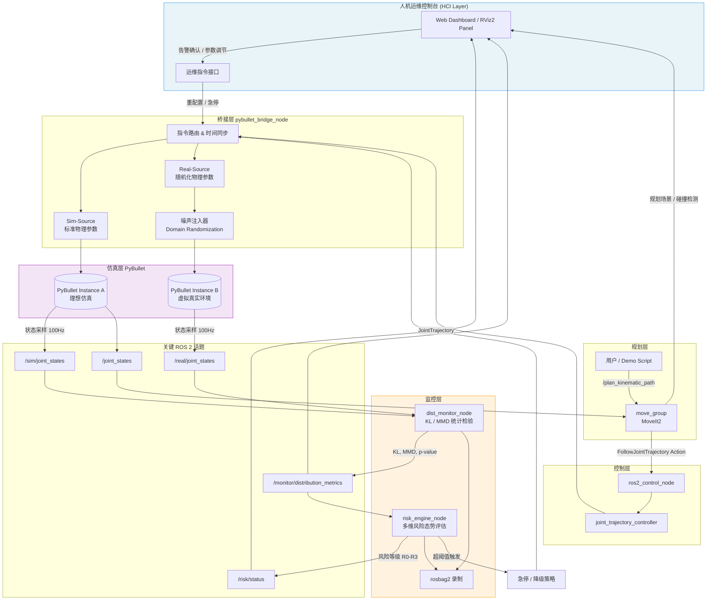

# 01 · 系统架构与需求

**文档版本**：v0.1  
**目标读者**：面试官 / 技术评审 / 实现参考  
**项目定位**：无真实硬件条件下的 Sim2Real 闭环验证与分布偏移监控作品集

---

## 1. 项目背景与目标

### 1.1 背景

本项目面向**机器人系统工程师**求职场景，在缺乏真实机械臂硬件的条件下，构建一套可演示、可度量、可扩展的仿真控制系统。核心命题：

> 如何在纯仿真环境中，尽可能复现真实世界的物理特性、传感噪声与控制不确定性，并建立可量化的 Sim2Real 偏差监控机制？

候选人具备 **HCI（人机交互）** 与 **FRM（金融风险管理）** 复合背景，系统设计引入：

- **多维风险态势评估**：将分布偏移、控制偏差、通信异常等映射为可聚合的风险指标；
- **人机运维控制台（HOC）**：为运维/调试人员提供可解释、可干预的监控界面，而非仅输出原始日志。

### 1.2 核心目标

| 目标层级 | 描述 |
|---------|------|
| **L1 桥接** | 建立 ROS2 控制节点 ↔ PyBullet 物理引擎的双向通信桥 |
| **L2 规划闭环** | 接入 MoveIt2，实现「规划 → 执行 → 反馈」的机械臂运动控制闭环 |
| **L3 分布监控** | 内置基于统计检验（KL 散度 / MMD）的 Sim2Real 分布偏移检测模块 |
| **L4 风险可视化** | 提供多维风险态势面板与人机运维控制台，支撑决策与干预 |

### 1.3 设计约束

- **无真实硬件**：所有「真实侧」数据由**双源仿真 + 参数随机化**构造；
- **可复现**：随机种子、参数配置、实验记录可版本化管理；
- **可演示**：单命令启动完整 Demo，含 RViz2 可视化与风险面板；
- **可迁移**：架构预留真实硬件接入点（`ros2_control`、真实驱动接口）。

---

## 2. 技术栈选型

### 2.1 总览

```
┌─────────────────────────────────────────────────────────┐
│  应用层    │ 人机运维控制台 (Web/RViz2 Plugin)            │
├───────────┼─────────────────────────────────────────────┤
│  监控层    │ Sim2Real 分布监控 (KL/MMD) + 风险聚合引擎    │
├───────────┼─────────────────────────────────────────────┤
│  规划层    │ MoveIt2 (move_group / OMPL / Pilz)          │
├───────────┼─────────────────────────────────────────────┤
│  控制层    │ ros2_control + joint_trajectory_controller  │
├───────────┼─────────────────────────────────────────────┤
│  桥接层    │ pybullet_bridge_node (Python)               │
├───────────┼─────────────────────────────────────────────┤
│  仿真层    │ PyBullet 3.x (DIRECT/GUI 模式)              │
├───────────┼─────────────────────────────────────────────┤
│  中间件    │ ROS 2 Jazzy + DDS (Fast-DDS)                │
└─────────────────────────────────────────────────────────┘
```

### 2.2 各组件选型与理由

#### ROS 2 Jazzy Jalisco

| 维度 | 说明 |
|------|------|
| **版本** | Jazzy（2024.05 LTS，支持至 2029.05） |
| **选型理由** | ① 与 Ubuntu 24.04 原生匹配；② MoveIt2 官方完整支持；③ `ros2_control` 接口成熟；④ 作品集可长期维护 |
| **关键包** | `rclpy`/`rclcpp`、`sensor_msgs`、`trajectory_msgs`、`control_msgs`、`ros2_control`、`robot_state_publisher` |

#### MoveIt2

| 维度 | 说明 |
|------|------|
| **版本** | 与 Jazzy 配套的 MoveIt2 2.9.x |
| **选型理由** | ① 工业界运动规划事实标准；② 支持 OMPL 多种规划器；③ `move_group` Action 接口便于闭环集成；④ SRDF/碰撞检测可直接对接 PyBullet 碰撞模型 |
| **规划器** | OMPL RRTConnect（默认）+ Pilz PTP/LIN（可选，轨迹可预测性好，利于分布对比） |

#### PyBullet 3.2.x

| 维度 | 说明 |
|------|------|
| **版本** | PyBullet ≥ 3.2.5 |
| **选型理由** | ① Python 原生，与 `rclpy` 同进程部署成本低；② 支持力矩控制、摩擦、阻尼等物理参数调节；③ URDF 直接加载；④ `DIRECT` 模式可无头运行，适合批量实验与 CI |
| **局限与应对** | 接触动力学精度弱于 Gazebo → 通过**参数随机化**覆盖不确定性，而非追求绝对精度 |

#### 分布监控：KL 散度 + MMD

| 方法 | 适用场景 | 理由 |
|------|---------|------|
| **KL 散度** | 单变量/低维关节误差分布对比 | 计算快、可解释性强，适合实时滑窗监控 |
| **MMD（RBF 核）** | 多维状态向量联合分布对比 | 非参数、不假设分布形式，对非高斯噪声鲁棒 |
| **实现库** | `scipy.stats`（KL）、`numpy` 自实现（MMD） | 轻量、无深度学习依赖 |

#### 辅助技术

| 组件 | 用途 |
|------|------|
| **RViz2** | 机械臂状态、规划轨迹、碰撞体可视化 |
| **Foxglove Studio / 自研 Web 面板** | 风险态势仪表盘、分布对比图、告警时间线 |
| **SQLite / rosbag2** | 实验数据持久化与离线回放 |
| **pytest + launch_testing** | 节点级与系统集成测试 |

---

## 3. 系统架构设计

### 3.1 逻辑分层架构

```
                    ┌──────────────────────┐
                    │  人机运维控制台 (HOC)  │  ← HCI 层
                    └──────────┬───────────┘
                               │ WebSocket / rosbridge
          ┌────────────────────┼────────────────────┐
          │                    │                    │
   ┌──────▼──────┐    ┌────────▼────────┐   ┌──────▼──────┐
   │ MoveIt2     │    │ 分布监控节点     │   │ 风险聚合引擎  │  ← 监控层
   │ move_group  │    │ (dist_monitor)  │   │ (risk_engine)│
   └──────┬──────┘    └────────┬────────┘   └──────┬──────┘
          │                    │                    │
   ┌──────▼────────────────────▼────────────────────▼──────┐
   │              ros2_control 控制器管理器               │  ← 控制层
   │         joint_trajectory_controller                  │
   └──────────────────────┬──────────────────────────────┘
                          │
   ┌──────────────────────▼──────────────────────────────┐
   │           pybullet_bridge_node                       │  ← 桥接层
   │  ┌─────────────┐  ┌──────────────┐  ┌────────────┐  │
   │  │ Sim-Source  │  │ Real-Source  │  │ 噪声注入器  │  │
   │  │ (标准仿真)   │  │ (域随机仿真)  │  │ (Noise Inj)│  │
   │  └─────────────┘  └──────────────┘  └────────────┘  │
   └──────────────────────┬──────────────────────────────┘
                          │
   ┌──────────────────────▼──────────────────────────────┐
   │              PyBullet 物理引擎 (×2 实例)              │  ← 仿真层
   └─────────────────────────────────────────────────────┘
```

### 3.2 核心节点职责

| 节点名 | 语言 | 职责 |
|--------|------|------|
| `pybullet_bridge_node` | Python | PyBullet 实例管理、关节指令下发、状态回读、双源仿真调度 |
| `robot_state_publisher` | C++ | URDF → TF 树发布 |
| `move_group` | C++ | 接收规划请求，输出 `JointTrajectory` |
| `ros2_control_node` | C++ | 加载控制器，转发轨迹到 bridge |
| `dist_monitor_node` | Python | 采集双源状态流，计算 KL/MMD，发布偏移指标 |
| `risk_engine_node` | Python | 聚合多维度风险指标，输出风险等级与告警 |
| `hoc_server` | Python | 人机运维控制台后端，WebSocket 推送 |

### 3.3 关键数据流

**控制闭环（正向通路）**：

```
用户/脚本 → MoveIt2 Planning Request
         → move_group → JointTrajectory
         → ros2_control → joint_trajectory_controller
         → pybullet_bridge → PyBullet setJointMotorControl
         → 物理步进 → 关节状态反馈
```

**监控通路（侧向采集）**：

```
PyBullet Sim-Source  → /sim/joint_states   ─┐
PyBullet Real-Source → /real/joint_states  ─┼→ dist_monitor
                                            │     ↓
                                            │  KL/MMD 指标
                                            │     ↓
                                            └→ risk_engine → /risk/status
                                                              ↓
                                                         HOC 面板
```

### 3.4 Mermaid 架构流程图



### 3.5 双源仿真架构（无硬件验证核心）

| 实例 | 角色 | 物理参数 | 语义 |
|------|------|---------|------|
| **Sim-Source (A)** | 训练/规划基准环境 | 标称 URDF 参数、无噪声 | 代表「仿真世界」 |
| **Real-Source (B)** | 虚拟真实环境 | 域随机化参数 + 传感/执行噪声 | 代表「真实世界代理」 |

**同一轨迹指令**同时驱动 A、B 两实例，监控模块持续对比二者状态分布差异，模拟 Sim2Real Gap。

**域随机化参数空间**（示例）：

```yaml
domain_randomization:
  joint_damping:      uniform(0.0, 0.5)
  joint_friction:     uniform(0.0, 0.3)
  motor_strength:     uniform(0.85, 1.15)
  position_noise_std: 0.01   # rad
  velocity_noise_std: 0.05   # rad/s
  time_delay_ms:      uniform(10, 50)
  payload_mass:       uniform(0.0, 0.5)  # kg
```

---

## 4. 多维风险态势评估（FRM 融合设计）

### 4.1 风险维度定义

| 风险维度 | 指标来源 | 计算方法 | 权重 |
|---------|---------|---------|------|
| **D1 分布偏移风险** | KL 散度、MMD | 滑窗统计检验 p-value | 0.35 |
| **D2 轨迹跟踪风险** | 关节位置/速度误差 | RMSE + 最大偏差 | 0.25 |
| **D3 动力学异常风险** | 力矩饱和、速度跳变 | 阈值越界计数 | 0.20 |
| **D4 通信健康风险** | 话题延迟、丢帧率 | EWMA 时延统计 | 0.10 |
| **D5 规划失败风险** | MoveIt2 规划成功率 | 滑动窗口失败率 | 0.10 |

### 4.2 风险等级映射

```
综合风险得分 R = Σ(wi × normalized_score_i)

R ∈ [0, 0.25)   → R0 正常（绿色）
R ∈ [0.25, 0.5) → R1 关注（黄色）— 日志增强
R ∈ [0.5, 0.75) → R2 警告（橙色）— 降速运行
R ∈ [0.75, 1.0] → R3 严重（红色）— 急停 + 人工确认
```

### 4.3 可解释性输出

```json
{
  "level": "R2",
  "score": 0.58,
  "attribution": {
    "distribution_shift": 0.72,
    "tracking_error": 0.45,
    "dynamics_anomaly": 0.31,
    "comm_health": 0.12,
    "planning_failure": 0.05
  },
  "primary_driver": "distribution_shift",
  "recommendation": "检查域随机化参数范围；考虑重标定噪声模型"
}
```

---

## 5. 功能性需求

### 5.1 桥接通信（FR-BRG）

| ID | 需求描述 | 验收标准 |
|----|---------|---------|
| FR-BRG-01 | 系统应支持通过 ROS2 向 PyBullet 发送关节位置/力矩指令 | 指令延迟 < 20ms（P99） |
| FR-BRG-02 | 系统应以可配置频率（默认 100Hz）发布 PyBullet 关节状态 | 频率抖动 < 5% |
| FR-BRG-03 | 桥接节点应支持加载标准 URDF 机械臂模型 | 至少验证 UR5/FR3 之一 |
| FR-BRG-04 | 桥接节点应支持 `DIRECT`（无头）与 `GUI` 双模式 | launch 参数切换 |
| FR-BRG-05 | 系统应支持双 PyBullet 实例并行运行 | 同指令同步驱动，时间戳对齐 |

### 5.2 MoveIt2 规划闭环（FR-MOV）

| ID | 需求描述 | 验收标准 |
|----|---------|---------|
| FR-MOV-01 | 系统应能通过 `move_group` 完成关节空间与笛卡尔空间规划 | 规划成功率 > 95%（标准场景） |
| FR-MOV-02 | 规划轨迹应通过 `ros2_control` 执行到 PyBullet | 轨迹跟踪 RMSE < 0.05 rad |
| FR-MOV-03 | 系统应发布完整 TF 树供 RViz2 可视化 | 所有 link 可正确显示 |
| FR-MOV-04 | 系统应支持碰撞检测（自碰撞 + 环境碰撞） | 碰撞场景规划被拒绝 |

### 5.3 分布监控（FR-MON）

| ID | 需求描述 | 验收标准 |
|----|---------|---------|
| FR-MON-01 | 系统应实时计算 Sim-Source 与 Real-Source 关节位置分布的 KL 散度 | 滑窗 5s，更新频率 10Hz |
| FR-MON-02 | 系统应支持 MMD 检验多维状态向量分布差异 | 输出 MMD 统计量 + 置换检验 p-value |
| FR-MON-03 | 监控模块应支持可配置的偏移告警阈值 | YAML 热加载 |
| FR-MON-04 | 系统应记录每次实验的分布指标时序数据 | 支持 rosbag2 回放分析 |
| FR-MON-05 | 系统应支持注入已知偏移（Ground Truth）用于检验检出率 | 注入 ±20% 阻尼变化，检出率 > 90% |

### 5.4 风险管理（FR-RSK）

| ID | 需求描述 | 验收标准 |
|----|---------|---------|
| FR-RSK-01 | 系统应聚合五维风险指标并输出 R0-R3 等级 | 等级变化延迟 < 500ms |
| FR-RSK-02 | 系统应在 R3 等级自动触发急停 | PyBullet 关节速度归零 < 100ms |
| FR-RSK-03 | 系统应输出可解释归因向量 | 每次等级变化附带 primary_driver |
| FR-RSK-04 | 系统应支持风险等级降级的人工确认流程 | HOC 确认后方可恢复运行 |

### 5.5 人机控制台（FR-HOC）

| ID | 需求描述 | 验收标准 |
|----|---------|---------|
| FR-HOC-01 | 控制台应实时显示综合风险等级与五维雷达图 | WebSocket 推送延迟 < 200ms |
| FR-HOC-02 | 控制台应支持分布对比可视化（直方图 + KL/MMD 曲线） | 支持暂停/缩放 |
| FR-HOC-03 | 控制台应提供急停、暂停、恢复操作 | 急停响应 < 100ms |
| FR-HOC-04 | 控制台应支持实验参数在线调节（随机化强度、随机种子） | 调节后下一周期生效 |
| FR-HOC-05 | 控制台应支持实验报告导出（JSON/CSV） | 含风险时序 + 分布指标 |

---

## 6. 非功能性需求

### 6.1 性能需求

| ID | 指标 | 目标值 | 度量方法 |
|----|------|--------|---------|
| NFR-P01 | 控制回路端到端延迟（规划→执行→反馈） | < 50ms（P95） | rosbag 时间戳差分 |
| NFR-P02 | 关节状态发布频率 | 100Hz ± 5% | 话题频率统计 |
| NFR-P03 | 分布指标计算周期 | 10Hz | 节点内计时 |
| NFR-P04 | HOC 面板刷新率 | ≥ 5Hz | WebSocket 帧率 |
| NFR-P05 | 双实例 PyBullet 步进 | 240Hz 物理步进，实时因子 ≥ 0.8 | 仿真时间 vs 墙钟时间 |

### 6.2 可靠性需求

| ID | 需求描述 | 目标 |
|----|---------|------|
| NFR-R01 | 桥接节点崩溃应触发系统安全停机 | 进程监控 + 看门狗 |
| NFR-R02 | 节点重启后应能恢复到上次安全状态 | 状态快照持久化 |
| NFR-R03 | 连续运行 2 小时无内存泄漏 | valgrind / top 监控 |
| NFR-R04 | rosbag 录制不因单节点异常中断 | 独立录制进程 |

### 6.3 安全需求（故障安全）

| ID | 机制 | 描述 |
|----|------|------|
| NFR-S01 | **急停（E-Stop）** | 任意时刻可通过 HOC / 键盘 / 服务调用触发，所有关节速度归零 |
| NFR-S02 | **软限位** | 关节位置超出 URDF limits 的 95% 时触发 R2 告警 |
| NFR-S03 | **看门狗** | 控制指令中断 > 500ms 自动降级为位置保持模式 |
| NFR-S04 | **降级运行** | R2 等级自动将速度/加速度限制降至 50% |
| NFR-S05 | **恢复互锁** | R3 急停后须经 HOC 人工确认 + 自检通过方可恢复 |

### 6.4 可维护性与可复现性

| ID | 需求描述 |
|----|---------|
| NFR-M01 | 所有节点参数通过 YAML 配置，支持 ROS2 参数服务动态调参 |
| NFR-M02 | 提供 `ros2 launch` 一键启动完整系统 |
| NFR-M03 | 代码遵循 ROS2 标准包结构，`colcon build` 可编译 |
| NFR-M04 | 关键模块单元测试覆盖率 > 70% |
| NFR-REP-01 | 所有随机过程使用可配置种子 |
| NFR-REP-02 | 实验配置（YAML + seed）与结果（rosbag）关联存储 |
| NFR-REP-03 | 提供标准 Demo 脚本，输出确定性基准指标 |

---

## 7. 无硬件验证方案

### 7.1 验证金字塔

```
                    ┌──────────┐
                    │ 系统级   │  端到端 Demo + 风险面板
                    │ 场景测试  │  pick-and-place 全流程
                   ┌┴──────────┴┐
                   │  集成测试    │  双源分布对比 + 注入实验
                  ┌┴─────────────┴┐
                  │   模块测试      │  KL/MMD 算法 + 桥接节点
                 ┌┴───────────────┴┐
                 │    单元测试       │  噪声模型 + 风险聚合
                 └─────────────────┘
```

### 7.2 双源仿真验证

| 步骤 | 操作 | 预期结果 |
|------|------|---------|
| 1 | 两实例使用**相同指令**、**不同物理参数** | 状态轨迹产生可观测偏差 |
| 2 | 逐步增大域随机化强度（0% → 50% → 100%） | KL/MMD 单调上升 |
| 3 | 注入已知偏移（如阻尼 +30%） | 监控模块在 5s 内检出，R 等级 ≥ R2 |
| 4 | 关闭随机化 | KL/MMD 回归基线，R 等级 → R0 |

### 7.3 参数随机化验证矩阵

| 实验编号 | 扰动参数 | 扰动幅度 | 验证指标 |
|---------|---------|---------|---------|
| EXP-01 | joint_damping | +0% / +20% / +50% | KL 检出率、检出延迟 |
| EXP-02 | motor_strength | ±10% / ±20% | MMD p-value |
| EXP-03 | position_noise | 0 / 0.01 / 0.05 rad | 跟踪 RMSE vs 分布偏移相关性 |
| EXP-04 | time_delay | 0 / 30 / 80 ms | 通信健康风险维度响应 |
| EXP-05 | payload_mass | 0 / 0.3 / 0.5 kg | 动力学异常风险响应 |

### 7.4 基准场景

| 场景 | 描述 | 验证重点 |
|------|------|---------|
| **SC-01** | 关节空间点到点 | 轨迹跟踪 + 基础分布对比 |
| **SC-02** | 笛卡尔直线运动 | 规划-执行一致性 |
| **SC-03** | 拾放操作 | 全流程风险监控 |
| **SC-04** | 碰撞边界 | 规划失败风险 + 安全停机 |
| **SC-05** | 长时间耐久（2h） | 稳定性 + 内存 |

---

## 8. 包结构规划

```
ros2-moveit-pybullet-bridge/
├── pybullet_bridge/          # 桥接节点 + 双源仿真
├── dist_monitor/             # KL/MMD 分布监控
├── risk_engine/              # 多维风险聚合
├── hoc_console/              # 人机运维控制台
├── moveit_config/            # MoveIt2 配置包
└── docs/design/              # 本设计文档目录
```

---

## 9. 里程碑建议

| 阶段 | 周期 | 交付物 |
|------|------|--------|
| **M1 桥接基础** | 第 1-2 周 | PyBullet 单实例 + ROS2 关节状态双向通信 |
| **M2 规划闭环** | 第 3-4 周 | MoveIt2 规划 → 执行 → RViz2 可视化 |
| **M3 双源仿真** | 第 5 周 | 双实例 + 域随机化 + 参数配置 |
| **M4 分布监控** | 第 6-7 周 | KL/MMD 模块 + 注入实验验证 |
| **M5 风险 + HOC** | 第 8-9 周 | 风险引擎 + Web 控制台 |
| **M6 作品集打磨** | 第 10 周 | Demo 视频 + 量化报告 + README |

---

**下一篇**：[02 · 接口设计](./02-interface-design.md)
