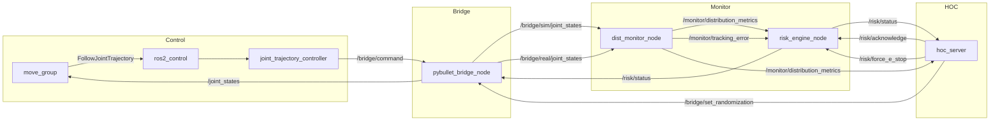

# 02 · 接口设计

**文档版本**：v0.1  
**依赖**：[01 · 系统架构与需求](./01-system-architecture-and-requirements.md)  
**范围**：ROS 2 话题、服务、Action、自定义消息、参数命名约定

---

## 1. 设计原则

| 原则 | 说明 |
|------|------|
| **命名空间隔离** | 所有本项目话题以 `/bridge`、`/monitor`、`/risk`、`/hoc` 为前缀 |
| **标准消息优先** | 控制与状态优先使用 `sensor_msgs`、`trajectory_msgs`、`control_msgs` |
| **自定义消息最小化** | 仅对分布指标、风险态势等无标准消息的场景定义 custom msg |
| **向后兼容** | 消息字段只增不删；废弃字段标记 `deprecated` 注释 |
| **QoS 显式声明** | 所有发布/订阅在 launch 或代码中显式指定 QoS Profile |

---

## 2. 自定义消息与服务定义

### 2.1 包：`bridge_monitor_msgs`

建议新建独立接口包，供 `dist_monitor`、`risk_engine`、`hoc_console` 共用。

#### `DistributionMetrics.msg`

```
# 分布偏移监控指标（dist_monitor 发布）
std_msgs/Header header

# 逐关节 KL 散度（rad 空间位置误差分布）
string[] joint_names
float64[] kl_divergence_per_joint
float64 kl_divergence_mean

# Wasserstein-1（平移型分布偏移）
float64[] wasserstein_per_joint
float64 wasserstein_mean
float64 w1_threshold
bool shift_detected_w1

# 多维 MMD
float64 mmd_statistic
float64 mmd_p_value
float64 mmd_threshold

# 滑窗元数据
float64 window_duration_sec
uint32 sample_count_sim
uint32 sample_count_real

# 综合判定
bool shift_detected
string detection_method    # "none" | "kl" | "w1" | "mmd" | "kl+w1" | ...
```

#### `RiskAttribution.msg`

```
string dimension           # distribution_shift | tracking_error | ...
float64 raw_score          # [0, 1]
float64 weighted_score     # raw × weight
float64 weight
bool is_primary_driver
```

#### `RiskStatus.msg`

```
std_msgs/Header header

uint8 level                # 0=R0, 1=R1, 2=R2, 3=R3
float64 composite_score    # [0, 1]
RiskAttribution[] attribution
string primary_driver
string recommendation

bool e_stop_active
bool degraded_mode         # R2 降级运行标志
uint32 consecutive_alerts  # 连续超阈值周期数
```

#### `DomainRandomizationConfig.msg`

```
std_msgs/Header header
int32 random_seed
float64 randomization_strength   # [0.0, 1.0] 全局缩放因子

float64 joint_damping_min
float64 joint_damping_max
float64 joint_friction_min
float64 joint_friction_max
float64 motor_strength_min
float64 motor_strength_max
float64 position_noise_std
float64 velocity_noise_std
float64 time_delay_min_ms
float64 time_delay_max_ms
float64 payload_mass_min
float64 payload_mass_max
```

#### `ExperimentMetadata.msg`

```
std_msgs/Header header
string experiment_id
string scenario_id           # SC-01 ~ SC-05
int32 random_seed
float64 randomization_strength
string operator_note
string git_commit_hash
```

#### `InjectShift.srv`

```
# 请求：注入已知 Ground Truth 偏移（验证用）
string parameter_name        # joint_damping | motor_strength | ...
float64 delta_percent        # 如 30.0 表示 +30%
float64 duration_sec         # 注入持续时间
---
bool success
string message
```

#### `SetRandomization.srv`

```
DomainRandomizationConfig config
---
bool success
string message
```

#### `AcknowledgeRisk.srv`

```
# 人工确认风险降级（R3 → 恢复前置步骤）
uint8 from_level
uint8 to_level
string operator_id
string comment
---
bool success
string message
```

#### `ExportExperiment.srv`

```
string experiment_id
string format               # "json" | "csv"
string output_path
---
bool success
string file_path
string message
```

---

## 3. 话题（Topics）

### 3.1 桥接层 `/bridge`

| 话题名 | 类型 | 发布者 | 订阅者 | 频率 | QoS | 说明 |
|--------|------|--------|--------|------|-----|------|
| `/joint_states` | `sensor_msgs/JointState` | `pybullet_bridge` | `robot_state_publisher`, `move_group`, `dist_monitor` | 100Hz | SensorDataQoS | **主反馈**：Sim-Source 关节状态（对外暴露） |
| `/bridge/sim/joint_states` | `sensor_msgs/JointState` | `pybullet_bridge` | `dist_monitor` | 100Hz | SensorDataQoS | Sim-Source 原始状态 |
| `/bridge/real/joint_states` | `sensor_msgs/JointState` | `pybullet_bridge` | `dist_monitor` | 100Hz | SensorDataQoS | Real-Source 带噪声状态 |
| `/bridge/sim/joint_torques` | `sensor_msgs/JointState` | `pybullet_bridge` | `dist_monitor`, `risk_engine` | 100Hz | SensorDataQoS | 关节力矩（`effort` 字段） |
| `/bridge/command` | `trajectory_msgs/JointTrajectory` | `ros2_control` | `pybullet_bridge` | 事件+50Hz | Default | 轨迹指令输入 |
| `/bridge/system_state` | `std_msgs/String` | `pybullet_bridge` | `hoc_server`, `risk_engine` | 10Hz | Reliable | `IDLE`/`RUNNING`/`PAUSED`/`E_STOP` |
| `/bridge/randomization_config` | `DomainRandomizationConfig` | `pybullet_bridge` | `hoc_server` | 1Hz | Reliable | 当前随机化配置回显 |
| `/bridge/experiment_metadata` | `ExperimentMetadata` | `pybullet_bridge` | `hoc_server`, rosbag | 1Hz | Reliable | 实验元数据 |

**`JointState` 字段约定**：

```yaml
# sensor_msgs/JointState 映射
name:     ["joint1", "joint2", ...]   # 与 URDF 一致
position: [rad]
velocity: [rad/s]
effort:   [Nm]                        # 可选，用于动力学风险
```

### 3.2 监控层 `/monitor`

| 话题名 | 类型 | 发布者 | 订阅者 | 频率 | QoS | 说明 |
|--------|------|--------|--------|------|-----|------|
| `/monitor/distribution_metrics` | `DistributionMetrics` | `dist_monitor` | `risk_engine`, `hoc_server` | 10Hz | Reliable | KL/MMD 核心指标 |
| `/monitor/tracking_error` | `sensor_msgs/JointState` | `dist_monitor` | `risk_engine` | 10Hz | SensorDataQoS | 逐关节位置误差（sim - real） |
| `/monitor/comm_health` | `diagnostic_msgs/DiagnosticArray` | `dist_monitor` | `risk_engine` | 1Hz | Reliable | 话题延迟、丢帧统计 |

### 3.3 风险层 `/risk`

| 话题名 | 类型 | 发布者 | 订阅者 | 频率 | QoS | 说明 |
|--------|------|--------|--------|------|-----|------|
| `/risk/status` | `RiskStatus` | `risk_engine` | `hoc_server`, `pybullet_bridge` | 10Hz | Reliable | 综合风险态势 |
| `/risk/alerts` | `std_msgs/String` | `risk_engine` | `hoc_server` | 事件 | Reliable | JSON 格式告警事件流 |
| `/risk/planning_stats` | `diagnostic_msgs/DiagnosticArray` | `move_group`（适配器） | `risk_engine` | 1Hz | Reliable | 规划成功率滑动统计 |

**`/risk/alerts` JSON 格式**：

```json
{
  "timestamp": {"sec": 0, "nanosec": 0},
  "event_type": "level_change",
  "from_level": 1,
  "to_level": 2,
  "primary_driver": "distribution_shift",
  "message": "KL mean exceeded threshold 0.15"
}
```

### 3.4 控制层（标准 MoveIt2 / ros2_control）

| 话题/接口 | 类型 | 说明 |
|-----------|------|------|
| `/robot_description` | `std_msgs/String` (参数) | URDF 字符串 |
| `/robot_description_semantic` | `std_msgs/String` (参数) | SRDF 字符串 |
| `/display_planned_path` | `moveit_msgs/DisplayTrajectory` | RViz2 规划轨迹可视化 |
| `/monitored_planning_scene` | `moveit_msgs/PlanningScene` | 碰撞场景 |
| `/tf`, `/tf_static` | `tf2_msgs/TFMessage` | 坐标变换 |

---

## 4. 服务（Services）

### 4.1 桥接层

| 服务名 | 类型 | 提供者 | 说明 |
|--------|------|--------|------|
| `/bridge/set_randomization` | `SetRandomization` | `pybullet_bridge` | 在线更新域随机化参数 |
| `/bridge/inject_shift` | `InjectShift` | `pybullet_bridge` | 注入已知偏移（验证实验） |
| `/bridge/reset_simulation` | `std_srvs/Trigger` | `pybullet_bridge` | 重置双实例到初始姿态 |
| `/bridge/set_mode` | `std_srvs/SetBool` | `pybullet_bridge` | `true`=GUI, `false`=DIRECT |

### 4.2 监控层

| 服务名 | 类型 | 提供者 | 说明 |
|--------|------|--------|------|
| `/monitor/set_thresholds` | `std_srvs/SetParameters` (或自定义) | `dist_monitor` | 动态调整 KL/MMD 告警阈值 |
| `/monitor/reset_baseline` | `std_srvs/Trigger` | `dist_monitor` | 以当前窗口重新标定基线 |

### 4.3 风险层

| 服务名 | 类型 | 提供者 | 说明 |
|--------|------|--------|------|
| `/risk/acknowledge` | `AcknowledgeRisk` | `risk_engine` | 人工确认风险降级 |
| `/risk/force_e_stop` | `std_srvs/Trigger` | `risk_engine` | 强制急停 |
| `/risk/clear_e_stop` | `std_srvs/Trigger` | `risk_engine` | 清除急停（需先 acknowledge） |

### 4.4 HOC 层

| 服务名 | 类型 | 提供者 | 说明 |
|--------|------|--------|------|
| `/hoc/export_experiment` | `ExportExperiment` | `hoc_server` | 导出实验报告 |
| `/hoc/start_recording` | `std_srvs/Trigger` | `hoc_server` | 开始 rosbag 录制 |
| `/hoc/stop_recording` | `std_srvs/Trigger` | `hoc_server` | 停止录制 |

---

## 5. Action 接口

### 5.1 MoveIt2 标准 Action

| Action 名 | 类型 | 客户端 | 服务端 | 说明 |
|-----------|------|--------|--------|------|
| `/move_action` | `moveit_msgs/MoveGroup` | Demo 脚本 / HOC | `move_group` | 运动规划与执行 |
| `/{controller}/follow_joint_trajectory` | `control_msgs/FollowJointTrajectory` | `move_group` / `ros2_control` | `joint_trajectory_controller` | 轨迹跟踪 |

**控制器命名约定**：`arm_controller`（示例，与 `moveit_config` 保持一致）

### 5.2 自定义 Action：`ExecuteScenario`

用于 HOC 一键运行标准验证场景（SC-01 ~ SC-05）。

**`ExecuteScenario.action`**：

```
# Goal
string scenario_id           # SC-01 | SC-02 | ...
int32 random_seed
float64 randomization_strength
bool record_bag
---
# Result
bool success
string experiment_id
DistributionMetrics final_metrics
RiskStatus final_risk
string message
---
# Feedback
float64 progress             # [0.0, 1.0]
string current_phase         # "planning" | "executing" | "monitoring"
RiskStatus current_risk
DistributionMetrics current_metrics
```

| Action 名 | 提供者 | 客户端 |
|-----------|--------|--------|
| `/hoc/execute_scenario` | `hoc_server` | HOC 前端 / CLI |

### 5.3 自定义 Action：`Pick` / `Place`

高层抓取/放置行为，由 `manipulation_actions` 组合 MoveIt2 `/move_action`（或 bridge 关节回退）。

| Action 名 | 类型 | 提供者 | 客户端 |
|-----------|------|--------|--------|
| `/manipulation/pick` | `bridge_monitor_msgs/Pick` | `manipulation_actions` | HOC / CLI / Demo |
| `/manipulation/place` | `bridge_monitor_msgs/Place` | `manipulation_actions` | HOC / CLI / Demo |

**Pick 阶段**：`approach` → `grasp` → `lift`  
**Place 阶段**：`approach` → `release` → `retreat`

验收：`./scripts/verify_pick.sh`

---

## 6. 参数（ROS 2 Parameters）

### 6.1 `pybullet_bridge_node`

```yaml
pybullet_bridge:
  ros__parameters:
    urdf_path: ""                    # 空则使用 robot_description 参数
    sim_mode: "DIRECT"               # DIRECT | GUI
    physics_frequency: 240.0
    publish_frequency: 100.0
    enable_dual_source: true
    random_seed: 42
    randomization_strength: 0.5
    watchdog_timeout_ms: 500
    # 域随机化（详见 bridge_config.yaml）
    joint_damping_range: [0.0, 0.5]
    joint_friction_range: [0.0, 0.3]
    motor_strength_range: [0.85, 1.15]
    position_noise_std: 0.01
    velocity_noise_std: 0.05
    time_delay_range_ms: [10.0, 50.0]
    payload_mass_range: [0.0, 0.5]
```

### 6.2 `dist_monitor_node`

```yaml
dist_monitor:
  ros__parameters:
    window_duration_sec: 5.0
    update_frequency_hz: 10.0
    joint_names: []                  # 空则自动从 joint_states 推断
    kl_threshold_mean: 0.15
    w1_threshold_mean: 0.08
    mmd_threshold: 0.05
    mmd_permutation_count: 100
    mmd_gamma: 1.0                   # RBF 核带宽
    use_kl: true
    use_w1: true
    use_mmd: true
    min_samples: 50
```

### 6.3 `risk_engine_node`

```yaml
risk_engine:
  ros__parameters:
    weights:
      distribution_shift: 0.35
      tracking_error: 0.25
      dynamics_anomaly: 0.20
      comm_health: 0.10
      planning_failure: 0.10
    level_thresholds: [0.25, 0.50, 0.75]   # R0|R1, R1|R2, R2|R3 边界
    tracking_rmse_threshold: 0.05          # rad
    torque_saturation_ratio: 0.9
    comm_latency_threshold_ms: 100.0
    planning_failure_rate_threshold: 0.1
    alert_cooldown_sec: 2.0
    auto_e_stop_on_r3: true
    cancel_move_group_on_e_stop: true
    move_group_action: /move_action
```

### 6.4 `hoc_server`

```yaml
hoc_server:
  ros__parameters:
    websocket_port: 8765
    http_port: 8080
    push_frequency_hz: 5.0
    rosbag_output_dir: "~/ros2_ws/bags"
    enable_cors: true
```

---

## 7. TF 树约定

```
world
 └── base_link
      ├── link1 → link2 → ... → tool0    # 机械臂运动链
      └── [环境碰撞体 static transforms]
```

| Frame | 发布者 | 说明 |
|-------|--------|------|
| `world` | 固定 | 全局参考系 |
| `base_link` | `robot_state_publisher` | 机械臂基座 |
| `tool0` | `robot_state_publisher` | 末端执行器（与 MoveIt2 EE 一致） |

---

## 8. 节点通信图



---

## 9. QoS 配置参考

```python
# Python rclpy QoS 示例
from rclpy.qos import QoSProfile, ReliabilityPolicy, HistoryPolicy

SENSOR_QOS = QoSProfile(
    reliability=ReliabilityPolicy.BEST_EFFORT,
    history=HistoryPolicy.KEEP_LAST,
    depth=10,
)

RELIABLE_QOS = QoSProfile(
    reliability=ReliabilityPolicy.RELIABLE,
    history=HistoryPolicy.KEEP_LAST,
    depth=10,
)
```

| 数据类型 | Reliability | Depth | 理由 |
|---------|-------------|-------|------|
| 关节状态 | BEST_EFFORT | 10 | 高频、允许丢帧 |
| 分布指标 | RELIABLE | 10 | 告警决策依赖 |
| 风险状态 | RELIABLE | 10 | 安全关键 |
| 轨迹指令 | RELIABLE | 1 | 最新指令优先 |

---

## 10. rosbag2 录制清单

| 话题 | 必录 | 用途 |
|------|------|------|
| `/joint_states` | ✓ | 控制回放 |
| `/bridge/sim/joint_states` | ✓ | 分布分析 |
| `/bridge/real/joint_states` | ✓ | 分布分析 |
| `/monitor/distribution_metrics` | ✓ | 偏移报告 |
| `/risk/status` | ✓ | 风险时序 |
| `/risk/alerts` | ✓ | 告警审计 |
| `/bridge/experiment_metadata` | ✓ | 实验关联 |
| `/tf` | ○ | 可视化回放 |

---

## 11. 实现检查清单

- [ ] 创建 `bridge_monitor_msgs` 包并 `rosidl_generate_interfaces`
- [ ] 在 `pybullet_bridge` 中实现全部 `/bridge/*` 话题与服务
- [ ] 在 `dist_monitor` 中订阅双源 `joint_states`，发布 `DistributionMetrics`
- [ ] 在 `risk_engine` 中订阅监控话题，发布 `RiskStatus`，响应急停服务
- [ ] 在 `hoc_server` 中桥接 ROS ↔ WebSocket（详见 [04-HOC 设计](./04-hoc-console-design.md)）
- [ ] 编写 `launch/full_system.launch.py` 统一拉起所有节点
- [ ] 使用 `ros2 interface show` 验证所有自定义接口可导入

---

**上一篇**：[01 · 系统架构与需求](./01-system-architecture-and-requirements.md)  
**下一篇**：[03 · 分布监控算法详设](./03-distribution-monitoring-algorithm.md)
