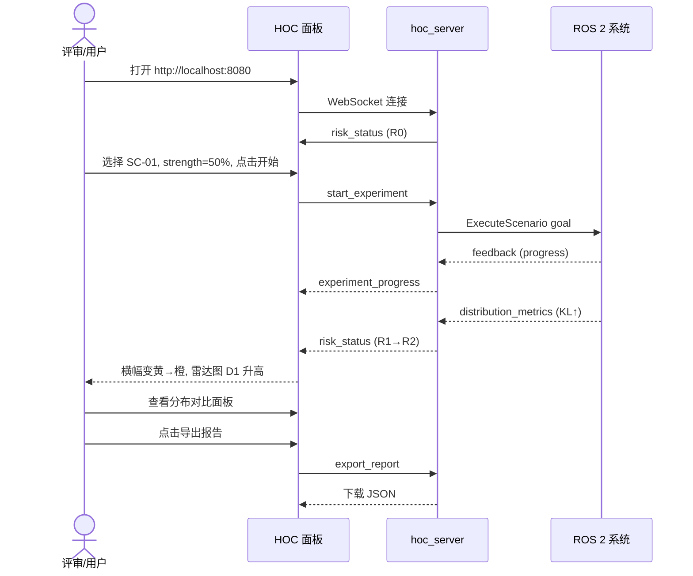
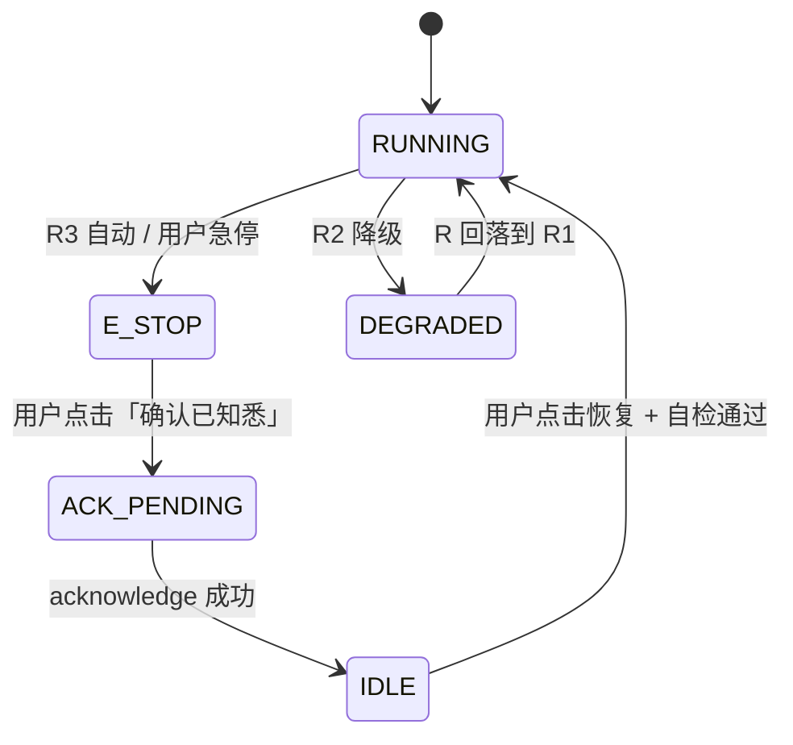

# 04 · 人机运维控制台（HOC）设计

**文档版本**：v0.1  
**依赖**：[01 · 系统架构与需求](./01-system-architecture-and-requirements.md)、[02 · 接口设计](./02-interface-design.md)  
**实现包**：`hoc_console`

---

## 1. 设计目标

### 1.1 用户画像

| 角色 | 目标 | 关键需求 |
|------|------|---------|
| **开发者（本人）** | 调试节点、标定阈值、录制实验 | 原始数据下钻、参数热更新 |
| **面试官/评审** | 快速理解系统能力 | 一屏态势感知、3min 内可演示 |
| **运维操作员** | 监控系统安全运行 | 告警分级、急停、恢复互锁 |

### 1.2 HCI 设计原则

| 原则 | 落地 |
|------|------|
| **态势感知 > 数据堆砌** | 首屏：风险等级 + 趋势箭头 + 主因 |
| **渐进式披露** | 概览 → 维度下钻 → 原始时序 |
| **操作可逆** | 参数调节有快照/撤销；急停有明确复位流程 |
| **认知负荷最小化** | 五维雷达图 + 颜色编码；避免裸露数组 |
| **告警分级推送** | R0-R1 面板静默；R2 高亮；R3 模态弹窗 |

---

## 2. 技术选型

### 2.1 架构

```
┌─────────────────────────────────────────────────────────┐
│  Browser (React + TypeScript)                          │
│  ├── Dashboard 主面板                                    │
│  ├── DistributionPanel 分布对比                          │
│  ├── RiskRadar 风险雷达                                  │
│  └── ExperimentControl 实验控制                          │
└────────────────────┬────────────────────────────────────┘
                     │ WebSocket (ws://localhost:8765)
┌────────────────────▼────────────────────────────────────┐
│  hoc_server (Python, rclpy + asyncio)                   │
│  ├── RosBridge: 订阅 /risk, /monitor 话题                │
│  ├── WsHub: 广播 JSON 帧到所有客户端                      │
│  ├── ActionClient: /hoc/execute_scenario                │
│  └── ServiceProxy: 急停、确认、导出、录制                  │
└────────────────────┬────────────────────────────────────┘
                     │ ROS 2 DDS
┌────────────────────▼────────────────────────────────────┐
│  dist_monitor / risk_engine / pybullet_bridge           │
└─────────────────────────────────────────────────────────┘
```

### 2.2 技术栈

| 层级 | 选型 | 理由 |
|------|------|------|
| **前端框架** | React 18 + TypeScript | 组件化、作品集生态成熟 |
| **构建工具** | Vite | 快速 HMR，轻量 |
| **图表库** | ECharts 5 | 雷达图、时序、直方图一体 |
| **UI 组件** | Ant Design 5 | 暗色主题、表格/滑块/告警开箱即用 |
| **状态管理** | Zustand | 比 Redux 轻，适合实时流 |
| **WebSocket** | 原生 WebSocket + 重连逻辑 | 无额外依赖 |
| **后端** | Python 3.12 + rclpy + websockets | 与 ROS 2 节点同语言，减少桥接层 |
| **静态资源服务** | aiohttp 或 FastAPI StaticFiles | 生产构建后托管 `dist/` |
| **备选方案** | Foxglove Studio + 自定义 Panel | 若前端开发时间不足 |

### 2.3 目录结构

```
hoc_console/
├── hoc_server/
│   ├── __init__.py
│   ├── server_node.py          # ROS 2 节点入口
│   ├── ros_bridge.py           # 话题订阅 → 内部事件
│   ├── ws_hub.py               # WebSocket 广播
│   └── experiment_runner.py    # ExecuteScenario Action 客户端
├── frontend/
│   ├── src/
│   │   ├── App.tsx
│   │   ├── components/
│   │   │   ├── RiskBanner.tsx
│   │   │   ├── RiskRadar.tsx
│   │   │   ├── DistributionPanel.tsx
│   │   │   ├── TrackingChart.tsx
│   │   │   ├── AlertTimeline.tsx
│   │   │   ├── ExperimentControl.tsx
│   │   │   └── EStopButton.tsx
│   │   ├── hooks/
│   │   │   └── useWebSocket.ts
│   │   ├── stores/
│   │   │   └── dashboardStore.ts
│   │   └── types/
│   │       └── messages.ts
│   ├── package.json
│   └── vite.config.ts
├── launch/
│   └── hoc.launch.py
└── package.xml
```

---

## 3. 页面线框

### 3.1 主面板（Dashboard）

```
┌──────────────────────────────────────────────────────────────────────────┐
│  ◉ Sim2Real Monitor          [R1 关注] 综合风险 0.32 ↑    ⏱ 00:15:23  │
│                                              [⏸ 暂停] [🔴 急停] [↻ 恢复] │
├────────────────────┬─────────────────────────────┬─────────────────────────┤
│                    │                             │                         │
│   风险雷达图        │     分布对比面板             │    轨迹跟踪面板          │
│   (五维)           │                             │                         │
│                    │  ┌─ Sim ─┐  ┌─ Real ─┐    │   关节误差时序           │
│      D1            │  │ ▁▃▅▇  │  │ ▂▄▆█  │    │   ── J1 ── J2 ── J3    │
│   D5    D2         │  └───────┘  └───────┘    │                         │
│      D4  D3        │                             │   末端位姿偏差           │
│                    │  KL mean: 0.12  MMD: 0.04   │   Δx Δy Δz             │
│  主因: 分布偏移     │  p-value: 0.03  ⚠ 检出偏移  │                         │
│                    │                             │                         │
├────────────────────┴─────────────────────────────┴─────────────────────────┤
│  实验控制                                                                  │
│  场景: [SC-01 点到点 ▼]  种子: [42    ]  随机化强度: ═══════●═══ 50%      │
│  [▶ 开始实验]  [⏺ 录制]  [📥 导出报告]                                      │
├──────────────────────────────────────────────────────────────────────────┤
│  告警时间线                                                                 │
│  14:32:08  R1→R2  分布偏移  KL=0.82  建议: 检查阻尼参数                      │
│  14:30:15  INFO   规划完成  SC-01  耗时 1.2s                               │
│  14:28:00  INFO   实验开始  seed=42  strength=0.5                          │
└──────────────────────────────────────────────────────────────────────────┘
```

### 3.2 风险等级视觉编码

| 等级 | 背景色 | 边框 | 动效 |
|------|--------|------|------|
| R0 正常 | `#f6ffed` | `#52c41a` | 无 |
| R1 关注 | `#fffbe6` | `#faad14` | 无 |
| R2 警告 | `#fff7e6` | `#fa8c16` | 顶部横幅闪烁 |
| R3 严重 | `#fff1f0` | `#f5222d` | 全屏模态 + 急停确认 |

### 3.3 R3 急停模态

```
┌─────────────────────────────────────────┐
│  ⚠ 严重风险 — 系统已急停                  │
│                                         │
│  综合得分: 0.82                          │
│  主因: 分布偏移 (KL=0.91)                │
│  建议: 检查域随机化参数；勿强制恢复         │
│                                         │
│  操作员 ID: [___________]                │
│  备注:     [___________]                │
│                                         │
│  [确认已知悉]          [暂不恢复]         │
└─────────────────────────────────────────┘
```

### 3.4 分布对比下钻页

```
┌──────────────────────────────────────────────────────────┐
│  ← 返回主面板          分布对比详情 — 关节 J3              │
├──────────────────────────────────────────────────────────┤
│  [直方图]  [核密度曲线]  [时序]                             │
│                                                          │
│     Sim ■  Real ■  误差 ε                                │
│     ▁▂▃▅▆▇█                                             │
│                                                          │
│  KL(J3)=0.23   窗口样本数: 487   窗口时长: 5.0s           │
├──────────────────────────────────────────────────────────┤
│  MMD 时序曲线（近 5min）                                   │
│  0.08 ┤        ╭─╮                                       │
│  0.04 ┤──╮  ╭──╯ ╰──                                    │
│  0.00 ┤──╰──╯                                            │
└──────────────────────────────────────────────────────────┘
```

---

## 4. WebSocket 协议

### 4.1 连接

```
URL: ws://localhost:8765/ws
重连: 指数退避 [1s, 2s, 4s, 8s, max 30s]
心跳: 客户端每 30s 发送 {"type": "ping"}，服务端回复 {"type": "pong"}
```

### 4.2 服务端 → 客户端（推送帧）

统一信封格式：

```json
{
  "type": "<message_type>",
  "timestamp": {"sec": 1718793600, "nanosec": 0},
  "payload": { }
}
```

| type | 频率 | payload 字段 |
|------|------|-------------|
| `risk_status` | 5Hz | 同 `RiskStatus.msg` JSON 化 |
| `distribution_metrics` | 5Hz | 同 `DistributionMetrics.msg` |
| `tracking_error` | 5Hz | `{joint_names, errors[]}` |
| `system_state` | 1Hz | `{state: "RUNNING"}` |
| `alert_event` | 事件 | 同 `/risk/alerts` JSON |
| `experiment_progress` | 1Hz | ExecuteScenario feedback |
| `recording_status` | 事件 | `{recording: bool, bag_path: ""}` |

**`risk_status` 示例**：

```json
{
  "type": "risk_status",
  "timestamp": {"sec": 1718793600, "nanosec": 500000000},
  "payload": {
    "level": 2,
    "level_name": "R2",
    "composite_score": 0.58,
    "primary_driver": "distribution_shift",
    "recommendation": "检查域随机化参数范围",
    "attribution": [
      {"dimension": "distribution_shift", "raw_score": 0.72, "weighted_score": 0.252, "weight": 0.35, "is_primary_driver": true},
      {"dimension": "tracking_error", "raw_score": 0.45, "weighted_score": 0.1125, "weight": 0.25, "is_primary_driver": false}
    ],
    "e_stop_active": false,
    "degraded_mode": true
  }
}
```

### 4.3 客户端 → 服务端（指令）

```json
{"type": "command", "action": "<action_name>", "params": { }}
```

| action | params | 后端行为 |
|--------|--------|---------|
| `e_stop` | `{}` | 调用 `/risk/force_e_stop` |
| `pause` | `{}` | 调用 `/bridge/set_mode` + 系统状态 PAUSED |
| `resume` | `{}` | 需先 `acknowledge`（若 R3） |
| `acknowledge` | `{operator_id, comment}` | 调用 `/risk/acknowledge` |
| `set_randomization` | `{strength, seed, ...}` | 调用 `/bridge/set_randomization` |
| `start_experiment` | `{scenario_id, seed, strength, record}` | 发送 `ExecuteScenario` goal |
| `start_recording` | `{}` | 调用 `/hoc/start_recording` |
| `stop_recording` | `{}` | 调用 `/hoc/stop_recording` |
| `export_report` | `{format, path}` | 调用 `/hoc/export_experiment` |
| `inject_shift` | `{parameter, delta_percent, duration}` | 调用 `/bridge/inject_shift` |

### 4.4 响应

```json
{
  "type": "command_result",
  "action": "e_stop",
  "success": true,
  "message": "E-stop triggered"
}
```

---

## 5. 核心组件规格

### 5.1 `RiskBanner`

| 属性 | 类型 | 说明 |
|------|------|------|
| `level` | 0-3 | 当前风险等级 |
| `score` | float | 综合得分 |
| `trend` | `up`/`down`/`stable` | 与 30s 前对比 |
| `primaryDriver` | string | 主因维度 |

### 5.2 `RiskRadar`

- ECharts `radar` 系列
- 五轴：D1~D5，最大值归一化到 1.0
- 当前帧 + 30s 前虚线对比

### 5.3 `DistributionPanel`

| 视图 | 图表类型 | 数据源 |
|------|---------|--------|
| 直方图 | `bar` 叠加 | 后端推送分箱数据（可选扩展）或前端滚动缓存 |
| KL/MMD 曲线 | `line` | `distribution_metrics` 历史 |
| 检出状态 | `badge` | `shift_detected` |

### 5.4 `EStopButton`

- 直径 ≥ 64px 红色圆形按钮
- 点击后 **500ms 内** UI 进入 `E_STOP` 状态
- 禁用双击（防抖 1s）
- 键盘快捷键：`Space`（需焦点不在输入框）

### 5.5 `ExperimentControl`

| 控件 | 绑定 |
|------|------|
| 场景下拉 | SC-01 ~ SC-05 |
| 种子输入 | `int32` |
| 随机化滑块 | `[0, 100]%` → `strength [0, 1]` |
| 开始按钮 | `start_experiment` 命令 |
| 录制开关 | `start/stop_recording` |

---

## 6. 关键交互流程

### 6.1 标准演示流程（面试官 3min）



### 6.2 急停与恢复



### 6.3 参数在线调节

1. 用户拖动「随机化强度」滑块至 70%
2. 前端发送 `set_randomization` 命令
3. `hoc_server` 调用 `/bridge/set_randomization` 服务
4. `pybullet_bridge` 在**下一控制周期**应用新参数
5. `randomization_config` 话题回显，前端确认生效

---

## 7. 后端实现要点

### 7.1 `hoc_server` 节点

```python
class HocServerNode(Node):
    """rclpy 节点 + asyncio WebSocket 服务并行运行"""

    def __init__(self):
        super().__init__('hoc_server')
        # 订阅
        self.create_subscription(RiskStatus, '/risk/status', self.on_risk, 10)
        self.create_subscription(DistributionMetrics, '/monitor/distribution_metrics', self.on_metrics, 10)
        # 服务代理
        self.e_stop_client = self.create_client(Trigger, '/risk/force_e_stop')
        # Action 客户端
        self.scenario_client = ActionClient(self, ExecuteScenario, '/hoc/execute_scenario')

    def on_risk(self, msg: RiskStatus):
        asyncio.run_coroutine_threadsafe(
            self.ws_hub.broadcast('risk_status', self._to_dict(msg)),
            self.loop
        )
```

### 7.2 推送节流

| 话题 | 原始频率 | 推送频率 | 方法 |
|------|---------|---------|------|
| `/risk/status` | 10Hz | 5Hz | 最新值采样（drop intermediate） |
| `/monitor/distribution_metrics` | 10Hz | 5Hz | 同上 |
| `/risk/alerts` | 事件 | 全推送 | 无节流 |

### 7.3 历史缓冲

前端本地维护 **5min 滚动历史**（`distribution_metrics` + `risk_status`），用于时序图。后端可选提供 `GET /api/history?seconds=300` REST 接口（首版可省略）。

---

## 8. 实验报告导出格式

### 8.1 JSON 结构

```json
{
  "experiment_id": "exp_20260619_143200",
  "metadata": {
    "scenario_id": "SC-01",
    "random_seed": 42,
    "randomization_strength": 0.5,
    "duration_sec": 120.5,
    "git_commit": "abc1234"
  },
  "summary": {
    "max_risk_level": 2,
    "max_composite_score": 0.68,
    "shift_detected_count": 15,
    "shift_detected_ratio": 0.125,
    "mean_kl": 0.18,
    "max_kl": 0.91,
    "mean_mmd": 0.04
  },
  "risk_timeline": [
    {"t": 0.0, "level": 0, "score": 0.05},
    {"t": 32.1, "level": 2, "score": 0.58}
  ],
  "alerts": [ ],
  "recommendation": "..."
}
```

### 8.2 CSV 列

```
timestamp_sec, risk_level, composite_score, kl_mean, mmd_stat, mmd_p_value, shift_detected
```

---

## 9. 启动与部署

### 9.1 开发模式

```bash
# 终端 1：ROS 系统
ros2 launch pybullet_bridge full_system.launch.py

# 终端 2：HOC 后端
ros2 run hoc_console hoc_server --ros-args -p websocket_port:=8765

# 终端 3：前端
cd hoc_console/frontend && npm run dev
# 访问 http://localhost:5173
```

### 9.2 生产模式（作品集演示）

```bash
cd hoc_console/frontend && npm run build
ros2 launch hoc_console hoc.launch.py
# 访问 http://localhost:8080（后端托管 dist/）
```

### 9.3 launch 文件

```python
# hoc_console/launch/hoc.launch.py
from launch import LaunchDescription
from launch_ros.actions import Node

def generate_launch_description():
    return LaunchDescription([
        Node(
            package='hoc_server',
            executable='hoc_server',
            parameters=[{
                'websocket_port': 8765,
                'http_port': 8080,
                'push_frequency_hz': 5.0,
            }],
        ),
    ])
```

---

## 10. 非功能性要求对照

| 需求 ID | 目标 | 实现手段 |
|---------|------|---------|
| FR-HOC-01 | 推送延迟 < 200ms | 5Hz 节流 + 本地 WebSocket |
| FR-HOC-03 | 急停 < 100ms | 直接服务调用，不经队列 |
| NFR-P04 | 刷新 ≥ 5Hz | `push_frequency_hz=5` |
| NFR-S05 | 恢复互锁 | R3 模态 + `acknowledge` 服务门禁 |

---

## 11. 实现检查清单

- [ ] 初始化 `frontend/`（Vite + React + TS + Ant Design + ECharts）
- [ ] 实现 `useWebSocket` hook（重连 + 心跳）
- [ ] 实现 `RiskBanner`、`RiskRadar`、`DistributionPanel`、`EStopButton`
- [ ] 实现 `hoc_server` ROS 节点 + `ws_hub`
- [ ] 对接全部 WebSocket 命令与 ROS 服务
- [ ] 实现 `ExecuteScenario` Action 服务端（或在 `hoc_server` 中）
- [ ] 暗色主题适配（作品集演示友好）
- [ ] 录制 3min 演示视频脚本

---

**上一篇**：[03 · 分布监控算法详设](./03-distribution-monitoring-algorithm.md)  
**返回索引**：[文档索引](./README.md)
