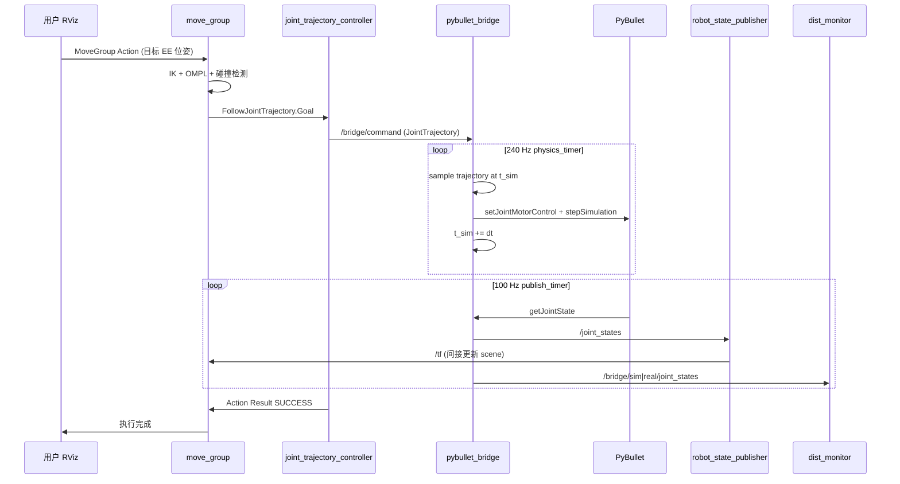

# 05 · ROS2 节点接口设计与数据流规格说明书

**文档版本**：v1.0  
**依赖**：[01 · 系统架构与需求](./01-system-architecture-and-requirements.md)、[02 · 接口设计](./02-interface-design.md)  
**实现对照**：`pybullet_bridge/`、`moveit_config/`、`bridge_monitor_msgs/`  
**目标读者**：实现/评审 PyBullet 桥接、MoveIt2 集成、Sim2Real 监控的工程师

---

## 1. 文档范围与节点总览

### 1.1 控制闭环中的节点角色

| 节点 | 包 | 语言 | 在闭环中的职责 |
|------|-----|------|----------------|
| `move_group` | MoveIt2 | C++ | 接收规划/执行请求，碰撞检测，OMPL 规划，调用 FollowJointTrajectory |
| `ros2_control_node` | ros2_control | C++ | 加载 `joint_trajectory_controller`，将 Action 轨迹转为 Topic 指令 |
| `robot_state_publisher` | robot_state_publisher | C++ | 订阅 `/joint_states`，发布 `/tf`、`/tf_static` |
| `pybullet_bridge` | pybullet_bridge | Python | **物理仿真核心**：Clock Sync、stepSimulation、状态回读 |
| `dist_monitor` | dist_monitor | Python | 双源关节状态对比，KL/MMD |
| `risk_engine` | risk_engine | Python | 风险聚合，急停联动 |
| `hoc_server` | hoc_console | Python | Web 运维控制台 |

### 1.2 架构数据通路（简图）

```
RViz2 拖拽末端
    → move_group (IK + OMPL + 碰撞检测)
    → FollowJointTrajectory Action
    → joint_trajectory_controller
    → /bridge/command (JointTrajectory)
    → pybullet_bridge (Clock Sync + stepSimulation)
    → /joint_states
    → robot_state_publisher → /tf
    → move_group (PlanningSceneMonitor 当前状态)
    → dist_monitor / risk_engine (侧向监控)
```

---

## 2. PyBullet 仿真节点设计

### 2.1 节点拆分建议

当前实现采用 **单节点 + 双定时器** 架构（`PyBulletBridgeNode`），内部模块化为：

| 模块 | 类/文件 | 职责 |
|------|---------|------|
| 仿真源 | `SimSource` | PyBullet 连接、URDF 加载、单步物理、读关节状态 |
| 伪真源 | `RealSource` | 第二 PyBullet 实例 + 域随机化（Sim2Real 对比） |
| 轨迹执行 | `TrajectoryExecutor` | `JointTrajectory` 时间插值 → 位置目标 |
| 桥接节点 | `PyBulletBridgeNode` | ROS 接口、定时器调度、Clock Sync |

> **设计原则**：物理步进与 ROS 发布解耦——物理 240 Hz，状态发布 100 Hz，避免 `stepSimulation()` 阻塞 DDS 回调。

### 2.2 仿真时间同步（Clock Sync）设计

#### 2.2.1 核心约束

PyBullet 在 `setRealTimeSimulation(0)` 下**不会自动推进时间**，必须由外部循环调用 `stepSimulation()`。ROS2 侧需要解决三个时钟对齐问题：

| 时钟 | 用途 | 来源 |
|------|------|------|
| **仿真时间** `t_sim` | 轨迹插值、`stepSimulation` 计数 | PyBullet 内部步数 × `dt` |
| **ROS 时间** | `JointState.header.stamp`、`/clock` | `rclcpp/rclpy::Clock` |
| **单调时间** | 看门狗、性能测量 | `time.monotonic()` |

#### 2.2.2 推荐模式：双定时器 + 手动步进（当前实现）

```
physics_timer (1/physics_frequency)
    ├── 轨迹采样: targets = trajectory.sample(t_sim)
    ├── 下发目标: sim.set_position_targets_by_name(targets)
    ├── 物理步进: sim.step() → stepSimulation() × 1
    └── t_sim += dt_physics

publish_timer (1/publish_frequency)
    ├── stamp = node.get_clock().now()
    ├── 读状态: snapshot = sim.read_state()
    └── 发布 /joint_states, /bridge/sim/joint_states, ...
```

**关键 PyBullet 初始化参数**（与 `sim_source.py` 一致）：

```python
p.setTimeStep(1.0 / physics_frequency)      # dt，如 240Hz → 1/240 s
p.setRealTimeSimulation(0)                  # 禁用实时模式，由定时器驱动
p.loadURDF(..., flags=p.URDF_USE_INERTIA_FROM_FILE)
```

#### 2.2.3 进阶模式：发布 `/clock`（use_sim_time 全栈同步）

当需要 rosbag 回放、多节点严格时间对齐时，桥接节点应成为 **仿真时钟源**：

```
每 stepSimulation 一次:
    sim_step_count += 1
    sim_time = sim_step_count * dt
    clock_msg.clock.sec = floor(sim_time)
    clock_msg.clock.nanosec = (sim_time - sec) * 1e9
    /clock.publish(clock_msg)

所有节点 launch 参数: use_sim_time := true
TrajectoryExecutor 采样改用: node.get_clock().now() 而非 monotonic
```

| 模式 | 优点 | 缺点 | 适用 |
|------|------|------|------|
| monotonic + ROS stamp 分离 | 实现简单，不依赖 `/clock` | 轨迹时间与 ROS sim time 可能微偏 | 当前 M1/M2 脚手架 |
| `/clock` 驱动 | MoveIt/rosbag/多节点一致 | 需全栈 `use_sim_time` | 正式 Demo / 回放 |

#### 2.2.4 轨迹时间与物理时间的绑定

MoveIt2 输出的 `JointTrajectoryPoint.time_from_start` 是**相对轨迹起点**的时间。桥接层必须在收到轨迹时记录 `t_start`：

```
收到 /bridge/command:
    t_start = t_sim          # 或 get_clock().now()（use_sim_time 模式）

physics_step 中:
    elapsed = t_sim - t_start
    在 points 间线性插值 → 关节目标位置
```

看门狗：若 `(monotonic_now - last_command_time) > watchdog_timeout_ms`，清空轨迹并 hold 当前位置，防止僵尸指令。

### 2.3 Python 伪代码（与仓库实现对齐）

```python
class PyBulletBridgeNode(Node):
    def __init__(self):
        super().__init__('pybullet_bridge')
        # --- 参数 ---
        physics_hz = 240.0
        publish_hz = 100.0
        self.dt = 1.0 / physics_hz
        self.sim_step_count = 0

        # --- PyBullet 初始化 ---
        self.sim = SimSource(SimSourceConfig(
            urdf_path=urdf_path,
            physics_frequency=physics_hz,
            use_gui=(sim_mode == 'GUI'),
        ))
        self.sim.initialize()  # setTimeStep, setRealTimeSimulation(0), loadURDF

        self.trajectory = TrajectoryExecutor()
        self.t_sim = 0.0  # 或用 sim_step_count * dt

        # --- ROS 接口 ---
        self.pub_joint = create_publisher(JointState, '/joint_states', SENSOR_QOS)
        self.sub_cmd   = create_subscription(JointTrajectory, '/bridge/command', self.on_command, 10)

        # --- 双定时器：物理与发布分离 ---
        create_timer(self.dt, self.on_physics_step)
        create_timer(1.0 / publish_hz, self.on_publish)

    def on_command(self, msg: JointTrajectory):
        self.trajectory.set_trajectory(msg, start_time_sec=self.t_sim)
        self.last_command_mono = time.monotonic()

    def on_physics_step(self):
        if self.paused or self.e_stop:
            return
        # 看门狗
        if self.trajectory.has_active and watchdog_expired():
            self.trajectory.clear()

        targets = self.trajectory.sample(self.t_sim)
        self.sim.set_position_targets_by_name(targets)
        self.sim.step()                    # 内部: setJointMotorControl + stepSimulation()
        self.t_sim += self.dt
        self.sim_step_count += 1
        # 可选: publish /clock from self.t_sim

    def on_publish(self):
        stamp = self.get_clock().now().to_msg()
        snap = self.sim.read_state()
        self.pub_joint.publish(to_joint_state(snap, stamp))
        # robot_state_publisher 据此发布 /tf
```

### 2.4 C++ 伪代码（等价 rclcpp 实现 sketch）

```cpp
class PyBulletBridgeNode : public rclcpp::Node {
public:
  PyBulletBridgeNode() : Node("pybullet_bridge"), dt_(1.0 / 240.0), t_sim_(0.0) {
    sim_.initialize(urdf_path, /*physics_hz=*/240.0, /*gui=*/false);

    joint_pub_ = create_publisher<sensor_msgs::msg::JointState>(
        "/joint_states", rclcpp::SensorDataQoS());
    cmd_sub_ = create_subscription<trajectory_msgs::msg::JointTrajectory>(
        "/bridge/command", 10,
        [this](const trajectory_msgs::msg::JointTrajectory::SharedPtr msg) {
          trajectory_.setTrajectory(*msg, t_sim_);
          last_command_time_ = now();
        });

    physics_timer_ = create_wall_timer(
        std::chrono::duration<double>(dt_),
        [this]() { onPhysicsStep(); });

    publish_timer_ = create_wall_timer(
        std::chrono::milliseconds(10),
        [this]() { onPublish(); });
  }

private:
  void onPhysicsStep() {
    if (paused_ || e_stop_) return;
    auto targets = trajectory_.sample(t_sim_);
    sim_.setPositionTargets(targets);
    sim_.step();  // bullet::stepSimulation once
    t_sim_ += dt_;
  }

  void onPublish() {
    auto stamp = get_clock()->now();
    auto snap = sim_.readState();
    joint_pub_->publish(toJointState(snap, stamp));
  }

  SimSource sim_;
  TrajectoryExecutor trajectory_;
  double dt_, t_sim_;
};
```

> **C++ vs Python 选型**：PyBullet 官方 Python API 更完整；C++ 可通过 `pybullet` 的 C API 或 `BulletRobotics` 绑定。本项目选 Python 以降低 MoveIt 集成迭代成本。

### 2.5 SimSource 单步逻辑（物理层伪代码）

```python
def step(self) -> JointStateSnapshot:
    self._apply_position_control()   # POSITION_CONTROL + effort limits
    p.stepSimulation()               # 推进 dt = 1/physics_frequency
    return self.read_state()         # getJointState → pos, vel, applied torque

def _apply_position_control(self):
    p.setJointMotorControlArray(
        bodyUniqueId=robot_id,
        jointIndices=revolute_prismatic_indices,
        controlMode=p.POSITION_CONTROL,
        targetPositions=self._target_positions,
        forces=self._effort_limits,   # 来自 URDF <limit effort="...">
    )
```

---

## 3. ROS2 通信接口设计

> 完整消息字段见 [02 · 接口设计](./02-interface-design.md)。本节按**控制闭环优先级**重排并补充 Action/TF 细节。

### 3.1 Topics

#### 3.1.1 控制闭环（必接）

| 话题 | 类型 | 方向 | 频率 | QoS | 说明 |
|------|------|------|------|-----|------|
| `/joint_states` | `sensor_msgs/JointState` | bridge → 全局 | 100 Hz | SensorData | **MoveIt 当前状态反馈**；`robot_state_publisher` 输入 |
| `/bridge/command` | `trajectory_msgs/JointTrajectory` | controller → bridge | 事件 ~50 Hz | Reliable, depth=10 | ros2_control 轨迹转发入口 |
| `/tf` | `tf2_msgs/TFMessage` | rsp → 全局 | 100 Hz | 默认 | 由 `robot_state_publisher` 根据 `/joint_states` 计算 |
| `/tf_static` | `tf2_msgs/TFMessage` | rsp → 全局 | 静态 | Latched | `base_link` 等固定变换 |
| `/robot_description` | param (`string`) | launch → 全局 | — | — | URDF 全文 |
| `/robot_description_semantic` | param (`string`) | launch → 全局 | — | — | SRDF 全文 |

**JointState 字段约定**：

```yaml
header.stamp:  与 bridge 发布时刻一致（use_sim_time 时来自 /clock）
name:          ["joint1", "joint2", ...]  # 与 URDF、MoveIt、控制器完全一致
position:      [rad] 或 [m]（prismatic）
velocity:      [rad/s] 或 [m/s]
effort:        [Nm] 或 [N]；PyBullet appliedJointMotorTorque
```

#### 3.1.2 MoveIt2 / 可视化（标准）

| 话题 | 类型 | 说明 |
|------|------|------|
| `/display_planned_path` | `moveit_msgs/DisplayTrajectory` | RViz 显示规划路径 |
| `/monitored_planning_scene` | `moveit_msgs/PlanningScene` | 碰撞场景（含 robot state） |
| `/attached_collision_object` | `moveit_msgs/AttachedCollisionObject` | 附加碰撞体 |
| `/planning_scene` | `moveit_msgs/PlanningScene` | 场景 diff（可选） |

#### 3.1.3 桥接层扩展 `/bridge/*`

| 话题 | 类型 | 说明 |
|------|------|------|
| `/bridge/sim/joint_states` | `JointState` | Sim-Source 原始（监控用） |
| `/bridge/real/joint_states` | `JointState` | Real-Source 带随机化（监控用） |
| `/bridge/sim/joint_torques` | `JointState` | 仅 effort 字段有效 |
| `/bridge/system_state` | `std_msgs/String` | `IDLE`/`RUNNING`/`PAUSED`/`E_STOP` |
| `/bridge/randomization_config` | `DomainRandomizationConfig` | 域随机化回显 |
| `/bridge/experiment_metadata` | `ExperimentMetadata` | 实验元数据 |

#### 3.1.4 监控 / 风险 / HOC

| 前缀 | 核心话题 | 类型 |
|------|----------|------|
| `/monitor` | `distribution_metrics`, `tracking_error`, `comm_health` | 自定义 + 标准 |
| `/risk` | `status`, `alerts`, `planning_stats` | 自定义 + Diagnostic |
| `/hoc` | WebSocket 桥接，无额外硬编码 Topic | — |

### 3.2 Services

#### 3.2.1 桥接层（仿真控制）

| 服务 | 类型 | 说明 |
|------|------|------|
| `/bridge/set_randomization` | `bridge_monitor_msgs/SetRandomization` | 在线更新域随机化 |
| `/bridge/inject_shift` | `bridge_monitor_msgs/InjectShift` | 注入已知 Ground Truth 偏移 |
| `/bridge/reset_simulation` | `std_srvs/Trigger` | 重置姿态与 sim time |
| `/bridge/set_mode` | `std_srvs/SetBool` | `true`=运行, `false`=暂停 |

#### 3.2.2 监控 / 风险 / HOC

见 [02 · 接口设计 §4](./02-interface-design.md#4-服务services)。

### 3.3 Actions

#### 3.3.1 MoveIt2 标准（控制闭环核心）

| Action | 类型 | 客户端 | 服务端 | 数据流 |
|--------|------|--------|--------|--------|
| `/move_action` | `moveit_msgs/action/MoveGroup` | RViz / Demo / HOC | `move_group` | 目标位姿 → 规划 → 执行 |
| `/arm_controller/follow_joint_trajectory` | `control_msgs/action/FollowJointTrajectory` | `move_group` | `joint_trajectory_controller` | 时间参数化轨迹 → `/bridge/command` |

**FollowJointTrajectory 与 `/bridge/command` 的衔接**：

```
move_group 执行阶段:
    发送 FollowJointTrajectory.Goal.trajectory
        ↓
joint_trajectory_controller (ros2_control):
    按 ros2_control 时钟采样 trajectory
    转发为 JointTrajectory → /bridge/command
        ↓
pybullet_bridge:
    TrajectoryExecutor 按 t_sim 插值
    POSITION_CONTROL + stepSimulation
        ↓
/joint_states 反馈 → controller 关闭 Action → move_group 完成
```

> **注意**：若 controller 与 bridge 各做一遍时间插值，会导致双重插值。推荐方案 A——controller **透传**完整 `JointTrajectory` 给 bridge，由 bridge 统一按 `t_sim` 采样；或方案 B——controller 以 50 Hz 发布**单点** trajectory（仅当前目标），bridge 不做插值。

#### 3.3.2 自定义 Action

| Action | 类型 | 说明 |
|--------|------|------|
| `/hoc/execute_scenario` | `bridge_monitor_msgs/ExecuteScenario` | 一键运行 SC-01~SC-05 验证场景 |

### 3.4 TF 树约定

```
world
 └── base_link                    (fixed 或 robot root)
      └── link1 → link2 → tool0   (robot_state_publisher 由 /joint_states 驱动)
```

| Frame | 发布者 | MoveIt 配置 |
|-------|--------|-------------|
| `world` | 静态 / `static_transform_publisher` | `move_group` 规划参考系 |
| `base_link` | URDF root | SRDF `manipulator` 链起点 |
| `tool0` | URDF `ee_fixed_joint` | SRDF 链终点 / EE 目标 |

**关键约束**：MoveIt 的 `end_effector` / `tip_link` 必须与 URDF 中 `tool0`（或等价 link）一致；`robot_state_publisher` 必须订阅 bridge 发布的 `/joint_states`，而非 fake joint states。

### 3.5 ros2_control 转发配置（待接入）

`joint_trajectory_controller` 需将输出映射到 `/bridge/command`。典型 `ros2_controllers.yaml` 片段：

```yaml
controller_manager:
  ros__parameters:
    update_rate: 100  # 与 publish_frequency 协调

arm_controller:
  type: joint_trajectory_controller/JointTrajectoryController
  joints: [joint1, joint2]
  command_interfaces: [position]
  state_interfaces: [position, velocity]

# 自定义 relay 节点或 controller 插件订阅 controller 内部 trajectory，
# 发布到 /bridge/command（脚手架阶段可直接由 demo 节点 publish）
```

---

## 4. MoveIt2 与 PyBullet 联合工作配置清单

### 4.1 必配参数文件（`moveit_config/`）

| 文件 | 关键内容 | 与 PyBullet 的关系 |
|------|----------|-------------------|
| `config/moveit_controllers.yaml` | `FollowJointTrajectory`、`joints` 列表、`action_ns` | 关节名必须与 URDF/PyBullet 一致 |
| `config/ompl_planning.yaml` | `planning_time`、`planning_attempts`、默认规划器 | 规划轨迹时间尺度需被 bridge 执行 |
| `config/joint_limits.yaml` | `max_velocity`、`max_acceleration` | 应 ≤ URDF `<limit>` 与 PyBullet 可达范围 |
| `config/kinematics.yaml` | IK 插件、`kinematics_solver` | 拖拽末端 IK 依赖 |
| `srdf/*.srdf` | `planning_group`、`disable_collisions` | 碰撞对与 PyBullet 碰撞体一致时可减少误报 |

当前仓库示例：

```yaml
# moveit_controllers.yaml
arm_controller:
  type: FollowJointTrajectory
  action_ns: follow_joint_trajectory
  default: true
  joints: [joint1, joint2]
```

### 4.2 碰撞检测

| 配置项 | 建议值 | 说明 |
|--------|--------|------|
| `move_group` 规划场景 | 订阅 `/monitored_planning_scene` | 从 `/joint_states` 更新 robot state |
| SRDF `disable_collisions` | 相邻 link 标记 `Adjacent` | 避免自碰撞误报（如 `base_link`-`link1`） |
| 碰撞几何 | URDF `<collision>` 与 PyBullet 一致 | 简化 mesh 为 primitive 可提高两边一致性 |
| `padding` / `scale` | 默认 0，必要时微增 | PyBullet 接触比 FCL 更“软”，可略增 padding 保守规划 |

### 4.3 OMPL 规划器

```yaml
# ompl_planning.yaml 推荐扩展
planning_plugin: ompl_interface/OMPLPlanner
request_adapters: >-
  default_planner_request_adapters/AddTimeOptimalParameterization
  default_planner_request_adapters/FixWorkspaceBounds
  default_planner_request_adapters/FixStartStateBounds
  default_planner_request_adapters/FixStartStateCollision

manipulator:
  planner_configs:
    - RRTConnect
    - RRTstar
  projection_evaluator: joints(joint1,joint2)
  longest_valid_segment_fraction: 0.005
```

| 项 | 说明 |
|----|------|
| `AddTimeOptimalParameterization` | 为路径添加时间参数化，输出可执行 `JointTrajectory` |
| `RRTConnect` | 默认，适合交互拖拽后 replan |
| `default_velocity_scaling_factor` | 0.3~0.5，防止 PyBullet 跟踪不上 |

### 4.4 ros2_control 配置要点

1. **同一 URDF** 生成 `robot_description` 与 `ros2_control` xacro（`<ros2_control>` 标签定义 joint interfaces）。
2. **`joint_trajectory_controller`** 的 `joints` 与 MoveIt controller 配置一致。
3. **状态来源**：controller 的 `state_interfaces` 从 `/joint_states` 回读（`joint_state_broadcaster` 或自定义 relay），形成 **PyBullet → /joint_states → controller → move_group** 闭环。
4. **`update_rate`**：建议 100 Hz，与 bridge `publish_frequency` 匹配。
5. **无真实硬件时**：可用 `mock_components/GenericSystem` + relay 到 `/bridge/command`，或简化为 demo 节点直接 publish trajectory。

### 4.5 Launch 集成检查

```bash
# 全系统（当前脚手架）
ros2 launch pybullet_bridge full_system.launch.py sim_mode:=DIRECT

# MoveIt（需 ros2_control 完整链接后）
ros2 launch moveit_config move_group.launch.py use_sim_time:=false
```

| 检查项 | 命令 |
|--------|------|
| 关节名一致 | `ros2 topic echo /joint_states --once` 对比 SRDF |
| TF 链完整 | `ros2 run tf2_tools view_frames` |
| Action 可用 | `ros2 action list \| grep follow_joint_trajectory` |
| 轨迹到达 bridge | `ros2 topic hz /bridge/command` |

---

## 5. URDF 物理参数与 PyBullet 注意事项

### 5.1 质量、质心、惯性

| URDF 元素 | PyBullet 行为 | 注意事项 |
|-----------|---------------|----------|
| `<inertial><mass>` | 刚体质量 | 必须 > 0；过小（如 1e-6）导致数值不稳定 |
| `<inertial><origin xyz>` | **质心 COM** 相对 link frame | 错误 COM 导致重力矩异常、跟踪误差 |
| `<inertial><inertia ixx..izz>` | 惯性张量 | 需 physically consistent（正定性）；可配合 `URDF_USE_INERTIA_FROM_FILE` |
| 缺失 inertial | PyBullet 自动估算 | 与 MoveIt 质量模型不一致，Sim2Real 对比失真 |

**推荐**：每个可动 link 显式填写 inertial；加载 flags：

```python
p.loadURDF(path, flags=p.URDF_USE_INERTIA_FROM_FILE)
```

### 5.2 摩擦系数

URDF 标准**无**摩擦字段。PyBullet 在加载后通过 `changeDynamics` 设置：

```python
for link_idx in range(p.getNumJoints(robot_id)):
    p.changeDynamics(robot_id, link_idx,
        lateralFriction=0.8,
        spinningFriction=0.01,
        rollingFriction=0.01,
        linearDamping=0.04,
        angularDamping=0.04)
```

| 参数 | 典型范围 | 影响 |
|------|----------|------|
| `lateralFriction` | 0.4 ~ 1.2 | 抓取、接触任务 |
| `linearDamping` / joint damping | 0 ~ 0.5 | 跟踪振荡 vs 响应速度 |
| 域随机化 | Real-Source 扰动上述参数 | 本项目 Sim2Real 监控核心 |

### 5.3 关节与执行器

| URDF | PyBullet 映射 |
|------|---------------|
| `<limit effort="100">` | `setJointMotorControlArray(..., forces=[100,...])` |
| `<limit velocity="2.0">` | 需在控制层或 MoveIt `joint_limits.yaml` 对齐 |
| `<limit lower/upper>` | `resetJointState` 初值；MoveIt 硬限位 |
| `revolute` / `prismatic` | 仅这两种参与控制（`sim_source._discover_joints`） |
| `fixed` | 不参与控制，但影响 TF 链（如 `ee_fixed_joint` → `tool0`） |

### 5.4 碰撞与视觉

| 项 | 建议 |
|----|------|
| collision 几何 | 优先 box/cylinder/sphere；mesh 需凸分解否则 PyBullet 行为异常 |
| visual vs collision | 可不同；MoveIt 用 collision，RViz 用 visual |
| `useFixedBase=True` | 机械臂固定基座；移动底盘改 `False` |
| 单位 | URDF 默认 **米**、**弧度**；PyBullet 一致 |

### 5.5 MoveIt 与 PyBullet 模型一致性清单

- [ ] 关节名、顺序、限位完全一致  
- [ ] `tool0` / SRDF tip link 一致  
- [ ] 碰撞体覆盖运动链所有 link  
- [ ] inertial 已定义，`URDF_USE_INERTIA_FROM_FILE` 已启用  
- [ ] effort limit 与 PyBullet motor force 一致  
- [ ] 摩擦/阻尼在 Sim-Source 与 Real-Source 间有可控差异（监控验证）

---

## 6. 完整闭环数据流（用户拖拽末端 → 状态回 MoveIt2）

以下按时间顺序描述**单次交互运动**的全链路。

### 6.1 阶段 0：系统就绪

1. `full_system.launch.py` 启动 `pybullet_bridge`、`robot_state_publisher`、`dist_monitor`、`risk_engine`。
2. bridge 初始化 PyBullet：`setTimeStep(1/240)`、`setRealTimeSimulation(0)`、`loadURDF`。
3. 双定时器运行：240 Hz 物理步进，100 Hz 发布 `/joint_states`。
4. `robot_state_publisher` 订阅 `/joint_states`，发布 `/tf`（`base_link` → `link1` → `link2` → `tool0`）。
5. `move_group` 的 PlanningSceneMonitor 收到 `/joint_states`，内部维护**当前机器人状态**。

### 6.2 阶段 1：用户在 RViz2 拖拽末端

1. 用户在 RViz **MotionPlanning** 插件拖动交互 marker，设置目标位姿（相对 `world` 或 `base_link`）。
2. RViz 调用 `/move_action`（或 `/plan_kinematic_path` 服务），目标为 `move_group` 中 `manipulator` 组的 EE 位姿。
3. `move_group` 执行 **IK**（`kinematics.yaml` 配置的 solver），得到目标关节角 `q_goal`。
4. 若目标与当前状态有碰撞，Planning Scene（FCL）拒绝或触发 replan。

### 6.3 阶段 2：MoveIt2 规划

1. `move_group` 调用 **OMPL**（如 RRTConnect）在关节空间搜索无碰撞路径。
2. `AddTimeOptimalParameterization` 适配器为路径添加速度/加速度约束，生成带 `time_from_start` 的 `JointTrajectory`。
3. RViz 通过 `/display_planned_path` 显示规划曲线（可选确认后再执行）。

### 6.4 阶段 3：轨迹执行下发

1. 用户点击 **Plan & Execute** 后，`move_group` 作为 Action **client** 调用  
   `/arm_controller/follow_joint_trajectory`。
2. `joint_trajectory_controller` 接收 `FollowJointTrajectory.Goal`，其中包含完整 `JointTrajectory`（`joint_names` + `points[]`）。
3. Controller 将轨迹转发到 **`/bridge/command`**（direct relay 或按采样发布）。
4. `pybullet_bridge` 回调 `on_command`：`TrajectoryExecutor.set_trajectory(msg, t_start=t_sim)`。

### 6.5 阶段 4：PyBullet 驱动

1. 每个 **physics tick**（240 Hz）：
   - `elapsed = t_sim - t_start`
   - 插值得到 `q_target(elapsed)`
   - `setJointMotorControlArray(POSITION_CONTROL, targetPositions=q_target)`
   - `stepSimulation()` 推进 `dt = 1/240 s`
   - `t_sim += dt`
2. PyBullet 物理引擎计算关节力矩、接触、重力；实际 `q_actual` 可能略滞后于 `q_target`（跟踪误差来源之一）。

### 6.6 阶段 5：状态反馈

1. 每个 **publish tick**（100 Hz）：
   - bridge 读取 `getJointState` → 组装 `sensor_msgs/JointState`
   - 发布 **`/joint_states`**（主反馈）及 `/bridge/sim/joint_states`
2. `robot_state_publisher` 更新 `/tf`，RViz 中机器人模型与 PyBullet 姿态同步。
3. `joint_trajectory_controller` / `move_group` 通过 `/joint_states` 确认轨迹跟踪进度。
4. 轨迹末点到达 + 容差内稳定 → `FollowJointTrajectory` **Result SUCCESS** → `move_group` 报告执行完成。

### 6.7 阶段 6：侧向监控（并行）

1. 若启用双源：`Real-Source` 同步接收相同 `q_target`，但带随机化物理参数。
2. `dist_monitor` 对比 `/bridge/sim/joint_states` 与 `/bridge/real/joint_states`，计算 KL/MMD → `/monitor/distribution_metrics`。
3. `risk_engine` 聚合风险 → `/risk/status`；R3 时可触发 bridge 急停（`_e_stop`），中断 `/bridge/command` 执行。

### 6.8 时序图



---

## 7. 实现状态与后续工作

| 模块 | 状态 | 后续 |
|------|------|------|
| `PyBulletBridgeNode` 双定时器 + Clock Sync（monotonic） | ✅ 已实现 | 可选 `/clock` + `use_sim_time` |
| `/bridge/command` 订阅 + 轨迹插值 | ✅ 已实现 | — |
| `/joint_states` + 双源监控 Topic | ✅ 已实现 | — |
| `trajectory_controller_node`（FollowJointTrajectory） | ✅ M2 已实现 | 等效 ros2_control relay |
| MoveIt `m2_demo.launch.py` + RViz | ✅ M2 已实现 | — |
| FollowJointTrajectory 闭环 | ✅ M2 已实现 | move_group → Action → bridge |
| 域随机化服务实现 | 🔶 桩 | M3 完整实现 |

---

**上一篇**：[02 · 接口设计](./02-interface-design.md)  
**相关实现**：`pybullet_bridge/pybullet_bridge/bridge_node.py`、`sim_source.py`、`trajectory_executor.py`
