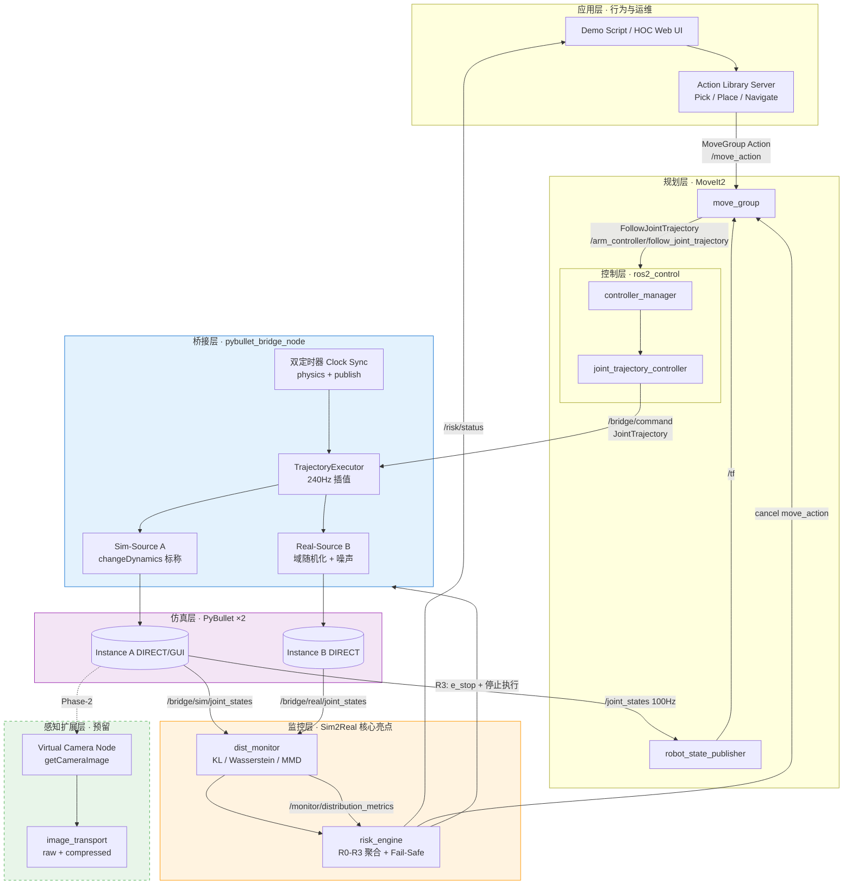
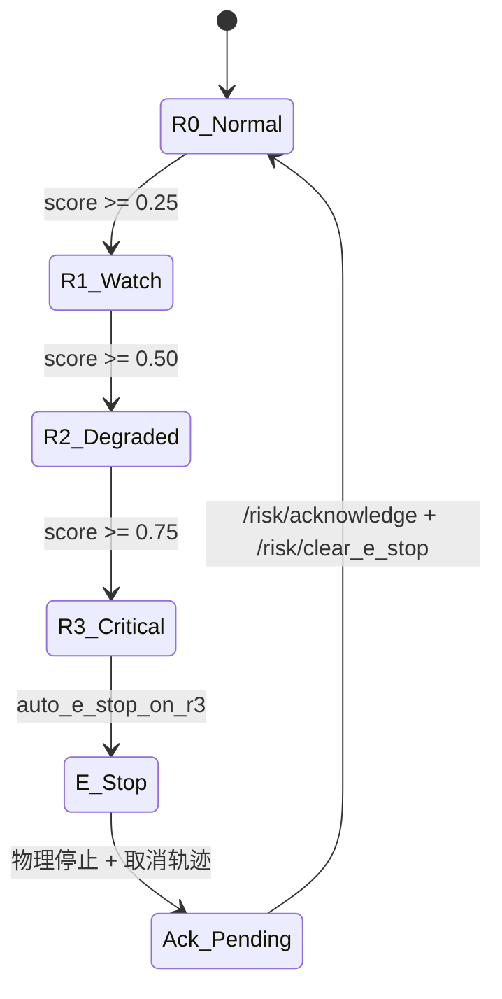

# 07 · 作品集系统设计文档与规格说明书（补充 Spec）

**文档版本**：v1.0  
**目标读者**：面试官 / 技术评审 / 编码落地参考  
**项目定位**：基于 ROS2 + MoveIt2 + PyBullet 的机器人物理仿真桥接与 Sim2Real 分布偏移监控系统  
**与现有文档关系**：本文档为**面向求职作品集的一页式总 Spec**，整合并补充 [01](./01-system-architecture-and-requirements.md)–[06](./06-robot-platform-selection.md) 中分散内容；实现细节以 02、03、05 为准。

> **双仓库联动（必读）**：本系统与 **`robot-arm-episode-data-lab`**（`~/robot-sim-lab/robot-arm-episode-data-lab`）是**同一作品集的两条腿**，设计时必须通盘考虑。完整跨仓库架构、数据契约、Real 三模式与统一 Sprint 见 **[08 · 双仓库通盘集成设计](./08-dual-repo-portfolio-integration-spec.md)**。

> **环境说明**：JD 与部分教程常用 **ROS 2 Humble**；本仓库当前主线为 **ROS 2 Jazzy**（Ubuntu 24.04 + MoveIt2 2.9.x）。§7 给出 Humble/Jazzy 依赖对照；迁移时仅需替换发行版包名与 launch 参数，架构不变。

---

## 0. 双仓库一体定位（摘要）

| 仓库 | 职责 | 与本文档章节对应 |
|------|------|------------------|
| **robot-arm-episode-data-lab** | 离线 PyBullet 采集、FSM 行为、Episode/LeRobot 导出 | §5 视觉预留、§7 Sprint S1/S3、Real 源 `lerobot` 模式 |
| **ros2-moveit-pybullet-bridge** | ROS2 桥接、MoveIt2、双源监控、Fail-Safe、HOC | 全文主体 |

**集成锚点**（不可单独变更）：

- 机型：**KUKA iiwa 7-DOF**（`kuka_iiwa/model.urdf`）
- 数据：`dataset/v1/lerobot_export`（LeRobot v2.1）
- 环境变量：`EPISODE_DATA_LAB_ROOT`、`LEROBOT_EXPORT`
- 一键联调：`./scripts/run_integration_demo.sh`

下文 §2 架构图以 bridge 为中心；**含 episode-data-lab 的通盘图**见 [08 §2](./08-dual-repo-portfolio-integration-spec.md#2-通盘逻辑架构)。

---

## 1. 项目概述与设计哲学

### 1.1 设计目标

在**无物理真机**前提下，构建一套可演示、可度量、可扩展的机器人软件系统集成作品集，直接对应人形/协作臂系统工程师 JD 的四项能力：

| JD 能力 | 本系统映射 |
|---------|-----------|
| SDK/API 二次开发、运动控制扩展 | PyBullet Bridge + `ros2_control` 轨迹 relay |
| 业务场景动作库与行为逻辑 | MoveIt2 规划 + 高层 Action Server（Pick/Place/Navigate） |
| 软硬件集成、调试、故障排查 | 双源仿真 + 分布监控 + HOC 运维台 |
| 仿真验证并迁移真机 | 双源架构预留 `ros2_control` / 真实驱动接入点 |

### 1.2 设计哲学：「双源仿真」替代真机

**核心命题**：没有硬件时，如何验证 Sim2Real 迁移能力？

本系统采用 **Dual-Source Simulation（双源仿真）**：

```
同一 JointTrajectory 指令
        │
        ├─► Sim-Source (A)  理想物理参数 ──► 代表「规划/训练基准环境」
        │
        └─► Real-Source (B)  域随机化 + 噪声 ──► 代表「真实世界代理」
```

**Real-Source 不是真机**，而是通过 PyBullet `changeDynamics` 与执行层噪声，在第二 PyBullet 实例中构造**可控的分布偏移 Ground Truth**，使监控模块可量化、可标定、可复现。

### 1.3 `changeDynamics` 驱动的物理域偏移

URDF 不含摩擦/阻尼等完整物理字段；加载 URDF 后，Bridge 在 `SimSource.initialize()` 中对每个 link/joint 调用 `changeDynamics`：

| PyBullet 参数 | Sim-Source (A) | Real-Source (B) | Sim2Real 语义 |
|---------------|----------------|-----------------|---------------|
| `jointDamping` | 标称（如 0.04） | `uniform(0.04, 0.5)` | 关节磨损、温漂 |
| `lateralFriction` | 0.8 | `uniform(0.4, 1.2)` | 接触/地面差异 |
| `mass`（link） | URDF 原值 | `+ payload_mass` | 负载不确定性 |
| motor `forces` 缩放 | 1.0 | `uniform(0.85, 1.15)` | 驱动器标定误差 |
| 观测噪声 | 无 | `position_noise_std` | 编码器/滤波 |
| 执行延迟 | 无 | `time_delay_ms` | 通信 + 控制器周期 |

**验证迁移能力的方法**：

1. 在 A 上规划并执行轨迹（MoveIt2 认为环境「理想」）；
2. B 接收相同指令，因物理参数不同产生跟踪误差序列 \(\varepsilon_t = q_{sim} - q_{real}\)；
3. `dist_monitor` 对 \(\varepsilon\) 的分布与基线对比（KL / Wasserstein / MMD）；
4. 注入已知偏移（`/bridge/inject_shift`）验证检测灵敏度与 Fail-Safe 链路。

这与《动手学深度学习》中「用分布距离度量两个数据生成分布的差异」一致：**不是比较单点误差，而是比较误差随机过程的分布是否发生漂移**。

### 1.4 FRM 背景融入的系统稳定性思维

将机器人运行态映射为**多维风险态势**（R0–R3），分布偏移只是维度之一；超阈值不直接 crash，而是**分级降级 → R3 急停 → 人工 Acknowledge 后恢复**，对应银行风控中的限额、熔断与人工复核流程。

---

## 2. 系统整体架构设计

### 2.1 逻辑架构图（Mermaid）



### 2.2 通信边界与接口类型

| 边界 | 跨边界数据 | 接口类型 | 典型名称 |
|------|-----------|----------|----------|
| 应用 → 规划 | 目标位姿、规划组名 | **Action** | `/move_action`（MoveGroup） |
| 应用 → 行为 | 抓取/放置/导航任务 | **Action** | `/manipulation/pick`, `/manipulation/place`, `/navigation/navigate_to_pose` |
| 规划 → 控制 | 时间参数化关节轨迹 | **Action** | `/{controller}/follow_joint_trajectory` |
| 控制 → 桥接 | 关节轨迹点 | **Topic** | `/bridge/command` |
| 桥接 → 规划/TF | 关节反馈 | **Topic** | `/joint_states` |
| 桥接 → 监控 | 双源状态 | **Topic** | `/bridge/sim/joint_states`, `/bridge/real/joint_states` |
| 监控 → 风险 | 分布指标 | **Topic** | `/monitor/distribution_metrics` |
| 风险 → 桥接/规划 | 急停、降级 | **Service + Topic** | `/risk/force_e_stop`, `/bridge/system_state` |
| 运维 → 实验 | 场景编排 | **Action** | `/hoc/execute_scenario`（已实现 `ExecuteScenario`） |
| 感知 → 下游 | 虚拟相机 | **Topic** | `/camera/color/image_raw`, `/camera/depth/image_raw` |

### 2.3 进程与通信边界（部署视图）

```
┌─────────────────────────────────────────────────────────────┐
│  Host / Docker 容器                                          │
│  ┌─────────────┐  ┌──────────────┐  ┌──────────────────┐  │
│  │ move_group  │  │ ros2_control │  │ pybullet_bridge  │  │
│  │  (C++ DDS)  │  │   (C++ DDS)  │  │ (Python + PyBullet)│ │
│  └──────┬──────┘  └──────┬───────┘  └────────┬─────────┘  │
│         └────────────────┴───────────────────┘              │
│                    ROS 2 DDS (Fast-DDS)                      │
│  ┌─────────────┐  ┌──────────────┐  ┌──────────────────┐  │
│  │ dist_monitor│  │ risk_engine  │  │ hoc_server       │  │
│  │  (Python)   │  │  (Python)    │  │ (Python + WS)    │  │
│  └─────────────┘  └──────────────┘  └──────────────────┘  │
└─────────────────────────────────────────────────────────────┘
         PyBullet 与 rclpy 同进程（bridge_node）—— 避免跨进程 IPC 延迟
```

---

## 3. 核心节点详细 Spec

### 3.1 物理引擎适配层：`pybullet_bridge_node`

**包**：`pybullet_bridge`  
**语言**：Python（`rclpy` + PyBullet C API）  
**详设引用**：[05 · ROS2 节点接口与数据流](./05-ros2-node-interface-and-dataflow-spec.md) §2–§5

#### 3.1.1 职责

1. 加载 URDF，解析 revolute/prismatic 关节与 effort limit；
2. 管理 Sim/Real 双 `SimSource` 实例；
3. **双定时器**驱动仿真步进与状态发布（解耦物理与 DDS）；
4. 订阅 `/bridge/command`，`TrajectoryExecutor` 按 `t_sim` 插值；
5. 发布 `/joint_states`（对外）与双源监控话题；
6. 响应 `/risk/status` 的急停标志，停止物理步进与轨迹执行。

#### 3.1.2 仿真时间同步（Step Simulation）

PyBullet 在 `setRealTimeSimulation(0)` 下**不会自动推进时间**，必须由外部循环调用 `stepSimulation()`。

| 时钟 | 用途 | 来源 |
|------|------|------|
| `t_sim` | 轨迹插值、步进计数 | `sim_step_count × (1/physics_hz)` |
| ROS Time | `JointState.header.stamp` | `node.get_clock().now()` |
| `monotonic` | 看门狗、性能 | `time.monotonic()` |

**关键参数**（与实现对齐）：

```yaml
physics_frequency: 240.0    # Hz → dt = 1/240 s
publish_frequency: 100.0    # Hz
watchdog_timeout_ms: 500    # 无新指令时的 idle 行为
dual_source_enabled: true
use_sim_time: false         # Phase-2 可发布 /clock
```

**伪代码（与 `bridge_node.py` 一致）**：

```python
class PyBulletBridgeNode(Node):
    def __init__(self):
        self.dt = 1.0 / self.physics_hz
        self.t_sim = 0.0
        self.sim = SimSource(config_nominal)      # changeDynamics 标称
        self.real = SimSource(config_randomized)    # Real-Source
        self.sim.initialize()   # setTimeStep(dt); setRealTimeSimulation(0); loadURDF
        self.real.initialize()

        self.create_subscription(JointTrajectory, '/bridge/command', self._on_command, 10)
        self.create_timer(self.dt, self._on_physics_step)           # 240 Hz
        self.create_timer(1.0 / self.publish_hz, self._on_publish)  # 100 Hz

    def _on_physics_step(self):
        if self._paused or self._e_stop:
            return
        targets = self._trajectory.sample(self._sim_time_sec())
        self._sim.set_position_targets_by_name(targets)
        self._latest_sim = self._sim.step()                    # stepSimulation × 1
        if self._dual_source:
            self._real.set_position_targets_by_name(targets)
            self._latest_real = self._real.step(self._sim_time_sec())
        # 可选: self.t_sim += self.dt

    def _on_publish(self):
        stamp = self.get_clock().now().to_msg()
        self._pub_joint_states.publish(to_joint_state(self._latest_sim, stamp))
        self._pub_sim.publish(to_joint_state(self._latest_sim, stamp))
        if self._dual_source:
            self._pub_real.publish(to_joint_state(self._latest_real, stamp))
```

#### 3.1.3 URDF 运动学/动力学解析

`SimSource._discover_joints()` 逻辑：

```python
for j in range(num_joints):
    info = p.getJointInfo(robot_id, j)
    joint_type = info[2]  # JOINT_REVOLUTE or JOINT_PRISMATIC
    if joint_type in (p.JOINT_REVOLUTE, p.JOINT_PRISMATIC):
        joint_names.append(info[1].decode())
        joint_indices.append(j)
        effort_limits.append(info[10] if info[10] > 0 else 100.0)
# 加载后:
p.loadURDF(path, useFixedBase=True, flags=p.URDF_USE_INERTIA_FROM_FILE)
for idx in joint_indices:
    p.changeDynamics(robot_id, idx, jointDamping=damping, lateralFriction=mu)
```

**一致性清单**（MoveIt ↔ PyBullet）：

- [ ] 关节名、顺序、限位与 `joint_limits.yaml` 一致  
- [ ] SRDF `tip link`（如 `tool0`）与 TF 链一致  
- [ ] `effort` limit 与 motor `forces` 一致  
- [ ] 每个 link 有合法 `<inertial>`  

---

### 3.2 运动规划与行为逻辑：MoveIt2 & Action Library

**包**：`moveit_config`  
**当前主线**：KUKA iiwa7（`manipulator` 规划组）

#### 3.2.1 MoveIt2 配置要点

| 文件 | 内容 |
|------|------|
| `config/kinematics.yaml` | KDL / Trac-IK，`tip_link: tool0` |
| `config/ompl_planning.yaml` | RRTConnect（默认） |
| `config/joint_limits.yaml` | 与 URDF 限位一致 |
| `config/moveit_controllers.yaml` | `follow_joint_trajectory` → `arm_controller` |
| `srdf/*.srdf` | 规划组、碰撞禁用对 |

**Launch 链**：`moveit_config/m2_iiwa_demo.launch.py` → `move_group` + `ros2_control` + `pybullet_bridge`

#### 3.2.2 规划 → 执行数据流

```
RViz Interact → move_group.plan()
             → move_group.execute()
             → FollowJointTrajectory Action
             → joint_trajectory_controller
             → /bridge/command
             → TrajectoryExecutor.sample(t_sim)
             → PyBullet POSITION_CONTROL
             → /joint_states → robot_state_publisher → /tf → RViz 同步
```

#### 3.2.3 动作库 Action Server 设计（JD：业务场景行为逻辑）

> **状态**：`ExecuteScenario`、`Pick`、`Place` 已实现；`NavigateToPose` 为预留扩展。

建议新建包 `manipulation_actions`，高层 Action **组合** MoveIt2，而非重写规划器。

##### `Pick.action`

```
# Goal
geometry_msgs/PoseStamped grasp_pose
string end_effector_link          # default: tool0
string planning_group             # default: manipulator
float64 pre_grasp_offset_m        # 沿 approach 轴后退
float64 grasp_timeout_sec
---
# Result
bool success
string message
trajectory_msgs/JointTrajectory executed_trajectory
---
# Feedback
string phase                      # "approach" | "grasp" | "lift"
float64 progress
```

##### `Place.action`

```
geometry_msgs/PoseStamped place_pose
string planning_group
float64 retreat_offset_m
---
bool success
string message
---
string phase                      # "approach" | "release" | "retreat"
float64 progress
```

##### `NavigateToPose.action`（移动底盘 / 人形步态预留）

```
geometry_msgs/PoseStamped target_pose
string frame_id                   # "map" | "odom"
float64 tolerance_xy_m
float64 tolerance_yaw_rad
---
bool success
string message
nav_msgs/Path executed_path
---
float64 distance_remaining
string phase
```

**Server 伪代码**：

```python
class PickActionServer(Node):
    def __init__(self):
        self._move_group = MoveGroupActionClient(self, 'move_action')
        self._server = ActionServer(self, Pick, '/manipulation/pick', self.execute)

    async def execute(self, goal_handle):
        # Phase 1: 预抓取位姿 = grasp_pose + offset
        pre_grasp = offset_along_approach(goal.grasp_pose, -goal.pre_grasp_offset_m)
        await self._move_group.move_to_pose(pre_grasp)
        goal_handle.publish_feedback(Pick.Feedback(phase='approach', progress=0.3))

        # Phase 2: 直线接近（Pilz LIN 或 Cartesian path）
        await self._move_group.move_to_pose(goal.grasp_pose)
        goal_handle.publish_feedback(Pick.Feedback(phase='grasp', progress=0.6))

        # Phase 3: 闭合夹爪（预留 /gripper/command）
        # Phase 4: 抬升
        lift_pose = copy_with_z_offset(goal.grasp_pose, +0.05)
        await self._move_group.move_to_pose(lift_pose)
        goal_handle.succeed(Pick.Result(success=True))
```

**与监控联动**：每个 Phase 切换时记录 `experiment_id`，便于 HOC 对齐分布偏移时间线。

---

## 4. Sim2Real 分布偏移监控与 Fail-Safe（核心亮点）

**包**：`dist_monitor`、`risk_engine`  
**算法详设**：[03 · 分布监控算法详设](./03-distribution-monitoring-algorithm.md)

### 4.1 监控对象与统计量

**误差序列**（优先于绝对关节角）：

\[
\varepsilon_t = q_{sim}(t) - q_{real}(t) \in \mathbb{R}^n
\]

| 统计量 | 数学定义 | 用途 | 实现 |
|--------|---------|------|------|
| **KL 散度** | \(D_{KL}(P \| Q) = \sum_i P(i)\log\frac{P(i)}{Q(i)}\) | 逐关节误差分布漂移；快速、可解释 | 直方图 + Laplace 平滑 |
| **Wasserstein-1** | \(W_1(P,Q) = \inf_{\gamma} \mathbb{E}_{(x,y)\sim\gamma}[\|x-y\|]\) | 对分布平移敏感；**不假设同支撑** | 1D 排序累积分布差（Earth Mover 离散形式） |
| **MMD** | \(\|\mu_P - \mu_Q\|_{\mathcal{H}}^2\)（RBF 核） | 多维联合分布；非参数检验 | 置换检验 p-value |

**与《动手学深度学习》的对应**：

- KL：信息论度量，非对称，对「尾部概率质量变化」敏感；
- Wasserstein：最优传输视角，梯度性质更好，适合**平移型偏移**（如阻尼整体偏大）；
- MMD：核方法，适合高维联合状态 \(\mathbf{x}_t = [q, \dot{q}]^T\)。

**Wasserstein-1（1D）伪代码**：

```python
def wasserstein_1d(samples_p: np.ndarray, samples_q: np.ndarray) -> float:
    """两样本经验分布的 W1 距离（单关节误差）。"""
    p_sorted = np.sort(samples_p)
    q_sorted = np.sort(samples_q)
    # 等分位插值到相同网格
    grid = np.linspace(
        min(p_sorted.min(), q_sorted.min()),
        max(p_sorted.max(), q_sorted.max()),
        num=256,
    )
    cdf_p = np.searchsorted(p_sorted, grid, side='right') / len(p_sorted)
    cdf_q = np.searchsorted(q_sorted, grid, side='right') / len(q_sorted)
    return float(np.trapz(np.abs(cdf_p - cdf_q), grid))
```

**扩展 `DistributionMetrics.msg`（建议字段）**：

```
float64[] wasserstein_per_joint
float64 wasserstein_mean
float64 w1_threshold
bool shift_detected_w1
string detection_method    # "kl" | "w1" | "mmd" | "both"
```

### 4.2 滑窗与基线策略

| 参数 | 默认值 | 说明 |
|------|--------|------|
| `window_duration_sec` | 5.0 | 滑窗长度 |
| `min_samples` | 50 | 冷启动前不报警 |
| `publish_hz` | 10 | 指标发布频率 |
| 基线模式 | 静态 | 启动后 30s 无扰动采集为 \(P\) |

**判定逻辑**：

```python
shift_detected = (
    kl_mean > kl_threshold
    or w1_mean > w1_threshold
    or (mmd_p_value < 0.05 and mmd_stat > mmd_threshold)
)
```

### 4.3 Fail-Safe 机制（FRM 熔断思维）



**R3 触发后的执行链**（与实现对齐 + MoveIt 扩展）：

| 步骤 | 动作 | 接口 |
|------|------|------|
| 1 | `risk_engine` 置 `e_stop_active=true` | 发布 `/risk/status` |
| 2 | `pybullet_bridge` 订阅风险或轮询，置 `_e_stop=True` | 停止 `_on_physics_step` |
| 3 | 清空 `TrajectoryExecutor` | 不再下发 motor target |
| 4 | **取消 MoveIt 执行** | `move_group` Action cancel goal |
| 5 | **停止 ros2_control 控制器** | `controller_manager` switch inactive |
| 6 | HOC 要求人工 Acknowledge | `/risk/acknowledge` |

**MoveIt2 停止轨迹伪代码**（Phase-4 接入）：

```python
class FailSafeCoordinator(Node):
    def __init__(self):
        self._move_cancel = ActionClient(self, MoveGroup, '/move_action')
        self._fjtc_hal = self.create_client(Trigger, '/arm_controller/halting')

    def on_r3_e_stop(self, risk: RiskStatus):
        if not risk.e_stop_active:
            return
        # 取消 move_group 当前 goal
        self._move_cancel.cancel_all_goals()
        # 停止 trajectory controller
        self._fjtc_hal.call_async(Trigger.Request())
        # bridge 侧 e_stop 由 risk → bridge 参数或 /bridge/system_state 同步
```

**阈值标定**：通过 `/bridge/inject_shift` 注入 +30% 阻尼等 Ground Truth，ROC 曲线确定 `kl_threshold`、`w1_threshold`，写入 `dist_monitor/config/thresholds.yaml`。辅助脚本：`python3 scripts/calibrate_monitor_thresholds.py --write`

---

## 5. 多模态扩展与接口预留

> **状态**：架构 Spec；`generate_milestone_assets.py` 已有 `getCameraImage` 原型。

### 5.1 虚拟相机节点 `virtual_camera_node`

**职责**：从 PyBullet 渲染 RGB-D，发布标准 ROS 感知话题，为后续视觉抓取、人形头部相机预留。

```python
def capture_and_publish(self):
    view_matrix = p.computeViewMatrixFromYawPitchRoll(
        cameraTargetPosition=[0.4, 0, 0.5],
        distance=1.2, yaw=90, pitch=-30, roll=0)
    proj_matrix = p.computeProjectionMatrixFOV(fov=60, aspect=1.0, near=0.01, far=2.0)
    width, height, rgba, depth, seg = p.getCameraImage(
        width=640, height=480,
        viewMatrix=view_matrix,
        projectionMatrix=proj_matrix,
        renderer=p.ER_BULLET_HARDWARE_OPENGL)
    self._pub_color.publish(self._numpy_to_image_msg(rgba, 'rgb8'))
    self._pub_depth.publish(self._depth_to_image_msg(depth))
    self._pub_info.publish(self._camera_info())
```

### 5.2 `image_transport` 接口

| 话题 | 类型 | 说明 |
|------|------|------|
| `/camera/color/image_raw` | `sensor_msgs/Image` | RGB |
| `/camera/color/camera_info` | `sensor_msgs/CameraInfo` | 内参（由 FOV 推算） |
| `/camera/depth/image_raw` | `sensor_msgs/Image` | 32FC1 深度 |
| `/camera/color/image_raw/compressed` | `sensor_msgs/CompressedImage` | `image_transport republish` |

**Launch 片段**：

```bash
ros2 run image_transport republish raw compressed \
  --ros-args -r in:=/camera/color/image_raw -r out/compressed:=/camera/color/image_raw/compressed
```

### 5.3 扩展路线

```
Phase-2  virtual_camera_node + TF (camera_link)
Phase-3  ArUco / AprilTag 位姿 → MoveIt Planning Scene
Phase-4  PickAction 结合视觉伺服修正 grasp_pose
Phase-5  与 episode-data-lab LeRobot 离线/在线联动（`offline_compare`、`real_source:=lerobot`；见 [08](./08-dual-repo-portfolio-integration-spec.md)）
```

---

## 6. 开发环境与工程化配置

### 6.1 依赖清单

#### ROS 2 核心（Jazzy 主线 / Humble 对照）

| 组件 | Jazzy（本仓库） | Humble（JD 常见） |
|------|-----------------|-------------------|
| 桌面/构建 | `ros-jazzy-desktop` | `ros-humble-desktop` |
| MoveIt2 | `ros-jazzy-moveit` | `ros-humble-moveit` |
| ros2_control | `ros-jazzy-ros2-control` | `ros-humble-ros2-control` |
| image_transport | `ros-jazzy-image-transport` | `ros-humble-image-transport` |
| TF2 | `ros-jazzy-tf2-ros` | `ros-humble-tf2-ros` |

#### Python 依赖（`requirements.txt`）

```
pybullet>=3.2.5
numpy>=1.24
scipy>=1.10          # KL、统计检验
pytest>=7.0
launch_testing       # 集成测试
```

#### 工作区包

```
bridge_monitor_msgs  pybullet_bridge  dist_monitor  risk_engine
hoc_console          moveit_config
```

### 6.2 Docker 容器化

见 [`docker/README.md`](../../docker/README.md)：

```bash
export EPISODE_DATA_LAB_ROOT=~/robot-sim-lab/robot-arm-episode-data-lab
docker compose run --rm verify          # 冒烟
docker compose run --rm portfolio-demo  # iiwa7 演示
```

**建议 Dockerfile 分层**：

1. `ros:jazzy-ros-base` + MoveIt2 apt  
2. `pip install pybullet scipy`  
3. `colcon build` 预编译接口包  
4. 非 root 用户 + `entrypoint.sh` source overlay  

### 6.3 版本管理与测试

| 实践 | 说明 |
|------|------|
| Git 分支 | `main` 稳定；`feature/m4-wasserstein` 等按 Sprint 命名 |
| 实验可复现 | `ExperimentMetadata.random_seed` + rosbag2 |
| 单元测试 | KL/MMD/W1 纯函数；`pytest -m "not launch_test"` |
| 节点测试 | 单节点 pub/sub；`test_*_node.py` |
| 集成测试 | `launch_testing`：`test_full_system_launch.py` |
| CI 入口 | `./scripts/run_tests.sh`、`./scripts/verify_portfolio.sh` |

---

## 7. 开发路线图与交付物（4 Sprint）

| Sprint | 目标 | 输入 | 输出 / 里程碑 | 验收 |
|--------|------|------|---------------|------|
| **S1 桥接基座** | PyBullet ↔ ROS2 闭环 | URDF、轨迹消息 | M1：`/bridge/command` → `/joint_states` | `./scripts/verify_m1.sh` PASS |
| **S2 规划集成** | MoveIt2 执行到 PyBullet | SRDF、controllers | M2：RViz Plan & Execute iiwa7 | `./scripts/verify_m2_iiwa.sh` |
| **S3 双源 + 监控** | Sim2Real 可度量 | 域随机化 YAML | M3–M4：双源话题 + KL/MMD 指标 | `portfolio_demo.launch.py` + 监控曲线 |
| **S4 运维 + 扩展** | 作品集可演示 | HOC 设计、W1、Action | M5：HOC + 实验报告 + Pick/Place Spec 落地 | `./scripts/hoc_demo_3min.sh` + HTML 报告 |

**交付物清单**：

- [ ] 设计文档 `docs/design/01–07`  
- [ ] 可运行 Launch：`full_system.launch.py`、`portfolio_demo.launch.py`  
- [ ] 测试报告：`pytest` + 集成日志  
- [ ] 里程碑配图：`docs/assets/m1–m5-*`  
- [ ] 样例实验报告：`docs/samples/sample-experiment-report.html`  
- [ ] 3 分钟演示脚本 + 录屏（iiwa7 + HOC 急停）  
- [ ] README 快速开始（面试官 5 分钟上手）

---

## 8. 面向面试官的架构师视点（讲解稿）

> 建议在 whiteboard 前 3 分钟讲完，再 Demo 5 分钟。

我这套系统的出发点很简单：**没有真机，但不能没有「迁移验证」**。所以我用 PyBullet 开了两个物理世界——一个代表理想仿真，一个通过 `changeDynamics` 注入阻尼、摩擦、负载和执行噪声，代表「可控的真实世界代理」。MoveIt2 和 ros2_control 只对接理想侧，监控层同时看两路关节状态，用 KL 散度和 Wasserstein 距离衡量误差分布是否偏离基线——这本质上和风控里「监控指标分布漂移」是同一套数学语言。

控制链路上，我坚持 **240Hz 物理步进与 100Hz 状态发布分离**，避免 `stepSimulation` 阻塞 DDS；桥接层与 PyBullet 同进程，把指令延迟压在毫秒级。风险侧我借鉴 FRM 的分级处置：R0–R2 是观察和降级，R3 触发急停并 cancel MoveIt 轨迹，必须人工 Acknowledge 才能恢复——**宁可误停，不可在分布未知时继续执行**。

架构上所有「真机接口」都预留为标准 ROS 2 话题：将来把 `/bridge/command` 换成真实 arm driver，把 Real-Source 换成真实 `/joint_states`，监控与 HOC 逻辑无需重写。与此同时，**episode-data-lab** 通过 LeRobot 导出与 `Ros2Robot` HAL 预留，与 bridge 共用 iiwa7 与数据契约——offline 采集与 online 监控是同一作品集的两条腿（详见 [08 §11](./08-dual-repo-portfolio-integration-spec.md#11-面试一体讲解稿3-分钟)）。这就是自动化专业里的**接口抽象 + 可测迁移**，加上银行系统里的**熔断与可解释告警**，适合做人形/协作臂的软件系统集成岗位。

---

## 9. 编码前前置工作清单

> **双仓库联动**：与 `robot-arm-episode-data-lab` 联调时，须同时完成 [08 §10 · 双仓库前置清单](./08-dual-repo-portfolio-integration-spec.md#10-编码前前置工作双仓库版)。以下为 bridge 单仓库清单。

按顺序完成以下项后再写业务代码，可显著减少返工。

### 9.1 环境与工具链

- [ ] 确认 ROS 2 发行版（Jazzy 或 Humble）与 Ubuntu 版本匹配  
- [ ] 安装 MoveIt2、ros2_control、colcon、pytest  
- [ ] Python 3.10+ 虚拟环境；`pip install -r requirements.txt`  
- [ ] conda 用户：编译前 `unset CONDA_PREFIX`，使用系统 Python 3.12（Jazzy）  
- [ ] 可选：Docker 镜像构建通过 `docker compose run --rm verify`

### 9.2 机器人模型与配置

- [ ] 确定主线机器人（推荐 **KUKA iiwa7**，CI 用 `planar_2dof`）  
- [ ] URDF 每个 link 具备合法 inertial；关节名与 MoveIt SRDF 一致  
- [ ] 运行 `python3 scripts/check_iiwa_joint_consistency.py`  
- [ ] 准备 `moveit_config`：`kinematics.yaml`、`joint_limits.yaml`、`controllers.yaml`  
- [ ] 确认 `tool0` / 规划组名称（iiwa：`manipulator`）

### 9.3 接口与命名空间

- [ ] 通读 [02 · 接口设计](./02-interface-design.md)，冻结 Topic/Service 前缀  
- [ ] `colcon build --packages-select bridge_monitor_msgs` 优先编译消息包  
- [ ] 确认 `/bridge/command` 与 `/joint_states` 不与其它 demo 冲突（勿同时跑 M1/M2）

### 9.4 双源与监控标定

- [ ] 编写 `domain_randomization.yaml` 参数范围  
- [ ] 确定基线采集流程（启动 30s 无扰动 → `/monitor/reset_baseline`）  
- [ ] 准备 Ground Truth 注入实验（`/bridge/inject_shift` +30% damping）  
- [ ] 标定 KL / W1 / MMD 阈值，写入 `monitor_config.yaml`、`risk_config.yaml`

### 9.5 测试与演示

- [ ] `./scripts/run_tests.sh` 基线通过  
- [ ] 准备录屏环境：`sim_mode:=GUI` 或 RViz2  
- [ ] HOC 前端 `npm install && npm run build`（M5）  
- [ ] 撰写 3 分钟演示脚本（规划 → 注入偏移 → 监控报警 → 急停 → Acknowledge）

### 9.6 文档与作品集

- [ ] README 快速开始可复现  
- [ ] 生成里程碑配图：`python3 scripts/generate_milestone_assets.py`  
- [ ] 准备 `sample-experiment-report.html` 与 Git commit hash 写入实验元数据  
- [ ] 面试讲解稿（§8）熟练背诵 + 白板架构图（§2.1 Mermaid）

---

## 10. 文档索引与版本

| 文档 | 何时阅读 |
|------|----------|
| [01 系统架构与需求](./01-system-architecture-and-requirements.md) | 总览 |
| [02 接口设计](./02-interface-design.md) | 编码前 |
| [05 节点接口与数据流](./05-ros2-node-interface-and-dataflow-spec.md) | Bridge + MoveIt 集成 |
| [03 分布监控算法](./03-distribution-monitoring-algorithm.md) | dist_monitor 实现 |
| [04 HOC 控制台](./04-hoc-console-design.md) | hoc_console 实现 |
| [06 机器人平台选型](./06-robot-platform-selection.md) | iiwa / episode-data-lab |
| **07 本文档** | bridge 作品集总 Spec + 面试讲解 |
| [08 双仓库通盘集成](./08-dual-repo-portfolio-integration-spec.md) | **episode-data-lab + bridge 一体设计（优先阅读）** |

| 版本 | 日期 | 变更 |
|------|------|------|
| v1.0 | 2026-06-19 | 初版：双源 changeDynamics、W1、Action Library、Fail-Safe、感知预留、Sprint 路线、前置清单 |
