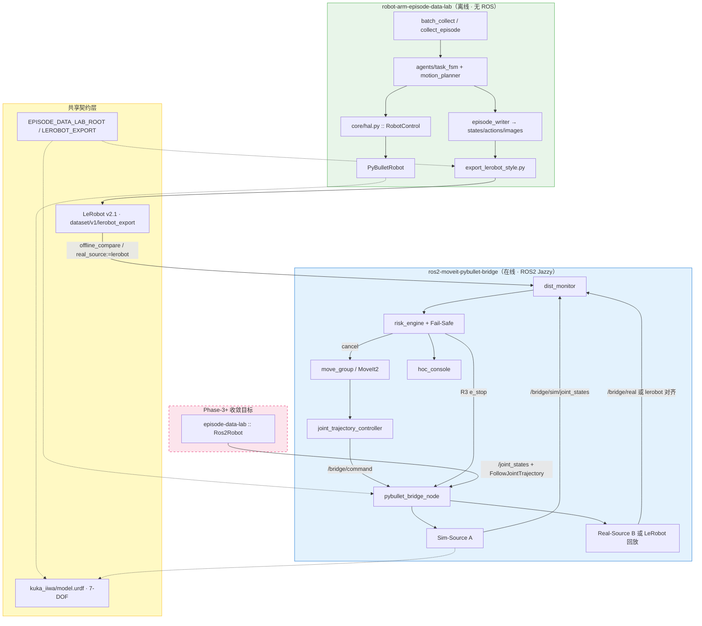

# 08 · 双仓库作品集通盘集成设计

**文档版本**：v1.0  
**关联仓库**：

| 仓库 | 典型路径 | 角色 |
|------|----------|------|
| **robot-arm-episode-data-lab** | `~/robot-sim-lab/robot-arm-episode-data-lab` | 离线采集、任务 FSM、Episode/LeRobot 导出、HAL 抽象 |
| **ros2-moveit-pybullet-bridge** | `~/ros2_ws/src/ros2-moveit-pybullet-bridge` | ROS2 在线桥接、MoveIt2 闭环、分布监控、风险引擎、HOC |

**依赖文档**：

- bridge：[07 · 作品集系统 Spec 补充](./07-portfolio-system-spec-supplement.md)、[06 · 机器人平台选型](./06-robot-platform-selection.md)、[INTEGRATION.md](../INTEGRATION.md)
- episode-data-lab：[architecture.md](https://github.com/inayina/robot-arm-episode-data-lab/blob/main/docs/dev/architecture.md)、[data_schema.md](https://github.com/inayina/robot-arm-episode-data-lab/blob/main/docs/dev/data_schema.md)、[migration_ros2_moveit.md](https://github.com/inayina/robot-arm-episode-data-lab/blob/main/docs/reference/migration_ros2_moveit.md)

> **设计原则**：两个仓库是**同一作品集的两条腿**——episode-data-lab 回答「行为与数据从哪来」，bridge 回答「在线控制与 Sim2Real 风险如何量化和熔断」。任何新功能设计必须先明确落在哪条腿、如何通过 **LeRobot 导出 / ROS2 接口 / HAL** 衔接。

---

## 1. 作品集一体叙事

### 1.1 面向 JD 的分工

| JD 要求 | episode-data-lab | bridge |
|---------|------------------|--------|
| 动作库与行为逻辑 | `agents/task_fsm.py`、`motion_planner.py`；pick-lift FSM | MoveIt2 + 规划 Action；`ExecuteScenario`；未来 Pick/Place Server |
| SDK/API 二次开发 | `RobotControl` HAL（`PyBulletRobot`） | `pybullet_bridge` + `ros2_control` shim |
| 仿真验证与 Sim2Real | PyBullet 批量采集、`validate_dataset.py` | 双源仿真 + KL/MMD + 风险 R0–R3 |
| 软硬件集成与故障排查 | Evaluator 步进拦截、metadata 失败原因 | dist_monitor + risk_engine Fail-Safe + HOC |

### 1.2 一句话架构

> **episode-data-lab 在离线 PyBullet 里采集「带标签的演示数据」；bridge 在 ROS2 栈里复现「规划—执行—监控」闭环，并用同构 iiwa7 数据或 LeRobot 轨迹作为 Real 侧基线，量化 Sim2Real 分布偏移。**

---

## 2. 通盘逻辑架构



---

## 3. 共享集成契约（必须遵守）

### 3.1 机器人与 URDF

| 项 | 约定 | 说明 |
|----|------|------|
| **主线机型** | KUKA LBR iiwa **7-DOF** | 两仓库作品集联动唯一默认 |
| **URDF** | `pybullet_data/kuka_iiwa/model.urdf` | bridge 拷贝于 `pybullet_bridge/urdf/kuka_iiwa/` |
| **CI 轻量机型** | bridge `planar_2dof` | **不得**与 LeRobot 7 维导出混做 M4 标定 |
| **MoveIt 规划组** | `manipulator`，tip `tool0` | bridge `moveit_config` iiwa 主线 |
| **task 默认** | episode-data-lab `pick_and_lift` | 与 bridge 演示场景语义对齐 |

### 3.2 数据格式契约

#### Episode 原生格式（episode-data-lab）

```
episode_xxxxxx/
├── images/{step:06d}.png      # 640×480 RGB，与控制 step 对齐
├── states.npy                 # [T, state_dim]  默认 state_dim=7
├── actions.npy                # [T, action_dim] 指令关节目标
├── ee_poses.npy               # [T, 7]  x,y,z,qx,qy,qz,qw
├── object_poses.npy
└── metadata.json              # robot=kuka_iiwa, task_name, success, ...
```

#### LeRobot 导出（bridge 消费入口）

| 字段 | 约定 |
|------|------|
| 路径 | `$EPISODE_DATA_LAB_ROOT/dataset/v1/lerobot_export` |
| 版本 | LeRobot **v2.1**（`meta/info.json` → `codebase_version`） |
| 关节状态列 | `observation.state`，shape `[7]`（constraint 模式） |
| 控制频率 | 导出默认 **10 Hz**（`export_lerobot_style.py --fps`） |
| 图像列 | `observation.images.main`（MP4 或 PNG 序列） |
| 任务语言 | `language_instruction`（pick-lift 场景） |

**bridge 加载器**：`dist_monitor/lerobot_loader.py` → `load_lerobot_dataset()`

### 3.3 环境变量（跨仓库唯一入口）

| 变量 | 设置方 | 解析实现 |
|------|--------|----------|
| `EPISODE_DATA_LAB_ROOT` | 用户 / Docker | `integration_paths.py`、`scripts/integration_paths.sh` |
| `LEROBOT_EXPORT` | 可选覆盖 | 默认 `$ROOT/dataset/v1/lerobot_export` |
| `BRIDGE_ROOT` | 集成脚本 | bridge 仓库根 |
| `ROS2_WS_ROOT` | 可选 | 默认 `~/ros2_ws` |

**默认探测顺序**（bridge）：

1. 环境变量 `EPISODE_DATA_LAB_ROOT`
2. Docker 挂载 `/data/episode-data-lab`
3. `~/robot-sim-lab/robot-arm-episode-data-lab`
4. bridge 同级目录 `../robot-arm-episode-data-lab`

### 3.4 关节名对齐（已解决）

| 项 | 约定 |
|----|------|
| **canonical** | `lbr_iiwa_joint_1` … `lbr_iiwa_joint_7` |
| **episode-data-lab 导出** | `core/joint_names.py` → `export_lerobot_style.py` 写入 `meta/info.json` |
| **bridge 加载** | `dist_monitor/joint_names.py` 将 legacy `joint_0…joint_6` 自动映射 |
| **参考配置** | `dist_monitor/config/joint_name_map.yaml` |

旧版已导出的 LeRobot 数据集**无需重导**即可被 bridge 正确识别；新采集建议重新 export 以写入 canonical 名称。

---

## 4. Real 侧三种模式（bridge 内可切换）

`dist_monitor` 参数 `real_source`：

| 模式 | 值 | Real 数据来源 | 用途 |
|------|-----|---------------|------|
| **双 PyBullet** | `topic`（默认） | `/bridge/real/joint_states`（Real-Source B + 域随机化） | 在线 Sim2Real、inject_shift 标定 |
| **LeRobot 回放** | `lerobot` | `lerobot_loader` 按 monotonic 时间查表 | 与 episode-data-lab 导出**零 ROS 联调** |
| **未来真机/ROS HAL** | `ros2`（预留） | 订阅外部 `/joint_states` | episode-data-lab `Ros2Robot` 接入后 |

**Launch 示例**：

```bash
# 模式 A：双 PyBullet（M3/M4 在线）
ros2 launch pybullet_bridge portfolio_demo.launch.py real_source:=topic

# 模式 B：LeRobot 作为 Real（与 episode-data-lab 联动）
export EPISODE_DATA_LAB_ROOT=~/robot-sim-lab/robot-arm-episode-data-lab
ros2 launch pybullet_bridge portfolio_demo.launch.py real_source:=lerobot

# 模式 C：离线标定（无需启动 bridge 物理）
ros2 run dist_monitor offline_compare \
  --real-dataset "$LEROBOT_EXPORT" \
  --sim-dataset "$LEROBOT_EXPORT"
```

---

## 5. 端到端数据流（四种场景）

### 5.1 场景 S1 · 离线采集 → 导出（仅 episode-data-lab）

```bash
cd "$EPISODE_DATA_LAB_ROOT"
python scripts/batch_collect.py --output dataset/v1 --num-episodes 20 --seed 42
python scripts/export_lerobot_style.py dataset/v1 --output dataset/v1/lerobot_export
python scripts/validate_dataset.py dataset/v1
```

**产出物**：20× episode 目录 + LeRobot parquet/mp4 + `meta/info.json`

### 5.2 场景 S2 · 离线分布对比（bridge dist_monitor，无 ROS 仿真）

```bash
ros2 run dist_monitor offline_compare \
  --real-dataset "$LEROBOT_EXPORT" \
  --sim-dataset "$LEROBOT_EXPORT"
```

**语义**：同一数据集自对比作 smoke；真实用法是 **Real=episode 采集轨迹，Sim=bridge 录 bag 或第二导出**。

### 5.3 场景 S3 · 在线 LeRobot Real + bridge Sim（作品集主 Demo）

```
MoveIt / demo 轨迹 → bridge Sim-Source → /bridge/sim/joint_states
                              ↓
dist_monitor ← LeRobot lookup ← export_lerobot_style 产出
                              ↓
                    KL/MMD → risk_engine → HOC
```

一键入口：`./scripts/run_integration_demo.sh`

### 5.4 场景 S4 · 在线双 PyBullet（inject_shift Ground Truth）

```
同一 /bridge/command → Sim A（标称）+ Real B（随机化）
                              ↓
dist_monitor 误差分布 KL/MMD
                              ↓
/risk/force_e_stop 或 R3 自动熔断
```

用于 **监控算法标定** 与 **Fail-Safe 演示**；不依赖 episode-data-lab 实时运行。

### 5.5 场景 S5 · 未来 HAL 统一（两仓库收敛）

episode-data-lab `migration_ros2_moveit.md` 中的 `Ros2Robot` 订阅 bridge 提供的：

- `/joint_states`
- `/arm_controller/follow_joint_trajectory`
- MoveIt `GetPositionIK`

则 **`batch_collect.py --backend ros2`** 与 **bridge 在线栈** 共用同一物理实例，episode 与 rosbag 同源。

---

## 6. HAL 与 ROS2 边界映射

episode-data-lab 的 `RobotControl` 与 bridge ROS 接口一一对应，便于面试讲解「只换 HAL」：

| RobotControl（episode-data-lab） | bridge / ROS2 |
|----------------------------------|---------------|
| `get_joint_positions()` | 订阅 `/joint_states` |
| `set_joint_positions()` | 发布 `/bridge/command` 或 FJT Action |
| `get_end_effector_pose()` | TF `base_link → tool0` |
| `compute_ik()` | MoveIt `GetPositionIK` |
| `step()` | bridge `_on_physics_step()` / 真机 wait trajectory |

**采集脚本改造点**（未来）：

```python
# collect_episode.py
robot = make_robot(backend=os.environ.get("ROBOT_BACKEND", "pybullet"))
# backend="ros2" → Ros2Robot(node, joint_names=IIWA_JOINTS, ee_link="tool0")
```

**数据落盘不变**：仍写 `states.npy` / `actions.npy`，附加 `metadata.rosbag_uri` 可选。

---

## 7. 多模态与视觉联动

| 模态 | episode-data-lab | bridge | 联动方式 |
|------|------------------|--------|----------|
| RGB | `images/*.png`，640×480 | 预留 `virtual_camera_node` | LeRobot `observation.images.main` 已对齐分辨率 |
| 深度 | 未默认采集 | 预留 `getCameraImage` depth | Phase-3 扩展 |
| 语言指令 | `metadata.language_instruction` | HOC / ExecuteScenario | 任务描述进实验报告 |
| 成功标签 | `metadata.success` | risk_engine D5 预留 | 离线评测 vs 在线监控对照 |

**设计约束**：bridge 虚拟相机参数（FOV、外参）变更时，须同步 episode-data-lab `core/world.py` 相机配置，否则视觉 Sim2Real 对比失效。

---

## 8. 统一 Sprint 路线图（双仓库）

| Sprint | episode-data-lab 交付 | bridge 交付 | 联动验收 |
|--------|-------------------------|-------------|----------|
| **S1 数据基座** | iiwa pick-lift 采集 + validate | M1 iiwa7 桥接 | URDF 同构；关节数=7 |
| **S2 规划** | cartesian / RRT planner 稳定 | M2 MoveIt iiwa 闭环 | 同 home 位姿 FK 偏差 < 阈值 |
| **S3 导出与监控** | LeRobot v2.1 导出 20 ep | M3 双源 + M4 KL/MMD | `offline_compare` PASS |
| **S4 运维与一体 Demo** | notebook / 样例报告 | M5 HOC + portfolio_demo | `run_integration_demo.sh` + 录屏 |
| **S5 收敛（可选）** | Ros2Robot HAL 草案 | Pick Action + W1 + 相机 | `batch_collect --backend ros2` |

---

## 9. 工程化：双仓库联调命令

```bash
# 0. 固定路径（建议写入 ~/.bashrc）
export EPISODE_DATA_LAB_ROOT=~/robot-sim-lab/robot-arm-episode-data-lab
export LEROBOT_EXPORT=$EPISODE_DATA_LAB_ROOT/dataset/v1/lerobot_export

# 1. 一键（采集 + 导出 + bridge 验证）
cd ~/ros2_ws/src/ros2-moveit-pybullet-bridge
./scripts/run_integration_demo.sh --collect

# 2. 作品集验证
./scripts/verify_portfolio.sh

# 3. Docker（挂载 episode-data-lab）
docker compose run --rm verify
```

---

## 10. 编码前前置工作（双仓库版）

在 [07 §9](./07-portfolio-system-spec-supplement.md#9-编码前前置工作清单) 基础上，**额外**完成：

### episode-data-lab 侧

- [ ] `dataset/v1/lerobot_export` 已生成且 `validate_dataset.py` 通过  
- [ ] 联动 episode 使用 `robot=kuka_iiwa`、`grasp_mode=constraint`、**7-DOF**  
- [ ] 确认 `metadata.json` 含 `task_name`、`success`、`random_seed`  
- [ ] 阅读 [migration_ros2_moveit.md](https://github.com/inayina/robot-arm-episode-data-lab/blob/main/docs/reference/migration_ros2_moveit.md) 明确 HAL 边界  

### bridge 侧

- [ ] `EPISODE_DATA_LAB_ROOT` 指向正确 checkout  
- [ ] `robot_profile:=iiwa7`；勿用 2-DOF 跑 LeRobot 对比  
- [ ] `python3 scripts/check_iiwa_joint_consistency.py`  
- [ ] `real_source:=lerobot` 与 `topic` 两种模式各跑通一次  

### 跨仓库契约

- [x] 关节名已统一为 `lbr_iiwa_joint_*`（新 export + bridge legacy 映射）
- [ ] 文档与 README 使用同一路径约定  
- [ ] 实验报告 `git_commit_hash` 两仓库分别记录  

---

## 11. 面试一体讲解稿（3 分钟）

> 我的作品集其实是**两个仓库一条链路**。  
>  
> **episode-data-lab** 负责离线：用 PyBullet HAL 跑 pick-lift 任务 FSM，把 states、actions、图像和 success 标签落成 episode，再导出成 LeRobot v2.1——这是「行为库 + 数据采集」能力。  
>  
> **ros2-moveit-pybullet-bridge** 负责在线：MoveIt2 规划、ros2_control 执行、PyBullet 桥接，以及双源 Sim2Real 监控。Real 侧可以是第二套带域随机化的 PyBullet，也可以直接回放 episode-data-lab 导出的 LeRobot 轨迹，用 KL/MMD 看分布有没有漂。  
>  
> 两仓库通过 **KUKA iiwa 7 轴 + LeRobot 导出路径 + EPISODE_DATA_LAB_ROOT** 对齐。将来真机只需要在 episode-data-lab 里把 `PyBulletRobot` 换成 `Ros2Robot`，订阅 bridge 的 `/joint_states` 和 FollowJointTrajectory，采集格式和监控逻辑都不用重写。  
>  
> 这对应 JD 里的动作库开发、仿真验证、Sim2Real 和系统集成——offline 和 online 互补，而不是两个孤立 Demo。

---

## 12. 版本记录

| 版本 | 日期 | 变更 |
|------|------|------|
| v1.0 | 2026-06-19 | 初版：双仓库通盘架构、契约、Real 三模式、HAL 映射、统一 Sprint |
