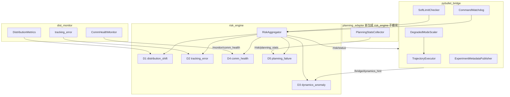

# 09 · 风险监控补全实现 Spec

**文档版本**：v1.0  
**日期**：2026-06-20  
**状态**：P1–P4（S5a–S5d）已实现  
**依赖**：[01 · 系统架构与需求](./01-system-architecture-and-requirements.md)、[02 · 接口设计](./02-interface-design.md)、[07 · 作品集 Spec 补充](./07-portfolio-system-spec-supplement.md)

> **背景**：M3–M5 主线已打通（双源监控 + KL/W1/MMD + R3 急停 + HOC）。本文档针对 **五维风险中 D3–D5 占位、R2 降级未执行、部分 NFR 未落地** 给出分阶段实现方案，目标是在 **最小 diff** 前提下补全作品集叙事闭环。
>
> **当前阅读方式**：第 1.2 节保留的是 S5 开始前的历史缺口；后续实现状态以第 13、15 节以及 [../PORTFOLIO_REMAINING.md](../PORTFOLIO_REMAINING.md) 的复验清单为准。

---

## 1. 现状与缺口

### 1.1 已实现（不再重复开发）

| 模块 | 能力 |
|------|------|
| `dist_monitor` | 双源对齐、KL/W1/MMD、`shift_detected`、基线 30s、`/monitor/tracking_error` |
| `risk_engine` | D1 分布偏移 + D2 跟踪 RMSE → R0–R3、归因、`/risk/alerts` |
| Fail-Safe 主链 | R3 → `e_stop_active` → bridge 停步 → MoveGroup cancel → HOC acknowledge |
| `hoc_console` | 雷达图、R3 模态、inject_shift、rosbag 录制、HTML/JSON 报告 |

### 1.2 原始缺口清单（历史记录）

下表记录 S5 补全启动时的缺口，用于说明设计动机；不是当前代码的未完成清单。当前仍属于 Phase-2+ 的边界见 [../PORTFOLIO_REMAINING.md](../PORTFOLIO_REMAINING.md) §6。

| ID | 类别 | 设计来源 | 当前状态 | 优先级 |
|----|------|----------|----------|--------|
| **G1** | D3 动力学异常 | 01 §4.1 | `risk_node` 恒为 0 | P1 |
| **G2** | D4 通信健康 | 02 §3.2 `/monitor/comm_health` | 话题未实现 | P1 |
| **G3** | D5 规划失败 | 02 §3.3 `/risk/planning_stats` | 未实现 | P2 |
| **G4** | R2 降级运行 | 01 NFR-S04 | 仅 `degraded_mode` 标志 | P1 |
| **G5** | 软限位 | 01 NFR-S02 | 未实现 | P2 |
| **G6** | 看门狗 | 01 NFR-S03 | bridge 内 `pass` 占位 | P2 |
| **G7** | 阈值热更新 | FR-MON-03 | YAML 静态加载 | P3 |
| **G8** | 实验元数据 | 02 `/bridge/experiment_metadata` | publisher 未 publish | P3 |
| **G9** | CSV 报告 | FR-HOC-05 | 仅 html/json | P3 |

### 1.3 设计原则（补全阶段）

1. **不新增重型依赖**：继续 `numpy` / `scipy` / 标准 ROS 消息，不用 DL。
2. **先 Sim 内可测**：D3/D4/D5 必须能用 `inject_shift`、人工延迟、故意规划失败复现。
3. **Fail-Safe 只加强、不破坏**：R3 急停链路保持不变；R2 降级为「软约束」。
4. **接口向后兼容**：优先扩展现有 msg/参数，避免破坏 HOC WebSocket 契约。

---

## 2. 目标架构（补全后）



---

## 3. 分阶段路线图

| Phase | Sprint | 交付 | 验收脚本 | 状态 |
|-------|--------|------|----------|------|
| **P1** | S5a | D4 通信健康 + R2 真降速 | `./scripts/verify_risk_d4.sh` | ✅ 已实现 |
| **P2** | S5b | D3 动力学异常 + G5 软限位 | `./scripts/verify_risk_d3.sh` | ✅ 已实现 |
| **P3** | S5c | D5 规划失败统计 | `./scripts/verify_risk_d5.sh` | ✅ 已实现 |
| **P4** | S5d | G6 看门狗 + G7–G9 工程化 | `./scripts/verify_risk_complete.sh` | ✅ 已实现 |

**建议总工时**：约 4–6 人日（按 Phase 顺序，每 Phase 可独立 PR）。

---

## 4. G2 · D4 通信健康（P1）

### 4.1 监控对象

| 被监控话题 | 期望频率 | 指标 |
|-----------|----------|------|
| `/bridge/sim/joint_states` | 100Hz | 实际间隔 vs 期望、丢帧计数 |
| `/bridge/real/joint_states` | 100Hz | 同上 |
| `/bridge/command` | 事件驱动 | 距上次指令间隔（看门狗输入） |

### 4.2 实现位置

**新增** `dist_monitor/dist_monitor/comm_health.py`：

```python
@dataclass
class CommHealthSnapshot:
    topic: str
    expected_hz: float
    measured_hz: float
    latency_ewma_ms: float      # |t_recv - t_header| 指数滑动平均
    gap_count: int              # 间隔 > 2×期望周期
    score: float                # 归一化 0..1，供 risk_engine 直接用
```

**集成** `monitor_node.py`：
- 在现有 `_on_sim` / `_on_real` 回调中调用 `CommHealthMonitor.record(topic, stamp)`
- 新增 1Hz 定时器发布 `diagnostic_msgs/DiagnosticArray` 到 `/monitor/comm_health`
- 可选：在 `DistributionMetrics` 中增加 `float64 comm_health_score`（v2 字段，HOC 可直读）

### 4.3 得分公式

```
gap_ratio = gap_count / window_samples
hz_error  = |measured_hz - expected_hz| / expected_hz
latency_norm = min(latency_ewma_ms / comm_latency_threshold_ms, 1.0)

comm_score = clip(0.4 * latency_norm + 0.3 * hz_error + 0.3 * gap_ratio, 0, 1)
```

参数（`dist_monitor/config/thresholds.yaml` 追加）：

```yaml
comm_health:
  expected_sim_hz: 100.0
  expected_real_hz: 100.0
  ewma_alpha: 0.2
  gap_multiplier: 2.0          # 间隔 > 2/f 算 gap
  latency_threshold_ms: 100.0
```

### 4.4 risk_engine 对接

`risk_node._compute_raw_scores()`：

```python
scores['comm_health'] = self._latest_comm_score  # 来自 DiagnosticArray 或 DistributionMetrics 扩展字段
```

订阅 `/monitor/comm_health`，解析 `DiagnosticStatus.message` 中的 JSON 或 key-value。

### 4.5 验证方法

1. 启动 `portfolio_demo.launch.py`
2. 用 `tc qdisc` 或临时在 bridge 发布回调中加 `sleep(0.05)` 模拟延迟（**仅测试分支，不合并主分支**）
3. 期望：`comm_health > 0.5`，综合等级 ≥ R1

---

## 5. G4 · R2 降级运行（P1）

### 5.1 设计行为

| 等级 | 标志 | bridge 行为 |
|------|------|-------------|
| R0–R1 | `degraded_mode=false` | 正常速度 |
| R2 | `degraded_mode=true` | 轨迹时间缩放 **×0.5**（等价降速 50%） |
| R3 | `e_stop_active=true` | 现有急停逻辑 |

### 5.2 实现位置

**`pybullet_bridge/pybullet_bridge/degraded_mode.py`**（新文件，约 30 行）：

```python
class DegradedModeScaler:
    def __init__(self, scale: float = 0.5):
        self._scale = scale

    def effective_elapsed(self, elapsed_sec: float, degraded: bool) -> float:
        return elapsed_sec * self._scale if degraded else elapsed_sec
```

**修改** `trajectory_executor.py` 的 `sample()`：
- 增加可选参数 `time_scale: float = 1.0`
- `elapsed = (now_sec - start) * time_scale` —— 或在 bridge_node 传入缩放后的 `now_sec`

**修改** `bridge_node.py`：
- 已有 `/risk/status` 订阅 → 增加 `_degraded_mode: bool`
- `_on_physics_step` 中：`t_sim = self._sim_time_sec(degraded=self._degraded_mode)`

**参数**（`bridge_config.yaml`）：

```yaml
degraded_velocity_scale: 0.5
degraded_only_when_r2: true   # false 则 R3 也先降速再停（不推荐）
```

### 5.3 HOC 展示

- `RiskBanner` 在 `degraded_mode=true` 时显示「降级运行 · 速度 50%」
- 无需改 WebSocket 协议（`degraded_mode` 已在 `RiskStatus`）

### 5.4 验证

1. 手动 `ros2 service call /risk/force_e_stop` 前先 inject_shift 拉高到 R2（或临时调低 R2 阈值）
2. 对比降级前后完成同一段轨迹的墙钟时间 ≈ 2×

---

## 6. G1 · D3 动力学异常（P2）

### 6.1 监控对象（无真机力矩传感器时的 Sim 代理）

| 信号 | 来源 | 异常判据 |
|------|------|----------|
| 速度跳变 | Sim/Real `JointState.velocity` 差分 | `\|Δq̇\| > velocity_jump_threshold` |
| 跟踪误差突增 | `/monitor/tracking_error` | 单帧 `\|ε\| > 3×RMSE_baseline` |
| 力矩饱和（可选） | PyBullet `getJointState` effort | `\|τ\| > ratio × τ_max`（iiwa7 可配置名义上限） |

> **说明**：PyBullet POSITION_CONTROL 不输出真实力矩；Phase P2 以 **速度跳变 + 误差突增** 为主，力矩为可选增强。

### 6.2 实现方案 A（推荐，改动最小）

**在 `dist_monitor` 扩展**，发布 `/monitor/dynamics_hint`（新话题，`std_msgs/Float64MultiArray` 或扩展 `DistributionMetrics`）：

```python
# metrics 追加字段（bridge_monitor_msgs v0.2）
float64 dynamics_anomaly_score      # 0..1
float64[] velocity_jump_per_joint
uint32 saturation_events_window
```

计算逻辑放在 `dist_monitor/dynamics_anomaly.py`：
- 输入：对齐后的 sim/real 速度、tracking_error 历史
- 输出：`dynamics_anomaly_score = max(jump_score, spike_score)`

**risk_engine** 直接读 `DistributionMetrics.dynamics_anomaly_score`，不再二次计算。

### 6.3 实现方案 B（bridge 侧）

bridge 在 `_on_publish` 统计 PyBullet joint state 跳变，发布 `/bridge/dynamics_hint`。  
**缺点**：risk 需多订阅一路；**优点**：可接入 effort（若改 VELOCITY_CONTROL）。

**Spec 决策：采用方案 A**，与监控层职责一致。

### 6.4 参数

```yaml
# dist_monitor/config/thresholds.yaml
dynamics_anomaly:
  velocity_jump_threshold: 2.0    # rad/s per step @100Hz
  error_spike_sigma: 3.0
  saturation_ratio: 0.9
  window_sec: 5.0
```

### 6.5 验证

`inject_shift` 增大 `payload_mass` 或 `joint_damping` → 速度响应变钝 → `dynamics_anomaly_score` 上升。

---

## 7. G3 · D5 规划失败（P2–P3）

### 7.1 监控对象

MoveIt2 `move_group` Action 结果：
- `MoveGroup.Result.error_code != SUCCESS`
- 或 `manipulation_actions` 中 pick/place 失败计数

### 7.2 实现位置

**新增** `risk_engine/risk_engine/planning_stats.py`（不单独建包）：

```python
class PlanningStatsCollector:
    """滑动窗口规划成功/失败计数"""

    def __init__(self, window_size: int = 20):
        self._results: deque[bool] = deque(maxlen=window_size)

    def record(self, success: bool) -> None: ...
    def failure_rate(self) -> float: ...
```

**订阅**（二选一，按场景）：

| 模式 | 订阅目标 | 说明 |
|------|----------|------|
| MoveIt 演示 | `/move_action` 结果（Action client 旁路监听） | `verify_m2_iiwa` |
| 作品集主线 | `/manipulation/pick` + `/manipulation/place` 结果 | `portfolio_demo` |

**发布** `/risk/planning_stats`（`diagnostic_msgs/DiagnosticArray`，1Hz）：
```json
{"failure_rate": 0.15, "window": 20, "last_error": "PLANNING_FAILED"}
```

**risk_node**：
```python
scores['planning_failure'] = min(failure_rate / planning_failure_rate_threshold, 1.0)
```

### 7.3 manipulation_actions 挂钩

在 `pick_executor.py` / `place_executor.py` 的 `execute()` 结束处：
```python
self._stats_pub.publish(Bool(data=goal_handle.status == SUCCEEDED))
```
或通过 ROS 参数把 stats 话题名注入。

### 7.4 验证

故意发送不可达 pose → failure_rate ↑ → 综合 risk 上升，primary_driver 可能为 `planning_failure`。

---

## 8. G5 · 软限位（P2）

### 8.1 行为

关节位置 `|q| > 0.95 × limit`（URDF limit 从 `robot_profiles` 或 MoveIt `joint_limits.yaml` 读取）：
- 发布 `/risk/alerts` 事件 `soft_limit_proximity`
- 注入 `dynamics_anomaly` 或独立维度得分 **0.6**（不直接 R3）

### 8.2 实现

**`pybullet_bridge/pybullet_bridge/soft_limits.py`**：
- 启动时加载每关节 `[lower, upper]`
- `_on_publish` 检查当前 sim 关节角

**或** 放在 `dist_monitor`（读 sim joint_states 即可，无需改 bridge）。

### 8.3 与 R2 关系

软限位触发 **≥ R2 警告**，但不急停；与 NFR-S02 一致。

---

## 9. G6 · 看门狗（P4）

### 9.1 设计行为（01 NFR-S03）

控制指令中断 **> 500ms** → 进入 **HOLD**（位置保持），并上报 `comm_health` 升高。

### 9.2 实现（替换 bridge 内占位 `pass`）

```python
# bridge_node._on_physics_step
if self._trajectory.has_active_trajectory:
    if (time.monotonic() - self._last_command_time) * 1000 > watchdog_timeout_ms:
        self._trajectory.clear()  # 停止跟踪，保持当前 hold
        self._watchdog_tripped = True
```

**risk_engine**：订阅 `/bridge/system_state`（已有 `E_STOP/PAUSED/RUNNING`），扩展枚举 `HOLD`；或 bridge 发布 `std_msgs/Bool` `/bridge/watchdog_tripped`。

**注意**：与 R3 e_stop 区分——看门狗是 **HOLD**，e_stop 是 **全停**。

---

## 10. G7–G9 · 工程化补项（P4）

### G7 阈值热更新

- `dist_monitor` 实现 `on_set_parameters_callback` 或使用 `/monitor/set_thresholds`（`rcl_interfaces/srv/SetParameters`）
- 接受 `kl_threshold_mean`、`w1_threshold_mean`、`mmd_threshold` 动态修改
- HOC 可选：Settings 面板调用 service

### G8 实验元数据

- `bridge_node` 1Hz 发布 `ExperimentMetadata`（robot profile、seed、dual_source、lerobot path）
- `hoc_server` 订阅合并进报告 `metadata` 块
- 字段对齐 [02 · 接口设计](./02-interface-design.md) §2

### G9 CSV 报告

- `hoc_server._generate_export` 增加 `format=csv`
- 列：`t, risk_level, composite_score, kl_mean, w1_mean, mmd_stat, shift_detected`
- 从 `_history.risk_timeline` + `metrics_timeline` 合并导出

---

## 11. 消息与接口变更

### 11.1 `bridge_monitor_msgs` 扩展（v0.2，向后兼容）

`DistributionMetrics.msg` 追加（optional 语义，旧节点忽略）：

```
float64 comm_health_score
float64 dynamics_anomaly_score
float64[] velocity_jump_per_joint
```

### 11.2 新话题

| 话题 | 类型 | 发布者 | 频率 |
|------|------|--------|------|
| `/monitor/comm_health` | `diagnostic_msgs/DiagnosticArray` | dist_monitor | 1Hz |
| `/risk/planning_stats` | `diagnostic_msgs/DiagnosticArray` | risk_engine | 1Hz |

### 11.3 新服务（可选）

| 服务 | 说明 |
|------|------|
| `/monitor/set_thresholds` | 运行时改 KL/W1/MMD 阈值 |

### 11.4 参数追加

| 包 | 参数 | 默认 |
|----|------|------|
| pybullet_bridge | `degraded_velocity_scale` | 0.5 |
| pybullet_bridge | `watchdog_timeout_ms` | 500 |
| dist_monitor | `comm_health.*` | 见 §4.3 |
| dist_monitor | `dynamics_anomaly.*` | 见 §6.4 |
| risk_engine | 已有 `torque_saturation_ratio` 等 | 启用即可 |

---

## 12. 测试计划

### 12.1 单元测试

| 模块 | 文件 | 覆盖 |
|------|------|------|
| comm_health | `test_comm_health.py` | EWMA、gap 检测 |
| dynamics_anomaly | `test_dynamics_anomaly.py` | 跳变、突增 |
| planning_stats | `test_planning_stats.py` | failure_rate 滑窗 |
| degraded_mode | `test_degraded_mode.py` | 时间缩放 |
| soft_limits | `test_soft_limits.py` | 95% 边界 |

### 12.2 节点测试

- `test_risk_node.py`：mock 五维输入，断言 R2/R3 边界
- `test_monitor_node.py`：comm_health 发布频率

### 12.3 集成验证脚本（新建）

**`scripts/verify_risk_complete.sh`**：

```bash
# 1. 基线 portfolio_demo 启动
# 2. 断言 /monitor/comm_health 存在
# 3. inject_shift → shift_detected + distribution_shift > 0
# 4. 临时调低 R2 阈值 → degraded_mode=true → 轨迹墙钟变慢
# 5. force_e_stop → e_stop → acknowledge → clear
```

### 12.4 CI

`.github/workflows/ci.yml` 当前运行 `./scripts/run_tests.sh` 与资产生成 smoke；`verify_risk_complete.sh` 仍作为发布/面试前的本地复验脚本，因其会清理并启动 ROS 进程，不默认放入 CI。

---

## 13. HOC 前端变更（轻量）

| 组件 | 变更 | 状态 |
|------|------|------|
| `RiskRadar` | 五维 attribution 接 WebSocket；30s 对比用真实历史 | ✅ |
| `RiskBanner` | R2「降级 50%」；HOLD / E_STOP 系统态 | ✅ |
| `TrendChart` | 叠加 `comm_health_score` 曲线（右轴 0–1） | ✅ |
| `DistributionPanel` | 展示 D3/D4 指标与软限位 | ✅ |
| `ExperimentControl` | 导出格式 HTML / CSV | ✅ |

无 breaking change；`messages.ts` 若扩展 `DistributionMetrics` 类型追加 optional 字段。

---

## 14. 风险与取舍

| 风险 | 缓解 |
|------|------|
| MoveIt action 监听复杂 | 优先 hook `manipulation_actions`；MoveIt 为可选 |
| 降速改变 sim_time 语义 | 只缩放轨迹 elapsed，不改 `_sim_time` 积分 |
| 五维同时触发 R3 过于敏感 | 保持 `auto_e_stop_on_r3` 仅看 **composite_score**，不看单维 |
| 消息包变更需 rebuild | `bridge_monitor_msgs` 改动后 CI 先 build msgs |

---

## 15. 完成定义（Definition of Done）

> 这里描述 S5 功能落地时的代码完成定义。当前工作区已在 2026-06-20 本机复跑通过；推送后仍需以 GitHub Actions 绿勾作为最终公开验收记录。

- [x] `risk_node._compute_raw_scores()` 五维均可能 > 0（有输入时）
- [x] R2 时 bridge 轨迹墙钟时间 ≥ 1.8× 正常（50% 缩放，容差 20%）
- [x] `/monitor/comm_health` 与 `/risk/planning_stats` 在 `ros2 topic list` 可见
- [x] 当前工作区最新版本复跑 `./scripts/run_tests.sh` + `verify_risk_complete.sh` 并记录结果
- [x] HOC 雷达图五维均有非零演示场景（portfolio_demo + inject_shift / Pick）
- [x] 本文档状态改为 **已实现**，README/作品集文档保留“发布前复验”口径

---

## 16. 参考文件

| 文件 | 作用 |
|------|------|
| `risk_engine/risk_engine/risk_node.py` | 五维得分入口 |
| `dist_monitor/dist_monitor/monitor_node.py` | 监控主节点 |
| `pybullet_bridge/pybullet_bridge/bridge_node.py` | e_stop / 看门狗 / 降级 |
| `docs/design/01-system-architecture-and-requirements.md` | FR-RSK、NFR-S* 原文 |
| `docs/MILESTONE_VERIFICATION_FIXES.md` | 已有修复记录 |

---

## 版本记录

| 版本 | 日期 | 变更 |
|------|------|------|
| v1.0 | 2026-06-20 | 初版：G1–G9 缺口、四 Phase 路线、接口与测试计划 |
| v1.1 | 2026-06-20 | P4 实现：看门狗 HOLD、阈值热更新、元数据、CSV 导出、`verify_risk_complete.sh` |
