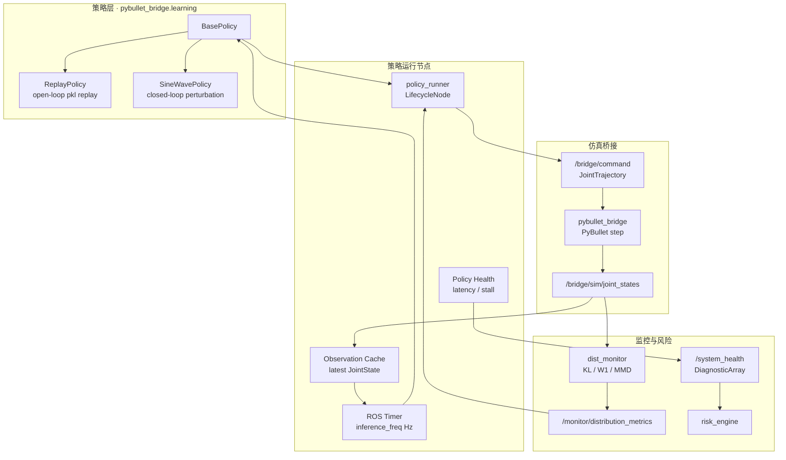

# 10 · Policy Runner 系统工程增强 Spec

**文档版本**：v0.1  
**日期**：2026-06-21  
**状态**：待实现  
**目标运行环境**：ROS 2 Jazzy · Python 3.10+ · PyBullet · MoveIt 2  
**依赖**：[05 · ROS2 节点接口设计与数据流规格](./05-ros2-node-interface-and-dataflow-spec.md)、[09 · 风险监控补全实现 Spec](./09-risk-monitoring-completion-spec.md)

> 本增强不训练 AI 模型；它为后续算法团队接入 PyTorch / ONNX / 传统控制器提供稳定接口，同时用可复现实验证明机器人软件系统的可靠性、可维护性、可观测性和故障恢复能力。

---

## 1. 目标与非目标

### 1.0 阶段定位

本计划定义为 **Phase-1.5 · Policy Runner 与系统验证增强**。

它的定位介于当前可演示主线和 Phase-2+ 真机迁移之间：

| 阶段 | 范围 | 与本计划关系 |
|------|------|--------------|
| 当前主线 | MoveIt + PyBullet + 双源监控 + 风险闭环 + HOC | 已基本完成；本计划复用这些节点和 topic，不重做核心闭环 |
| Phase-1.5 | 策略抽象、PolicyRunner、benchmark、故障注入、系统工程文档 | 本文档范围；目标是证明系统抽象、可靠性验证和可维护交付能力 |
| Phase-2+ | 真机 `real_source:=ros2`、完整 `ros2_control`、HAL、`/clock + use_sim_time`、长稳 supervisor | 未来迁移边界；本计划只为其铺路，不把它们作为当前验收项 |

面试口径：

- 这不是 AI 训练项目，而是机器人软件平台的策略运行与系统验证层。
- `ReplayPolicy` / `SineWavePolicy` 是可复现基线，后续算法团队可替换为 PyTorch / ONNX 模型。
- benchmark 和故障注入补强当前项目的可靠性、可观测性和 CI 交付证据。

### 1.1 目标

| ID | 目标 | 工程价值 |
|----|------|----------|
| PR-SE-01 | 在 `pybullet_bridge/learning/` 增加策略抽象层 | 将策略算法与 ROS 2 节点、仿真桥接解耦 |
| PR-SE-02 | 实现 `ReplayPolicy` 与 `SineWavePolicy` 两个基线策略 | 为延迟、稳定性、监控指标建立可复现基准 |
| PR-SE-03 | 实现 lifecycle 风格的 `PolicyRunner` | 明确配置、激活、停用、资源释放边界 |
| PR-SE-04 | 将策略输出、PyBullet 执行、分布监控、健康报警纳入 benchmark | 用数据证明系统工程能力，而不是只展示动画 |
| PR-SE-05 | 生成架构、ICD、FMEA 与一键验证脚本 | 面向 CI、评审和交付的系统文档闭环 |

### 1.2 非目标

- 不在本阶段实现模型训练、数据标注或 RL pipeline。
- 不改变 `/bridge/system_state` 的字符串状态语义。
- 不用新的 topic 替代已有 `/monitor/distribution_metrics`、`/monitor/comm_health`、`/risk/status`。
- 不让策略节点直接控制 E-stop；安全闭环仍通过 bridge watchdog、risk_engine 和 HOC acknowledge 完成。

---

## 2. 目标架构



设计原则：

- **策略可替换**：所有策略只依赖 `BasePolicy` 契约，`PolicyRunner` 不判断具体算法内部结构。
- **推理与仿真解耦**：策略以 ROS Timer 频率运行，PyBullet 仍由 bridge 的 physics timer 控制。
- **控制输出可追踪**：每条 `JointTrajectory` 携带 header stamp，benchmark 用该时间戳与执行反馈估算端到端延迟。
- **监控复用**：KL / W1 / MMD 由现有 `dist_monitor` 计算，`PolicyRunner` 只订阅并打印，不复制算法。

---

## 3. 子任务 1 · 策略抽象层

### 3.1 文件结构

```text
pybullet_bridge/
└── pybullet_bridge/
    └── learning/
        ├── __init__.py
        ├── base_policy.py
        ├── replay_policy.py
        └── sine_wave_policy.py
```

> 说明：Python package 目录应位于 `pybullet_bridge/pybullet_bridge/learning/`，这样 `setup.py` 的 `find_packages()` 能自动发现并安装。

### 3.2 `BasePolicy` 契约

```python
from abc import ABC, abstractmethod
from typing import Dict

import numpy as np


class BasePolicy(ABC):
    @property
    @abstractmethod
    def inference_freq(self) -> int:
        """Recommended inference frequency in Hz."""

    @abstractmethod
    def reset(self) -> None:
        """Reset internal state at episode or lifecycle activation boundary."""

    @abstractmethod
    def get_action(self, obs: Dict[str, np.ndarray]) -> np.ndarray:
        """Return target joint positions for the current observation."""
```

Liskov 替换要求：

- `get_action()` 必须返回一维 `np.ndarray`，长度等于观测中的关节数量。
- 策略不得直接创建 ROS publisher/subscriber/service。
- 策略不得修改输入 `obs` 字典中的数组；需要缓存时必须 copy。
- 推理异常必须抛出明确异常，由 `PolicyRunner` 转换为 lifecycle failure 或 `/system_health` 报警。
- 后续 PyTorch 策略只需继承 `BasePolicy`，并在内部完成 tensor 转换、设备选择和模型加载。

### 3.3 `ReplayPolicy`

用途：从 `.pkl` 加载离线关节轨迹，按时间步开环回放，用于端到端延迟和可重复性基线。

输入文件建议格式：

```python
{
    "joint_names": ["joint_a", "joint_b", "..."],
    "positions": np.ndarray,  # shape: [T, J]
    "timestamps": np.ndarray, # optional, shape: [T], seconds
    "metadata": {"source": "robot-arm-episode-data-lab"}
}
```

行为要求：

- 构造参数：`path: str`, `inference_freq: int = 50`, `loop: bool = False`。
- `reset()` 将内部 step index 归零。
- `get_action(obs)` 返回当前 step 的 positions，并推进 index。
- 文件结束且 `loop=False` 时，保持最后一帧输出，不发布空动作。
- 若 pkl 缺少 `positions` 或维度不合法，构造时立即失败。

### 3.4 `SineWavePolicy`

用途：基于实时关节角度叠加正弦扰动，用于闭环稳定性和 watchdog/监控压力测试。

行为要求：

- 构造参数：`amplitude: float = 0.05`, `frequency_hz: float = 0.2`, `inference_freq: int = 50`, `seed: int = 0`。
- `obs["joint_positions"]` 是基准位置。
- 输出：`joint_positions + amplitude * sin(2*pi*frequency_hz*t + phase)`。
- `reset()` 将内部时间 `t` 和 phase 重置，保证同 seed 可复现。
- 默认幅值必须小于 iiwa7 常见软限位余量；超限裁剪由 `PolicyRunner` 或 bridge 层执行。

### 3.5 导出

`learning/__init__.py` 导出：

```python
from pybullet_bridge.learning.base_policy import BasePolicy
from pybullet_bridge.learning.replay_policy import ReplayPolicy
from pybullet_bridge.learning.sine_wave_policy import SineWavePolicy

__all__ = ["BasePolicy", "ReplayPolicy", "SineWavePolicy"]
```

---

## 4. 子任务 2 · `PolicyRunner` 节点

### 4.1 ROS 节点类型

实现文件：`pybullet_bridge/pybullet_bridge/learning/policy_runner.py`

推荐继承：`rclpy.lifecycle.LifecycleNode`。若目标环境的 Python lifecycle API 有限制，允许先实现等价状态机，但对外日志和方法命名保留 `on_configure`、`on_activate`、`on_deactivate`。

`setup.py` console entry：

```python
"policy_runner = pybullet_bridge.learning.policy_runner:main"
```

### 4.2 参数

| 参数 | 类型 | 默认值 | 说明 |
|------|------|--------|------|
| `strategy_type` | string | `replay` | `replay` / `sine_wave` |
| `replay_path` | string | `""` | ReplayPolicy pkl 路径 |
| `policy_inference_freq` | int | `0` | `0` 表示使用策略默认频率 |
| `joint_names` | string array | `[]` | 为空时从首个 JointState 推断 |
| `command_topic` | string | `/bridge/command` | 输出 `JointTrajectory` |
| `joint_state_topic` | string | `/bridge/sim/joint_states` | 输入观测 |
| `metrics_topic` | string | `/monitor/distribution_metrics` | 分布指标订阅 |
| `system_health_topic` | string | `/system_health` | 故障注入和策略健康输出 |
| `fault_injection_enabled` | bool | `false` | benchmark 专用 |
| `fault_sleep_probability` | double | `0.0` | 每次推理注入 sleep 的概率 |
| `fault_sleep_sec` | double | `0.1` | 默认卡顿时长 |
| `watchdog_timeout_sec` | double | `1.0` | 策略推理或输出停滞报警阈值 |
| `seed` | int | `0` | 策略和故障注入随机种子 |

### 4.3 Topic 契约

| Topic | 类型 | PolicyRunner 角色 | QoS |
|-------|------|-------------------|-----|
| `/bridge/sim/joint_states` | `sensor_msgs/msg/JointState` | subscribe | SensorDataQoS / BestEffort |
| `/bridge/command` | `trajectory_msgs/msg/JointTrajectory` | publish | Reliable, depth 10 |
| `/monitor/distribution_metrics` | `bridge_monitor_msgs/msg/DistributionMetrics` | subscribe | Reliable, depth 10 |
| `/system_health` | `diagnostic_msgs/msg/DiagnosticArray` | publish | Reliable, transient local optional |

### 4.4 生命周期行为

| 阶段 | 行为 |
|------|------|
| `on_configure` | 读取参数；创建 policy；创建 publisher/subscriber；校验 replay 文件；不启动 timer |
| `on_activate` | `policy.reset()`；创建或启动 inference timer；打印加载日志 |
| `on_deactivate` | 停止 timer；发布一次健康状态 `inactive`；保留已加载 policy 以便快速重激活 |
| `on_cleanup` | 释放 policy、清空 observation cache 和 metric cache |
| `on_shutdown` | 停止 timer，输出最终统计日志 |

启动日志必须包含：

```text
[PolicyRunner] 加载策略: replay, 推理频率: 50 Hz
```

### 4.5 观测格式

`PolicyRunner` 将 `JointState` 转为：

```python
obs = {
    "joint_positions": np.asarray(msg.position, dtype=np.float64),
    "joint_velocities": np.asarray(msg.velocity, dtype=np.float64),
    "stamp_sec": np.asarray([stamp_sec], dtype=np.float64),
}
```

约束：

- 没有收到首个 JointState 前，timer 不调用 `get_action()`。
- `joint_names` 长度与 action 长度不一致时发布 `/system_health` error 并跳过本次 command。
- `JointTrajectory.header.stamp` 使用策略输出时刻的 ROS time，用于 benchmark 延迟计算。
- 每个 command 至少包含 1 个 `JointTrajectoryPoint`，`time_from_start` 建议为 `1 / inference_freq`。

### 4.6 与 `dist_monitor` 集成

`PolicyRunner` 订阅 `/monitor/distribution_metrics` 并打印节流日志：

```text
[PolicyRunner] metrics kl=0.012 w1=0.004 mmd=0.031 shift=false
```

要求：

- 只读订阅现有指标，不复制 KL/W1/MMD 实现。
- 日志频率不高于 1 Hz。
- benchmark 可将最近一次 metrics 快照写入 CSV / JSON summary。

### 4.7 故障注入与健康报警

故障注入只在 `fault_injection_enabled=true` 时启用：

```python
if rng.random() < fault_sleep_probability:
    time.sleep(fault_sleep_sec)
```

Watchdog 判定：

- `now - last_successful_action_time > watchdog_timeout_sec`。
- 或单次 `get_action()` 耗时超过 `watchdog_timeout_sec`。
- 1 秒内向 `/system_health` 发布 `DiagnosticArray`，level 为 `WARN` 或 `ERROR`。

建议 diagnostic key：

| Key | 含义 |
|-----|------|
| `strategy_type` | 当前策略类型 |
| `inference_latency_ms` | 最近一次推理耗时 |
| `last_action_age_ms` | 距离最近成功输出的时间 |
| `fault_injection` | 是否启用故障注入 |
| `reason` | `ok` / `stalled` / `exception` / `inactive` |

---

## 5. 子任务 3 · `benchmark_system.py`

### 5.1 文件与入口

文件：`scripts/benchmark_system.py`

命令示例：

```bash
python3 scripts/benchmark_system.py \
  --strategy replay \
  --episodes 100 \
  --output-dir docs/samples/system-benchmark/replay
```

### 5.2 参数

| 参数 | 默认值 | 说明 |
|------|--------|------|
| `--strategy` | `replay` | `replay` / `sine_wave` |
| `--episodes` | `100` | episode 数 |
| `--duration-sec` | `10` | 单 episode 最长运行时间 |
| `--output-dir` | required | CSV、JSON、HTML 输出目录 |
| `--replay-path` | `""` | replay pkl |
| `--seed` | `0` | 固定随机性 |
| `--fault-injection` | false | 启用卡顿测试 |
| `--process-name` | `policy_runner` | psutil 采样目标 |

### 5.3 指标采集

| 指标 | 采集方式 | 输出 |
|------|----------|------|
| 端到端延迟 | `JointTrajectory.header.stamp` vs `/bridge/sim/joint_states.header.stamp` 首次响应 | `latency_ms` |
| CPU | `psutil.Process.cpu_percent()` | `cpu_percent` |
| 内存 | `psutil.Process.memory_info().rss` | `rss_mb` |
| 策略推理耗时 | `/system_health` diagnostic 或 runner 日志 | `inference_latency_ms` |
| 分布指标 | `/monitor/distribution_metrics` 最新快照 | `kl_mean`, `w1_mean`, `mmd` |
| 健康报警延迟 | 注入 sleep 时间到 `/system_health` WARN/ERROR 时间 | `health_alarm_latency_ms` |

### 5.4 输出文件

```text
output-dir/
├── benchmark_timeseries.csv
├── benchmark_summary.json
├── system_health_events.csv
└── benchmark_report.html
```

`benchmark_summary.json` 至少包含：

```json
{
  "strategy": "replay",
  "episodes": 100,
  "max_latency_ms": 0.0,
  "mean_latency_ms": 0.0,
  "std_latency_ms": 0.0,
  "cpu_peak_percent": 0.0,
  "rss_peak_mb": 0.0,
  "health_alarm_detected_within_1s": true,
  "seed": 0
}
```

### 5.5 可复现性

- 固定 `--seed` 并传给 `PolicyRunner`、策略和故障注入 RNG。
- CSV 按 monotonic receive order 写入，summary 按确定性 key 排序。
- HTML 报告只引用本次输出目录内的 CSV/JSON。
- 脚本退出码：benchmark 运行失败、100 episode 未完成、故障注入未在 1 秒内报警时返回非 0。

---

## 6. 子任务 4 · 系统工程文档

### 6.1 `docs/ARCHITECTURE.md`

必须包含：

- Mermaid 逻辑架构图：UI / planning / policy / bridge / monitor / risk / reporting 分层。
- Mermaid 物理部署图：ROS 2 Python 进程、MoveIt 2 进程、HOC 前端、可选 Docker/headless 运行边界。
- QoS 选择说明：
  - `/bridge/sim/joint_states`、`/bridge/real/joint_states` 使用 BestEffort：高频传感器流允许丢旧帧，避免可靠传输反压拖慢仿真。
  - `/bridge/command` 使用 Reliable：控制命令不能静默丢失。
  - `/monitor/distribution_metrics` 使用 Reliable：低频指标必须可追溯。
  - `/system_health` 使用 Reliable，可选 transient local：后启动的 HOC/监控工具能读到最近健康状态。

### 6.2 `docs/ICD.md`

接口表至少包含：

| 话题 | 类型 | 发布者 | 订阅者 | 频率 | QoS | 数据范围约束 |
|------|------|--------|--------|------|-----|--------------|
| `/bridge/command` | `trajectory_msgs/msg/JointTrajectory` | MoveIt controller / policy_runner | pybullet_bridge | 事件/策略频率 | Reliable depth 10 | joint positions 在 profile limits 内 |
| `/bridge/sim/joint_states` | `sensor_msgs/msg/JointState` | pybullet_bridge | dist_monitor / policy_runner | 100 Hz | BestEffort | positions rad, velocities rad/s |
| `/bridge/real/joint_states` | `sensor_msgs/msg/JointState` | real_source | dist_monitor | 100 Hz | BestEffort | 同 sim joint order |
| `/monitor/distribution_metrics` | `bridge_monitor_msgs/msg/DistributionMetrics` | dist_monitor | risk_engine / HOC / policy_runner | 5-10 Hz | Reliable | KL/W1/MMD 非负 |
| `/system_health` | `diagnostic_msgs/msg/DiagnosticArray` | policy_runner / benchmark hooks | risk_engine / HOC | 1 Hz 或事件 | Reliable | level ∈ OK/WARN/ERROR |

### 6.3 `docs/FMEA.md`

至少包含以下失效模式：

- PyBullet 物理引擎崩溃。
- MoveIt 规划超时。
- 分布偏移异常激增。
- 策略推理卡顿或异常。
- JointState 高频流丢帧或延迟。

每行字段：失效模式、影响、严重度、发生概率、可检测性、现有缓解、建议检测手段、验收证据。

### 6.4 README 系统性能章节

README 新增“系统性能”章节，引用 `scripts/benchmark_system.py` 的输出文件。未运行 benchmark 时不得填入虚构数值，应写明：

```text
最新 benchmark 数据生成后提交到 docs/samples/system-benchmark/<strategy>/benchmark_summary.json。
```

---

## 7. 子任务 5 · `run_system_validation.sh`

### 7.1 目标

文件：`scripts/run_system_validation.sh`

行为：

1. 解析或软链接 `robot-arm-episode-data-lab` 示例数据集。
2. 启动 headless PyBullet 仿真环境。
3. 依次运行 ReplayPolicy 与 SineWavePolicy benchmark。
4. 收集 ROS 日志、benchmark CSV/JSON、distribution metrics、system health。
5. 生成 HTML 汇总报告。
6. 任一环节失败时返回非 0。

### 7.2 脚本结构

```bash
#!/usr/bin/env bash
set -Eeuo pipefail

section() { printf '\n========== %s ==========\n' "$*"; }

section "1/5 Resolve dataset"
section "2/5 Start headless PyBullet"
section "3/5 Benchmark ReplayPolicy"
section "4/5 Benchmark SineWavePolicy"
section "5/5 Generate validation report"
```

### 7.3 时间预算

| 阶段 | 预算 |
|------|------|
| 环境检查与数据集解析 | 30 s |
| headless launch 启动 | 45 s |
| Replay benchmark | 90 s |
| SineWave benchmark | 90 s |
| 报告生成与清理 | 45 s |
| 总计 | < 5 min |

### 7.4 输出目录

```text
docs/samples/system-validation/
├── replay/
├── sine_wave/
├── ros_logs/
├── validation_summary.json
└── validation_report.html
```

---

## 8. 验收标准

| ID | 验收项 | 通过标准 |
|----|--------|----------|
| AC-PR-01 | 策略替换 | `ReplayPolicy` 与 `SineWavePolicy` 可由同一 `PolicyRunner` 参数切换，无节点代码改动 |
| AC-PR-02 | 生命周期 | configure/activate/deactivate 路径均有测试或 smoke 证据 |
| AC-PR-03 | 时间解耦 | 策略频率改变不影响 bridge physics timer 配置 |
| AC-PR-04 | 指标集成 | runner 日志能输出 KL/W1/MMD 最新值 |
| AC-PR-05 | 故障注入 | `sleep(0.1s)` 卡顿场景中 `/system_health` 在 1 秒内报警 |
| AC-PR-06 | Benchmark | 100 episodes 输出最大延迟、平均延迟、标准差、CPU 峰值 |
| AC-PR-07 | 文档 | `ARCHITECTURE.md`、`ICD.md`、`FMEA.md` 与 README 系统性能章节存在且引用正确 |
| AC-PR-08 | CI 友好 | `run_system_validation.sh` 任一失败返回非 0，总时长 < 5 分钟 |

---

## 9. 实现顺序建议

### 9.1 推荐 PR / 开发阶段

| 阶段 | 建议分支/PR | 主要交付 | 退出条件 |
|------|-------------|----------|----------|
| D0 | `docs/policy-runner-plan` | 本 spec、ARCHITECTURE、ICD、FMEA、README 入口 | 文档评审通过，范围确认是 Phase-1.5 |
| D1 | `feature/learning-policies` | `BasePolicy`、`ReplayPolicy`、`SineWavePolicy`、`learning/__init__.py`、单元测试 | `pytest pybullet_bridge/test/test_learning_policies.py` 通过 |
| D2 | `feature/policy-runner-node` | `policy_runner.py`、console entry、参数、JointState→JointTrajectory、最小节点测试 | 可用 `strategy_type:=sine_wave` 在 headless bridge 中发布 `/bridge/command` |
| D3 | `feature/policy-runner-health` | lifecycle/state machine、metrics 订阅、`/system_health`、fault injection、watchdog | 注入 sleep 后 1 秒内出现 WARN/ERROR |
| D4 | `feature/system-benchmark` | `scripts/benchmark_system.py`、CSV/JSON/HTML summary、psutil 采样 | replay 与 sine_wave 均生成 summary，schema 稳定 |
| D5 | `feature/system-validation` | `scripts/run_system_validation.sh`、汇总报告、日志收集、CI 友好退出码 | 本地 headless 总时长 < 5 分钟，失败返回非 0 |

### 9.2 每阶段开发清单

**D1 · 策略抽象层**

- 创建 `pybullet_bridge/pybullet_bridge/learning/`。
- 实现 `BasePolicy` 抽象类，确保 `inference_freq` 是只读属性契约。
- 实现 `ReplayPolicy`，先支持最小 pkl schema：`positions`，再支持 `joint_names` / `timestamps`。
- 实现 `SineWavePolicy`，用 seed 保证 phase 可复现。
- 单元测试覆盖：pkl 缺字段、维度错误、loop 行为、reset 行为、Liskov 替换。

**D2 · 最小 PolicyRunner**

- 先实现普通 `Node` 或 lifecycle-compatible state machine；若 `rclpy.lifecycle` smoke 通过，再切换为 `LifecycleNode`。
- 订阅 `/bridge/sim/joint_states`，缓存最新 obs。
- 使用 ROS Timer 按 `policy.inference_freq` 调用 `get_action()`。
- 发布单点 `JointTrajectory` 到 `/bridge/command`。
- 增加 `setup.py` console entry：`policy_runner = pybullet_bridge.learning.policy_runner:main`。

**D3 · 健康与故障注入**

- 订阅 `/monitor/distribution_metrics`，1 Hz 节流打印 KL/W1/MMD。
- 发布 `/system_health`，包含 strategy、latency、last_action_age、reason。
- 增加 `fault_injection_enabled`、`fault_sleep_probability`、`fault_sleep_sec`。
- Watchdog 判定与报警：推理耗时或输出停滞超过 `watchdog_timeout_sec`。
- 测试策略异常、sleep 卡顿、无 JointState、action 维度不匹配。

**D4 · Benchmark**

- 用 `argparse` 提供 `--strategy`、`--episodes`、`--duration-sec`、`--output-dir`、`--seed`、`--fault-injection`。
- 采集 latency、CPU、RSS、system health event、latest distribution metrics。
- 输出 `benchmark_timeseries.csv`、`system_health_events.csv`、`benchmark_summary.json`、`benchmark_report.html`。
- summary 不写主观结论，只写可复现数值和通过/失败字段。

**D5 · 一键系统验证**

- `set -Eeuo pipefail`，所有后台 launch 通过 `trap cleanup EXIT` 清理。
- 解析 `EPISODE_DATA_LAB_ROOT`，没有数据时给出明确错误或使用 repo 内最小 replay fixture。
- 依次跑 replay 与 sine_wave benchmark。
- 合并两个 summary 生成 `validation_summary.json` 和 `validation_report.html`。
- 保持 CI 友好：失败非 0、输出路径固定、日志可追溯。

### 9.3 开工前决策

| 决策 | 建议 | 原因 |
|------|------|------|
| Lifecycle 实现 | 先做 smoke；不稳定则用显式状态机保留 `on_configure/on_activate/on_deactivate` 方法 | 避免被 `rclpy.lifecycle` 环境差异阻塞 |
| `/system_health` 类型 | `diagnostic_msgs/msg/DiagnosticArray` | 不新增 msg 包，易被 HOC 和 CLI 消费 |
| benchmark 数据源 | 先用小型 pkl fixture，再接 episode-data-lab | 保证单元和 CI 不依赖大数据仓库 |
| README 数值 | 只引用生成的 `benchmark_summary.json` | 避免手写不可复现指标 |
| 是否接真机/HAL | 不做 | 保持 Phase-1.5 范围清晰，Phase-2+ 再迁移 |

### 9.4 首个开发日建议

1. 做 D1：策略包和单元测试。
2. 同时准备一个最小 replay fixture，长度 20-50 step，2/7 DOF 都可，但 metadata 写清楚。
3. 跑 `python3 -m pytest pybullet_bridge/test/test_learning_policies.py -v`。
4. 提交前确认 `python3 -m pytest pybullet_bridge/test/test_learning_policies.py -v` 和 `python3 -m py_compile` 覆盖新增文件。

---

## 10. 测试计划

| 层级 | 文件建议 | 覆盖点 |
|------|----------|--------|
| 单元 | `pybullet_bridge/test/test_learning_policies.py` | replay 维度校验、sine deterministic、BasePolicy 替换性 |
| 节点 | `pybullet_bridge/test/test_policy_runner_node.py` | 参数加载、JointState 到 command、health diagnostic |
| 集成 | `pybullet_bridge/test/test_policy_runner_launch.py` | bridge + runner + dist_monitor headless smoke |
| 脚本 | `scripts/check_policy_runner_benchmark.py` | summary schema、故障注入报警、CSV 行数 |

---

## 11. 风险与注意事项

- `rclpy.lifecycle` 在不同 Jazzy Python 环境中可用性需先 smoke；若受限，先实现显式状态机并保留 lifecycle 方法名。
- `psutil` 是新增运行依赖，应加入 `requirements.txt` 或脚本内给出清晰错误提示。
- `/system_health` 是新增健康聚合 topic，不应替代已有 `/bridge/system_state`。
- benchmark 延迟用 ROS header stamp 估算，受系统时钟和仿真时间策略影响；报告必须注明时钟来源。
- Replay pkl 文件格式应与 `robot-arm-episode-data-lab` 导出契约对齐，避免另建不可复用数据格式。
