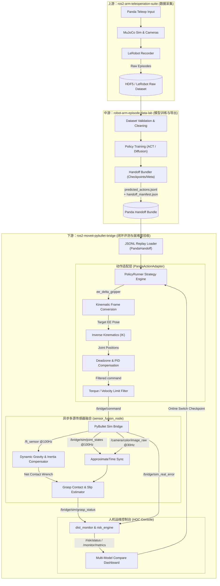

# 13 · 三仓集成与真机就绪度（Real-Machine Readiness）联合开发方案

## 1. 总体目标与三仓协同定位

为了实现从**仿真交互数据采集 -> 离线数据集清洗与模型训练 -> 跨仿真器闭环评测 -> 真机就绪度安全验收**的完整具身智能数据闭环，我们需要将上游、中游和下游三个仓库进行深度集成与规范对齐。

```
【上游：ros2-arm-teleoperation-suite】
    ├── 负责 MuJoCo / ROS 2 遥操作与控制仿真
    └── 产出 raw episode (多模态观测与动作数据)
         │
         ▼ (LeRobot canonical format)
【中游：robot-arm-episode-data-lab】
    ├── 负责数据验证、格式转换与 Baseline 训练
    └── 产出 handoff bundle (含 predicted_actions.jsonl 与数据校验报告)
         │
         ▼ (predicted_actions.jsonl / ee_delta_gripper)
【下游：ros2-moveit-pybullet-bridge】
    ├── 负责 MoveIt / PyBullet 物理环境闭环评测与分布偏移监控
    └── 执行真机就绪度（Real-Machine Readiness）验收与安全熔断评估
```

本方案定义了三个仓库的后续联合开发规划，重点解决 **Panda 机器人契约对齐**、**闭环策略评测** 和 **真机就绪度方案落地**。

### 1.1 三仓联合系统数据流与架构流程图

本流程图展示了从上游的数据采集（MuJoCo + 遥操作）、中游的离线处理与模型训练、到下游基于 `PandaActionAdapter` 与多源传感器融合节点的闭环评测与 HOC 看板对比分析：



---

## 2. 核心集成任务与对齐契约

### 2.1 机械臂状态与动作语义对齐（Panda Alignment Contract）
为了消除跨仓通信的命名与维度转换成本，三个仓库统一采用 Franka Emika Panda 机械臂作为主线平台：
- **关节空间（Joint Space）**：统一命名为 `panda_joint1` 至 `panda_joint7`，单位为弧度（rad），正方向及限位严格遵循 `mujoco_menagerie` 的 XML 与下游 ROS 2 URDF 的定义。
- **夹爪状态（Gripper State）**：统一为单自由度宽度映射 `[0.0, 0.04]` 米（单侧指尖位移，总开距 0-0.08m）。
- **任务空间动作（Task-space Action）**：采用 `ee_delta_gripper_v0` 格式，即 `[dx, dy, dz, drx, dry, drz, gripper_width]`。其中位置增量单位为米，姿态增量为外规 Euler 轴角或 RPY（单位：弧度），夹爪目标宽度单位为米。

### 2.2 仿真物理保真度对齐（Sim-to-Sim Calibration）
针对 MuJoCo（上游）与 PyBullet（下游）的物理引擎差异：
- **刚体动力学参数对齐**：下游 PyBullet URDF 必须回读并同步上游 XML 中各连涵的质量（`mass`）、质心位置（`pos`）和惯性张量（`inertia`）。
- **关节特性对齐**：在下游 PyBullet 导入时，关节的摩擦系数（`lateralFriction`）、阻尼系数（`jointDamping`）和刚度参数需通过正弦扫描（Sine Wave Sweep）进行系统辨识，将跟踪误差（RMSE）控制在 `0.01 rad` 以内。
- **接触动力学对齐**：对齐夹爪指尖硅胶材质的摩擦系数，确保相同的握力下，指尖与抓取目标之间的滑移率（Slip Rate）在两边仿真中表现一致。

### 2.3 CAN总线电机控制与底层PID对齐 (CAN Bus & Motor PID Alignment)
在涉及底层控制柜及 CANopen DS402 现场总线的实机迁移中，PID 环路、力矩饱和及物理死区参数必须显式对齐：
- **位置/速度环 PID 参数映射**：
  - 针对上游虚拟伺服（`virtual_servo_driver`）的电流环/速度环 PID 参数，与实机控制柜（如 CANopen 驱动器的主从环路）进行数学等效映射。
  - 针对下游 PyBullet 的控制增益（$K_p, K_d$），设计带积分饱和抗风满（Anti-windup）的 PID 仿真调节器，确保仿真中的控制刚度与实机一致。
- **力矩饱和与 RPDO/TPDO 限制**：
  - 定义严格的力矩限制（Torque Limit）与变比，防止神经网络输出的控制指令导致驱动器触发“过流限制”或“轮廓误差超限”故障。
  - 在下游安全层拦截器中，对发送到 `/bridge/command` 的位置突变进行导数限制（差分滤波），模拟实机底层驱动器的加速度限制（DS402 规范中的 Profile Acceleration Limit）。
- **关节与控制死区管理 (Deadzone / Deadband Management)**：
  - **机械传动死区（Backlash）**：标定减速器（如谐波或行星减速器）在极小控制量下的空程回程误差，并在下游仿真中引入传动死区仿真。
  - **电气/控制死区（Control Deadband）**：为防止极小微调指令引起电机“蜂鸣”或频繁高频微小振荡，设计合理的控制死区阈值（如位置偏差小于 $10^{-4}$ rad 时积分器挂起/指令清零）。同时设计相应的死区前馈补偿，确保大指令输出时能快速跨越静摩擦死区。

### 2.4 异步多源传感器融合与状态估计 (Asynchronous Sensor Fusion & Estimation)
实机环境下的多模态数据流（相机、触觉、力矩、关节角）具有异步、非等频及不同延迟的特性。方案规范如下融合方法：
- **时间戳对齐与多频缓冲同步 (Temporal Synchronization & Buffering)**：
  - 上下游控制和录制链路统一采用 ROS 2 的 `message_filters::ApproximateTime` 策略进行对齐。
  - 对 30Hz 的视觉/触觉图像观测、100Hz 的六维力/FT 传感器数据、以及 100Hz-1000Hz 的关节状态进行双端环形缓存（Ring Buffer）时间戳插值对齐，消除异频观测带来的策略时滞偏差。
- **动态负载力矩补偿与末端力矩估计 (Dynamic Force/Torque Estimation)**：
  - 实机 FT 传感器测得的力矩包含夹爪自身重力与加减速惯性力。
  - 结合关节角加速度反馈与前向动力学模型，对原始 FT 数据进行**动态重力补偿与惯性力过滤**，融合估计出物体作用于末端的真实“净外力（Net Contact Wrench）”，用以进行高精度的接触/碰撞判定。
- **抓取接触与滑移状态融合判定 (Contact & Slip State Fusion)**：
  - 单一触觉传感器易受噪声干扰，方案将**夹爪位置差分变化**（检测闭合受阻时的电流突变）、**末端力矩突变（FT）** 和 **指尖触觉变形值** 进行卡尔曼滤波（或决策树）融合，提高 `grasp_established` 与 `object_slipped` 判定在噪杂环境下的鲁棒性。

### 2.5 多模型评测支撑与 HOC 看板重构 (Multi-Model Evaluation & HOC Refactoring)
为了支持中游仓库后续接入不同的神经网络策略（如 ACT、Diffusion Policy、不同训练 Epoch 或是不同的模型架构），下游的评测执行器与 HOC 看板必须具备多模型对比（A/B Test 风格）与动态切换能力：
- **多模型配置与数据路由机制**：
  - 升级 `predicted_actions.jsonl` 及 `handoff_manifest.json` 契约，支持定义 `model_meta`（含 `model_type`、`checkpoint_epoch`、`training_loss`、`architecture` 等字段）。
  - 下游 `PolicyRunner` 改为动态加载模式，支持接收模型元数据，并将当前模型标识（Model ID）打包进 `/system_health` 和评估日志中。
- **HOC 人机控制台（看板）重构规划**：
  - **模型管理与切换面板**：重构 Settings UI，允许用户在界面上动态选择、切换当前运行的策略模型或不同 Checkpoint 轮次，并下发 service 请求更新 `PolicyRunner` 的策略路由。
  - **多模型指标对比视图**：
    - 在前端重构对比看板（如增加 `ModelBenchmarkPanel`），支持以折线图或雷达图同步渲染多组模型的性能指标（如 ACT vs Diffusion 在相同路径下的跟踪 RMSE、推理时延（Inference Latency）、最大力矩等）。
    - 增加 **“基准成功率（Benchmark Success Rate）”** 累计直方图，按模型分类直观展示各模型的抓取成功率、滑移率及熔断警报频次。
  - **导出报告重构**：将报告结构升级为支持多模型交叉审计的样式，自动在 HTML/CSV 报告中为每项测试记录标注所对应的 Model Checkpoint。

---

## 3. 分阶段开发路线图

### 3.1 新周期开发时间线与甘特图

```mermaid
gantt
    title 新周期三仓集成与就绪度开发路线图 (Timeline)
    dateFormat  YYYY-MM-DD
    section Phase 1: 契约对齐
    Panda关节及夹爪语义对齐      :active, p1_1, 2026-07-06, 3d
    Handoff离线载入器与格式校验 :active, p1_2, after p1_1, 3d
    section Phase 2: 闭环执行
    PandaActionAdapter与IK求解器 :rect, p2_1, after p1_2, 4d
    关节及电气死区补偿控制实现   :rect, p2_2, after p2_1, 3d
    双源PyBullet闭环评估与漂移监控:rect, p2_3, after p2_2, 4d
    section Phase 3: 就绪度文档
    重力补偿与上电自检SOP (D1/D5):rect, p3_1, after p2_3, 3d
    手眼标定与抓取稳定性规范 (D3/D4):rect, p3_2, after p3_1, 3d
    集成测试与实施报告模板 (D2/D6):rect, p3_3, after p3_2, 2d
    section Phase 4: 自动化评测
    HOC看板重构(多模型热切/对比大屏):rect, p4_1, after p3_3, 5d
    自动化评测脚本与网格扫描 (Batch):rect, p4_2, after p4_1, 4d
    孤立进程清理与CI测试管道加固   :rect, p4_3, after p4_2, 3d
```

### Phase 1：契约冻结与 Panda 状态对齐（已开始）
- **上游任务**：
  - 确认 `franka_panda.xml` 在 MuJoCo 中运行稳定，且包含 `left_tactile_camera` / `right_tactile_camera` 传感器配置。
  - 规范 raw episode 输出，确保 `/sim/encoder_state` 的关节顺序与名称跟 ROS 2 主流规范一致。
- **中游任务**：
  - 在 `validate_dataset.py` 中增加对 `panda_joint1..7` 的命名硬校验，拒绝非标准命名的数据集。
  - 冻结 `handoff_manifest.json` 契约，支持将训练输出动作导出为 `predicted_actions.jsonl`，并预留多模型元数据字段。
- **下游任务**：
  - 导入 Panda URDF 与 MoveIt 2 配置文件。
  - 实现 [PANDA_JSONL_REPLAY_ROADMAP](../PANDA_JSONL_REPLAY_ROADMAP.md) 的 Phase B1，完成对中游 handoff bundle 的离线 Loader 编写与格式校验。

### Phase 2：闭环评测与动作适配器落地（核心编码阶段）
- **下游开发任务**：
  1.  **策略加载器升级**：实现 `JsonlActionReplayPolicy`，支持按照当前仿真的时间步长步进读取 `predicted_actions.jsonl` 中的动作。
  2.  **动作适配器（PandaActionAdapter）**：
      - 接收当前关节角 `/bridge/sim/joint_states`，调用 PyBullet 或 MoveIt 的逆运动学（IK）求解器。
      - 将输入任务空间的 `ee_delta_gripper` 增量命令转换为关节空间的位置/速度目标指令，并下发给 `/bridge/command`。
  3.  **闭环监控联调与传感器融合实现**：
      - 启动双源 PyBullet 实例（一个执行 nominal replay，一个执行带 domain randomization 的偏移执行）。
      - 启动 `sensor_fusion_node`（估算净外力与融合滑动特征）。
      - 检验 `dist_monitor` 是否能准确输出 KL 散度与 MMD 漂移指标，并确认 `risk_engine` 能将漂移归因为 `distribution_shift`。

### Phase 3：真机就绪度实施验证文档落地与进程管理加固
- **联合输出任务**：
  下游仓库按照 [12-real-machine-readiness-spec](12-real-machine-readiness-spec.md) 落地以下 6 份验证文档：
  1.  [REAL_MACHINE_READINESS.md](file:///home/ina/ros2_ws/src/ros2-moveit-pybullet-bridge/docs/REAL_MACHINE_READINESS.md)：包含重力补偿标定、多源传感器采样率一致性、DDS 局域网隔离和上电顺序的 Go/No-Go Checklist。
  2.  [INTEGRATION_TEST_PLAN.md](file:///home/ina/ros2_ws/src/ros2-moveit-pybullet-bridge/docs/INTEGRATION_TEST_PLAN.md)：包含从单关节低速验证到多关节联动、DDS 丢包压测和限制范围（Joint Limit）校验。
  3.  [SAFETY_ACCEPTANCE_PLAN.md](file:///home/ina/ros2_ws/src/ros2-moveit-pybullet-bridge/docs/SAFETY_ACCEPTANCE_PLAN.md)：定义轨迹 $C^2$ 连续性校验（速度/加速度限制拦截）、死区补偿突变过滤以及抱闸释放重力下沉消除（Brake Release Sag）的安全 SOP。
  4.  [FRAME_AND_CALIBRATION_CHECK.md](file:///home/ina/ros2_ws/src/ros2-moveit-pybullet-bridge/docs/FRAME_AND_CALIBRATION_CHECK.md)：定义手眼标定矩阵（Eye-in-Hand / Eye-to-Hand）在 5 点法下的精度验收规范与 TCP 旋转一致性检查。
  5.  [GRASP_EVALUATION_PROTOCOL.md](file:///home/ina/ros2_ws/src/ros2-moveit-pybullet-bridge/docs/GRASP_EVALUATION_PROTOCOL.md)：定义包含接触力对称性（Force Balance）、动态扰动晃动测试（Shake Test）的稳定抓取评估协议。
  6.  [IMPLEMENTATION_REPORT_TEMPLATE.md](file:///home/ina/ros2_ws/src/ros2-moveit-pybullet-bridge/docs/IMPLEMENTATION_REPORT_TEMPLATE.md)：可直接复制复用的现场实施报告 Markdown 模板。
- **进程生命周期加固 (Process Lifecycle Enforcement)**：
  - 在所有的集成验证脚本和测试启动入口中，加固**孤立进程检测与清理机制**（基于 Bash `trap cleanup EXIT`，精准捕获 `ros2 launch` 相关守护进程、PyBullet headless 进程及 HOC 前端 Node/Vite 进程）。
  - 增加对 zombie 节点和端口占用（如 `5173`, `8080`, `9090`）的预检和强杀逻辑，确保 CI 环境在多次运行之间完全保持纯净。

### Phase 4：就绪度自动化评估脚本开发与 HOC 看板重构（集成验收）
- **下游开发任务**：
  - **HOC 前端重构**：开发新的 Settings 模型管理面板，增加多模型对比 ECharts 视图，升级实验报告生成模板，支持对多模型实验结果的分类与合并展示。
  - **自动化评估脚本**：
    - 升级 `scripts/run_grasp_evaluation.py` 自动化评测脚本，支持在 yaml 配置中指定多个模型 checkpoint 的文件路径，批量运行并自动分类落盘为 `grasp_trials.jsonl`，输出对比报告。
    - 支持在 CI/CD 中一键执行 `--dry-run` 烟雾测试，确保多模型评估管线正常。

---

## 4. 关键验证与测试计划

### 4.1 单元测试（Unit Tests）
- 编写 `test_sensor_fusion.py`，模拟带噪异频传感器信号输入，验证融合滤波器在 FT 重力补偿时的零漂消除效果。
- 编写 `test_multi_model_selection.py`，测试 `PolicyRunner` 的策略服务切换接口是否能在运行时安全进行热切换，验证异常 Checkpoint 的拦截。
- 编写 `test_panda_handoff.py`，验证当 handoff jsonl 中包含非法 NaN/Inf 数值、未知字段或维度非标准 7 维时，loader能准确拦截并报错。
- 编写 `test_panda_action_adapter.py`，测试逆运动学边界与 PID 饱和：当目标位置超出关节边界或指令跳变过大时，控制器能够实现软性平滑（Clamping）并反馈报警状态。

### 4.2 集成测试（Integration & CI Verification）
- 执行离线端到端验证脚本：
  ```bash
  ./scripts/run_system_validation.sh
  ```
  校验在新加入 Panda Replay 模式后，原有的 iiwa7 轨迹跟踪、安全限制、HOC 数据链路在 headless 模式下不受任何影响。
- 运行进程清理与重置验证：
  确保在强制中断测试（例如 `Ctrl+C` 或 CI 超时终止）后，不留下 any ROS 2 守护进程，系统能自动恢复可用性。
