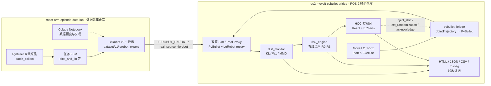

# ros2-moveit-pybullet-bridge 作品集材料包

本目录面向作品集、面试讲解与技术评审，目标是把仓库里的代码、验收证据、联调报告和演示素材整理成一条可快速阅读的展示线。

> 一句话定位：这是一个 ROS 2 / MoveIt 2 / PyBullet 端到端联调项目，覆盖运动规划闭环、可插拔 Policy Runner、双源 Sim2Real 偏移监控、五维风险管理、 HOC 运维控制台和可复现实验报告。

**跨仓库统一计划（Dashboard 三仓 + Bridge 双仓）**：见 **[MASTER_PORTFOLIO_PLAN.md](./MASTER_PORTFOLIO_PLAN.md)** — 含资料索引、下周开发日程与面试巩固安排。Dashboard 主入口：`~/workspace/robot-ops-dashboard`。

## 推荐阅读顺序

| 顺序 | 材料 | 适合回答的问题 |
|------|------|----------------|
| 0 | [统一作品集主计划](./MASTER_PORTFOLIO_PLAN.md) | 五仓怎么投、下周做什么、面试背什么 |
| 0b | [统一简历描述](./UNIFIED_RESUME.md) | Dashboard + Bridge 五仓合并写进简历 |
| 0c | [系统设计幻灯片](./system-design-slides.md) | Marp 导出 PDF/PPTX（含 Dashboard 章节 v1.1） |
| 0d | [面试巩固 · 标准答法](./INTERVIEW_PREP.md) | 必掌握清单、10 题答法、48h checklist |
| 0e | [五仓统一架构总图](./UNIFIED_ARCHITECTURE.md) | 作品集主图、三链细节、仓库对照表 |
| 1 | [项目首页](../../README.md) | 这个项目解决什么问题，系统怎么跑起来 |
| 2 | [验收摘要](./ACCEPTANCE_SUMMARY.md) | 哪些 FR/NFR 已经验证，有哪些明确边界 |
| 3 | [Demo 脚本](./DEMO_SCRIPT.md) | 5-8 分钟如何演示，讲解顺序是什么 |
| 4 | [代码导览](./CODE_WALKTHROUGH.md) | 核心模块在哪里，面试时怎么讲源码 |
| 5 | [简历描述](./RESUME_SUMMARY.md) | 如何把本仓库和采集仓库合并写进简历 |
| 6 | [系统设计说明书](./SYSTEM_DESIGN_SPEC.md) | 架构、接口、算法与交付取舍 |
| 7 | [系统设计幻灯片](./system-design-slides.md) | 导出 PDF/PPTX 用于投递或现场讲解 |

## 作品集亮点

- **端到端集成**：MoveIt 2 规划结果经 `FollowJointTrajectory` relay 驱动 PyBullet，并反馈 `/joint_states` 给 MoveIt / TF。
- **Sim2Real 预验证**：双源 PyBullet 与 LeRobot 回放用于构造可复现偏移，在线输出 KL / W1 / MMD。
- **风险闭环**：五维风险聚合到 R0-R3，R3 自动急停，HOC acknowledge 后才允许恢复。
- **可审计运维**：React + ECharts HOC 控制台展示风险、分布、tracking、相机与实验导出。
- **策略与系统验证**：可插拔 `PolicyRunner`（Replay / SineWave）、`/system_health`、故障注入与 `run_system_validation.sh` benchmark 报告。
- **工程证据较完整**：`scripts/verify_*.sh` 生成 JSON/CSV/rosbag/HTML 样例，覆盖主要功能与非功能验收；公开 CI、公开视频、Bridge jitter 与长稳证据仍按收尾项跟踪。

## 双仓库综合架构图

这张图是作品集主图口径：采集仓库负责“数据从哪里来”，联调仓库负责“数据如何进入 ROS 2 验证、监控、风险和报告闭环”。



简历或面试中建议这样概括：两个仓库共同组成“机器人操作数据采集 + ROS 2 Sim2Real 验证平台”。采集仓库输出 LeRobot 数据，联调仓库消费这些数据并完成 MoveIt 闭环、分布监控、风险处置和可审计报告。

## 现有材料索引

| 类别 | 文件 | 用法 |
|------|------|------|
| 联调报告 | [dual-repo-experiment-report.html](../samples/dual-repo-experiment-report.html) | 展示 bridge 仓库与 LeRobot 数据仓的跨仓联动 |
| 校准报告 | [same-task-calibration-report.html](../samples/same-task-calibration-report.html) | 解释 KL / W1 / MMD 在同任务双源下的含义 |
| HOC 报告 | [sample-experiment-report.html](../samples/sample-experiment-report.html) | 展示五维风险、仪表盘与报告导出 |
| Policy Runner 验证 | [validation_report.html](../samples/system-validation/validation_report.html) | Replay / SineWave benchmark 汇总与 `/system_health` 证据 |
| 指标索引 | [samples/README.md](../samples/README.md) | 查找 FR/NFR JSON、CSV、rosbag 与覆盖率产物 |
| 验收台账 | [ACCEPTANCE_GAP.md](../ACCEPTANCE_GAP.md) | 追踪逐项验收状态、证据缺口和 Phase-2+ |
| 架构配图 | [assets/README.md](../assets/README.md) | README、幻灯片和 Demo 截图资源 |
| 演示视频 | [portfolio-demo-zh-visual.mp4](../samples/portfolio-demo-zh-visual.mp4) / [portfolio-demo-zh-dynamic.mp4](../samples/portfolio-demo-zh-dynamic.mp4) | 本地作品集视频素材，公开投递时建议放 Release 或网盘外链 |

## 建议投递组合

- **GitHub README**：保留当前项目首页，突出系统架构、快速开始、验收边界。
- **PDF/PPTX**：从 `system-design-slides.md` 导出 8-13 页系统设计讲解。
- **Demo 视频**：使用 `DEMO_SCRIPT.md` 的顺序录制 5-8 分钟版本，重点覆盖偏移注入和 R3 恢复。
- **证据附件**：引用 `ACCEPTANCE_SUMMARY.md`，把原始 JSON/CSV/rosbag 留在 `docs/samples/` 作为可追溯材料。

## 不建议作为主展示入口的文件

- `.ros-log/`、`.ros_log/`、`docs/samples/system-validation/ros_logs/`：本地 ROS / benchmark 运行日志，适合排障，不适合公开作品集。
- `docs/samples/maintainability-coverage/.coverage`：coverage 原始数据库，建议只引用 `coverage.json` / `coverage.xml` 或摘要。
- `docs/samples/**/*.mcap`：rosbag 原始数据体积较大，公开展示时建议保留 `metadata.yaml` 和摘要 JSON，原始包走外链。
- `docs/samples/**/concat.txt`、`.capture_tmp/`：生成视频的中间文件，不适合作为评审主线。

## 导出 PDF（推荐）

### 方式 A · Marp 幻灯片 → PDF（最快）

```bash
# 安装 Marp CLI（一次性）
npm install -g @marp-team/marp-cli

# 导出 PDF
cd docs/portfolio
marp system-design-slides.md --pdf -o system-design-slides.pdf

# 导出 PowerPoint（可选）
marp system-design-slides.md --pptx -o system-design-slides.pptx
```

### 方式 B · Pandoc 说明书 → PDF

```bash
# 需安装 pandoc + texlive（或 wkhtmltopdf）
cd docs/portfolio
pandoc SYSTEM_DESIGN_SPEC.md -o system-design-spec.pdf \
  --pdf-engine=xelatex -V CJKmainfont="Noto Sans CJK SC" \
  -V geometry:margin=2.5cm --toc
```

### 方式 C · VS Code / Cursor

1. 安装扩展 **Marp for VS Code**
2. 打开 `system-design-slides.md`
3. 右上角 **Export Slide Deck** → PDF

## 配图替换

幻灯片与说明书中标注了 `docs/assets/` 路径，导出前可将合成图替换为真实录屏截图：

| 占位 | 建议替换为 |
|------|-----------|
| `portfolio-overview.png` | 系统总览 |
| `m2-iiwa-pipeline.svg` | MoveIt 闭环 |
| `m4-monitor-metrics.png` | 监控指标 |
| `m5-hoc-dashboard.png` | HOC 浏览器截图 |

生成基础配图：`python3 scripts/generate_milestone_assets.py`

## 版本

与 [docs/design/README.md](../design/README.md) v1.0 对齐 · 2026-06-21
