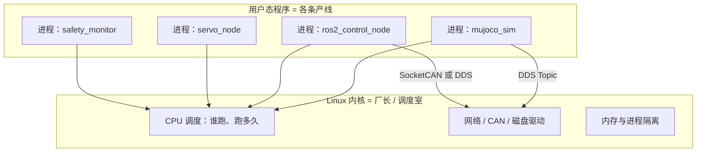
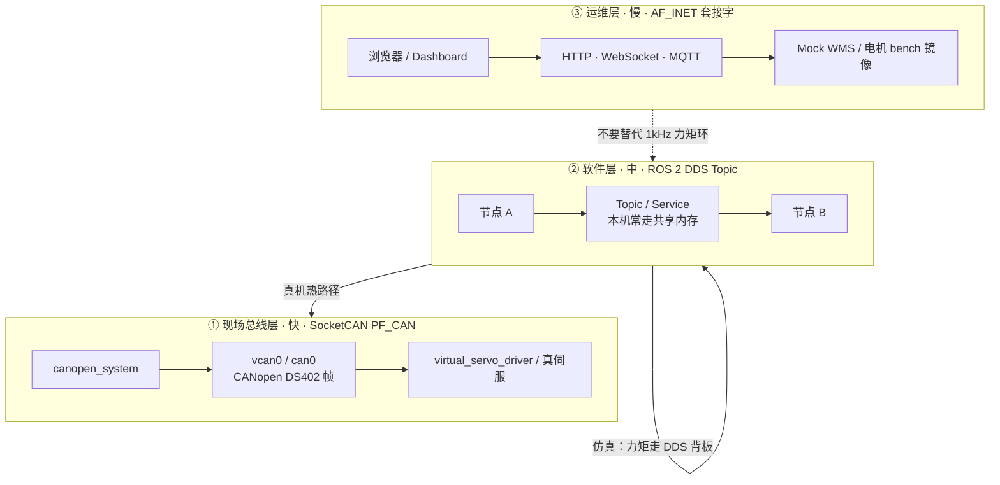
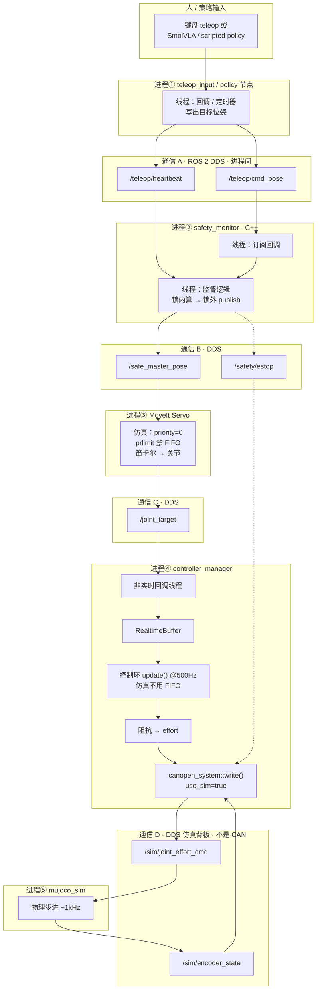
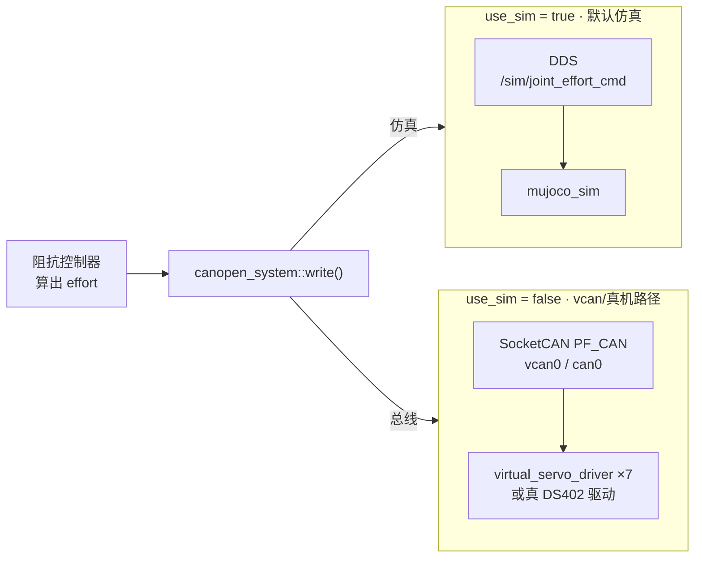
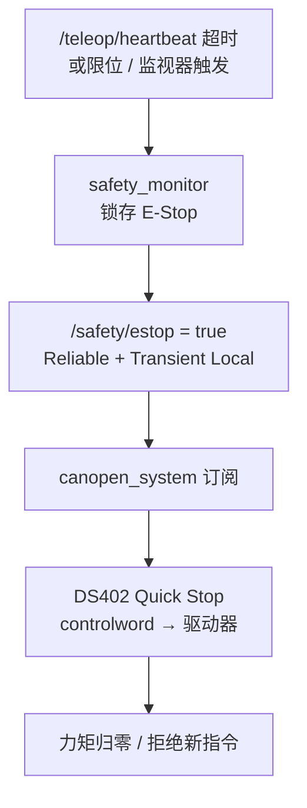
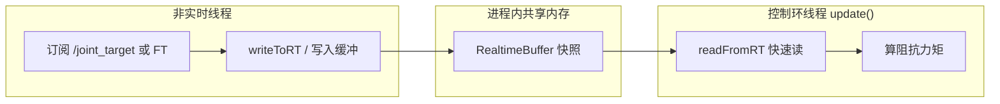
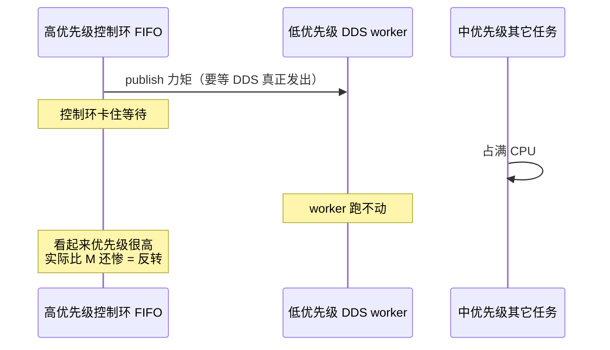

# 内核 · 进程/线程 · 通信 — 对照本项目的学习笔记

> 面向：对 Linux 内核与通信不太熟、但想对照三仓真实链路理解的学习者。  
> 配套面试速查：[INTERVIEW_PREP.md](./INTERVIEW_PREP.md)（Q12–Q16、六-B / 六-C）。  
> 代码主仓：上游 [`ros2-arm-teleoperation-suite`](file:///home/ina/dev/ros2-arm-teleoperation-suite)。

**口径提醒**

- **已实现**：仿真路径 DDS 背板、SocketCAN/`vcan0`、仿真关 FIFO、`RealtimeBuffer`、错峰启动与 `nice`/`ionice`。
- **设计规划 / 未验收**：本机仿真 ≠ 已跑通 `PREEMPT_RT` 硬实时；真机 FIFO 50/40 是参数意图，不是现场 WCET 证明。

---

## 目录

1. [零基础概念表](#1-零基础概念表)
2. [图 A：工厂类比总览](#2-图-a工厂类比总览)
3. [图 B：三条通信通道分层](#3-图-b三条通信通道分层)
4. [图 C：仿真主路径逐步注释](#4-图-c仿真主路径逐步注释每跳进程线程通信)
5. [图 D：仿真 vs 真机/vcan 分叉](#5-图-d仿真-vs-真机vcan-分叉)
6. [图 E：急停 E-Stop 旁路](#6-图-e急停-e-stop-旁路)
7. [图 F：同进程内 RealtimeBuffer](#7-图-f同进程内-realtimebuffer)
8. [调度：CFS / FIFO / 优先级反转](#8-调度cfs--fifo--优先级反转)
9. [小练检查清单](#9-小练检查清单)
10. [相关代码与文档索引](#10-相关代码与文档索引)
11. [下一步该着重学哪几个模块](#11-下一步该着重学哪几个模块优先级)
12. [学底层要买什么硬件](#12-学底层要买什么硬件按阶段别一次买齐)

---

## 1. 零基础概念表

| 概念 | 一句话 | 工厂类比 | 本项目例子 |
|------|--------|----------|------------|
| **内核** | 管 CPU、内存、网卡、CAN 口的总调度员 | 厂长 + 调度室 | Linux；你的节点通过系统调用用 CPU/设备 |
| **进程** | 一个正在跑的程序副本（内存隔离） | 一条产线 | `ros2_control_node`、`servo_node`、`mujoco_sim` |
| **线程** | 进程里的工人（共享内存） | 产线上的工人 | 控制环 `update()`、DDS 回调、定时器 |
| **调度** | 下一毫秒哪个线程用 CPU | 排班表 | CFS（普通）/ `SCHED_FIFO`（实时意图） |
| **套接字** | 向内核申请的通信句柄 | 传话筒 | TCP（网页）、`PF_CAN`（电机总线） |
| **DDS / ROS Topic** | 进程间消息中间件 | 产线之间的传票 | `/teleop/cmd_pose`、`/sim/joint_effort_cmd` |
| **现场总线** | 控制器 ↔ 驱动器的工业链路 | 车间设备总线 | CANopen over SocketCAN |

**进程 vs 线程（务必分清）**

- 多个 ROS 节点 ≈ **多个进程**（launch 拉起多个程序）。
- 一个节点内部多个回调 ≈ **多线程**（如 `MultiThreadedExecutor`）。
- 同进程线程之间传数据常用内存缓冲（如 `RealtimeBuffer`），**不是**再开一条 TCP。

---

## 2. 图 A：工厂类比总览



读法：你的 C++/Python **不能直接**操作硬件；一律「请求内核帮忙」。

---

## 3. 图 B：三条通信通道分层



| 层 | 典型载荷 | 本项目 |
|----|----------|--------|
| 运维 | JSON / HTTP | Dashboard、`/ws/status` |
| 软件 | ROS 消息 | `/teleop/*`、`/joint_*`、`/sim/*` |
| 总线 | CAN 帧（RPDO/TPDO/SDO…） | `use_sim:=false` 时的关节力矩/反馈 |

**同叫 socket，不是同一种路**：`PF_CAN` ≠ `AF_INET` TCP ≠「给电机开外网」。

---

## 4. 图 C：仿真主路径逐步注释（每跳：进程/线程/通信）

这是默认学习主图：`use_sim:=true`。



### 逐步对照表

| 跳 | 从 → 到 | 进程关系 | 通信 |
|----|---------|----------|------|
| 1 | 输入 → Safety | 跨进程 | DDS `/teleop/cmd_pose` |
| 2 | Safety → Servo | 跨进程 | DDS `/safe_master_pose` |
| 3 | Servo → 阻抗 | 跨进程 | DDS `/joint_target` |
| 4 | 回调 → `update()` | **同进程、跨线程** | `RealtimeBuffer`（内存） |
| 5 | HW → MuJoCo | 跨进程 | DDS `/sim/joint_effort_cmd` |
| 6 | 编码器反馈 | 跨进程 | DDS `/sim/encoder_state` |

### 三句口诀

1. **实线主路径 = 仿真**：力矩先走 DDS 背板 → **不要**开高 FIFO。  
2. **同进程 RealtimeBuffer**：线程间的箱子，不是网络协议。  
3. **急停虚线**：Safety → `/safety/estop` → `canopen_system`（见[图 E](#6-图-e急停-e-stop-旁路)）。

---

## 5. 图 D：仿真 vs 真机/vcan 分叉



| | 仿真 | 真机 / vcan |
|--|------|-------------|
| 力矩怎么出去 | DDS Topic | CAN 帧（RPDO） |
| 控制环调度意图 | `thread_priority=0` | FIFO 50 / Servo 40（参数意图） |
| 为何不同 | 热路径依赖非 RT 的 DDS worker，开 FIFO 易**优先级反转** | 热路径可直写总线，少卡在 DDS publish |

---

## 6. 图 E：急停 E-Stop 旁路



要点：急停是**安全旁路**，优先级逻辑上高于正常阻抗跟踪；QoS 用 Transient Local，晚启动的硬件接口也能收到最后一态。

---

## 7. 图 F：同进程内 RealtimeBuffer



目的：避免在 500 Hz / 1 kHz 环里直接抢锁、打日志、等网络。

---

## 8. 调度：CFS / FIFO / 优先级反转

### 8.1 两种排班

| 策略 | 行为 | 本项目 |
|------|------|--------|
| **CFS（普通）** | 轮流、相对公平；`nice` 越大越客气 | spawner：`nice -n 19 ionice -c 3` |
| **SCHED_FIFO** | 高优先级可打断低优先级 | 真机意图：CM 50 > Servo 40；**仿真关掉** |

### 8.2 优先级反转（仿真关 FIFO 的原因）



对策（已实现于 launch）：

- 仿真：`controller_thread_priority=0`
- Servo：`prlimit --rtprio=0:0`
- 契约测试：`tests/test_sim_backend_launch.py`

---

## 9. 小练检查清单

在上游仓练习（务必带超时，练完 `pkill` 扫尾）：

```bash
# 1) 看进程/线程与调度类
htop          # 按 H 显示线程
ps -eLo pid,tid,class,rtprio,ni,comm | grep -E 'ros2|servo|control|mujoco'

# 2) 看某一进程调度
chrt -p <pid>

# 3) 看话题频率（对照图 C 各跳）
ros2 topic hz /teleop/cmd_pose
ros2 topic hz /safe_master_pose
ros2 topic hz /joint_target
ros2 topic hz /sim/joint_effort_cmd
ros2 topic hz /sim/encoder_state

# 4) 生命周期
timeout 60s ros2 launch ...   # 你的常用 launch
pkill -9 -f teleop_bringup || true
pkill -9 -f mujoco_sim || true
```

建议顺序：图 B 分层 → 图 C 主路径 → 图 D 分叉 → 图 E 急停 → 图 F 缓冲。

---

## 10. 相关代码与文档索引

| 主题 | 路径 |
|------|------|
| 仿真关 FIFO / CM 优先级 | [ros2_control.launch.py](file:///home/ina/dev/ros2-arm-teleoperation-suite/src/teleop_bringup/launch/ros2_control.launch.py) |
| Servo `prlimit` | [servo.launch.py](file:///home/ina/dev/ros2-arm-teleoperation-suite/src/teleop_moveit_config/launch/servo.launch.py) |
| 契约测试 | [test_sim_backend_launch.py](file:///home/ina/dev/ros2-arm-teleoperation-suite/tests/test_sim_backend_launch.py) |
| RealtimeBuffer | [cartesian_impedance_controller.hpp](file:///home/ina/dev/ros2-arm-teleoperation-suite/src/teleop_controllers/include/teleop_controllers/cartesian_impedance_controller.hpp) |
| SocketCAN / DS402 HW | [canopen_system.cpp](file:///home/ina/dev/ros2-arm-teleoperation-suite/src/canopen_hw_interface/src/canopen_system.cpp) |
| 架构总览 | [ARCHITECTURE_V2.md](file:///home/ina/dev/ros2-arm-teleoperation-suite/docs/ARCHITECTURE_V2.md) |
| 为何 CANopen 而非 EtherCAT | [ADR 02](file:///home/ina/dev/ros2-arm-teleoperation-suite/docs/ARCHITECTURAL_DECISION_RECORDS.md) |
| 面试 FAQ Q12–Q16 | [INTERVIEW_PREP.md](./INTERVIEW_PREP.md) |
| 甘特与 FIFO 图 | INTERVIEW_PREP 六-B / 六-C |

---

## 修订记录

| 日期 | 说明 |
|------|------|
| 2026-07-31 | 初版：从对话整理图 A–F + 小练清单，独立成学习文档 |

---

## 附录：和「嵌入式软硬件工程师」差在哪？

你现在学的主线更接近 **机器人系统 / Linux 中间件工程师**，不是经典 MCU 嵌入式全职岗。简表：

| | 你当前主线 | 嵌入式软件 | 嵌入式硬件 |
|--|------------|------------|------------|
| 平台 | Linux + ROS 2 | MCU + RTOS/裸机 | 原理图 / PCB |
| 通信 | DDS、用户态 SocketCAN | 寄存器级外设、中断 | 电平、EMC、连接器 |
| 交付 | 节点、控制栈、仿真闭环 | Firmware / 驱动 | Gerber、BOM |

重叠：DS402/CAN 语义、实时路径思维、台架固件（`robot-state-monitor`）。  
详细口径见 [INTERVIEW_PREP.md Q17](./INTERVIEW_PREP.md)。

若你的面试漏斗已偏向「内核 / 进程 / 通信」，建议把本笔记升为 **主攻材料**，作品集改成底层证据实验室；策略见 [INTERVIEW_PREP.md Q19](./INTERVIEW_PREP.md)。

---

## 11. 下一步该着重学哪几个模块（优先级）

> 前提：主攻 Linux 用户态系统软件 + 工控通信边界；不先啃内核模块 / 画板。  
> 原则：**每个模块都要能指回本项目的命令或代码**，否则算没学完。

### P0 — 本周到两周内（面试开口就能用）

| # | 模块 | 学到什么算够 | 用项目怎么验收 |
|---|---|---|---|
| 1 | **进程 vs 线程 vs 调度** | CFS/`nice`、FIFO 意图、仿真为何关 FIFO、优先级反转能讲圆 | `ps -eLo`、`chrt`；对照 launch 里 `thread_priority` / `prlimit` |
| 2 | **三种通信口** | `PF_CAN` ≠ TCP ≠ DDS Topic；各自用在哪一层 | 图 B/C；`ros2 topic hz` +（有条件）`candump vcan0` |
| 3 | **实时路径纪律** | 为何不能在控制环里堵；缓冲/锁外发/独立 RX | 指 `RealtimeBuffer`、Safety 锁边界、CAN RX 超时 |

### P1 — 随后 2–4 周（把「底层」做成可演示）

| # | 模块 | 学到什么算够 | 用项目怎么验收 |
|---|---|---|---|
| 4 | **Linux I/O 与阻塞** | 阻塞/非阻塞、超时、`EAGAIN` 直觉；`epoll` 知道干什么即可 | 对照 CAN `SO_RCVTIMEO`；口述「若 write 堵了会怎样」 |
| 5 | **CANopen / DS402 主路径** | NMT、PDO/SDO、状态机到 Operation Enabled、E-Stop→Quick Stop | `use_sim:=false` + `candump`；急停旁路图 E |
| 6 | **多进程生命周期** | 启动错峰、僵尸/残留、`timeout`/`pkill`、降权 `ionice` | 全系统带超时拉起再扫尾；讲清 spawner 为何 `nice 19` |

### P2 — 按 JD 选加（不要并行铺太多）

| # | 模块 | 何时加 | 备注 |
|---|---|---|---|
| 7 | **Modbus 主从** | JD 出现仪表/网关/夹爪外设 | 夹爪 Mock → 真 TCP/RTU；别塞进 1 kHz 环 |
| 8 | **C/C++ 并发基础** | 岗位偏控制系统软件 | mutex、原子、无锁直觉；对照阻抗控制器 |
| 9 | **台架固件邻接** | JD 偏嵌入式软件 | ESP32/STM32 仓；仍不是主盘 |
| 10 | **EtherCAT / 内核模块 / 画板** | 有硬件或明确 JD | **默认先不做** |

### 建议学习节奏（单线程）

```text
第 1–2 周：P0 三个模块讲圆 + 对照学习笔记图 C/D/E/F
第 3–4 周：P1 做出「vcan + candump + 急停」一次完整演示口述
第 5 周起：只按投递 JD 从 P2 里挑 1 个加深
```

### 刻意先不学什么

- 为「显得底层」去写内核模块、刷 PREEMPT_RT 定制盘  
- 并行开应用层框架课 / 纯刷题当主线（可维持最低手感，勿占主精力）  
- 无 JD 信号就深挖 EtherCAT 主站  

详见面试策略 [Q19](./INTERVIEW_PREP.md) / 市场位置 [Q20](./INTERVIEW_PREP.md)。

---

## 12. 学底层要买什么硬件？（按阶段，别一次买齐）

> 原则：**能用 `vcan0` / 仿真先学透的，先不买。**  
> 硬件只为补「真帧、真电平、真串口」——对应 P1 的 CAN / 可选 Modbus / 可选台架固件。

### 0 元也能练（先做完再买）

| 练什么 | 不需要硬件 |
|---|---|
| 进程/线程/调度、FIFO 反转口述 | 现有 PC + 上游 launch |
| DDS Topic 路径图 C | 现有仿真栈 |
| SocketCAN **软件路径** | `vcan0` + `candump`/`cansend` |
| DS402 状态机逻辑 | `virtual_servo_driver` |

没有 USB-CAN 之前，**不要**认为学不了 CAN——协议与调度可以先在 vcan 上闭环。

### 第一笔（强烈建议，性价比最高）~ ¥100–300

| 东西 | 干什么 | 备注 |
|---|---|---|
| **USB–CAN 适配器**（支持 SocketCAN 的，如基于 candleLight / gs_usb / 常见「USB CAN 分析仪」） | 电脑出现 `can0`，发真 CAN 帧 | 买前确认：**Linux SocketCAN 驱动**，不要只支持厂家闭源 Windows 上位机 |
| **两根终端电阻意识**（120Ω）或自带终端的转接板 | 总线要端接 | 即使只挂适配器 + 一个节点也要懂端接 |
| （可选同单）**杜邦线 / 接线端子** | 接 CAN_H/L | — |

学什么：`ip link set can0 up type can bitrate 500000` → `candump` → 对照项目 PDO ID；以后可接真实从站。

### 第二笔（P1 末 / P2 Modbus）~ ¥50–200

| 东西 | 干什么 | 备注 |
|---|---|---|
| **USB–RS485** 转换器 | 练 Modbus RTU 物理层 | 和夹爪「慢速外设」叙事一致 |
| 任意 **Modbus RTU 从站模块**（廉价温湿度/继电器/电表均可） | 真主从问答 | 功能码 03/06/10；别买贵 |

也可先只做 **Modbus TCP**（零硬件，本机端口 502），RS485 作为加分。

### 第三笔（JD 偏嵌入式 / 想练双核任务时再买）~ ¥50–150

| 东西 | 干什么 | 对齐你哪个仓 |
|---|---|---|
| **ESP32-S3 开发板**（你 monitor 仓已在用同类） | FreeRTOS 双核、UART/USB、以后可扩 CAN | `robot-state-monitor-v1` |
| （可选）**STM32 最小系统**（F4 一类） | 中断、外设、与 ESP 串口联调 | 同仓 STM32 节点 |
| USB 转 TTL 串口线 | 看日志 | 一块板往往自带 |

**先买 ESP32 一块就够**；STM32 等你真要跟仓库固件对齐再加。

### 默认先不要买

| 东西 | 原因 |
|---|---|
| 机械臂 / 整机套件 | 贵；对「进程+总线」主线性价比低 |
| EtherCAT 专用网卡 + ESC 从站 | 贵、驱动折腾；P2 默认延后 |
| 工控机 / 实时补丁整机 | 真机阶段再考虑 |
| 闭源仅 Windows 的 CAN 盒 | 和你 Linux/SocketCAN 学习目标冲突 |
| 一堆无关传感器「先囤着」 | 分散精力 |

### 推荐购买顺序（一句话）

```text
现在：0 元把 vcan + 调度讲透
↓
第一笔：USB-CAN（SocketCAN）
↓
第二笔：USB-RS485 + 廉价 Modbus 从站（或先 TCP）
↓
第三笔：ESP32（对齐已有固件仓）
```

### 明确型号推荐（可照着搜）

> 价格随电商浮动；认准规格比认准某个店铺更重要。  
> **USB-CAN 硬条件**：Linux 插上后能出 `can0`，内核驱动走 **`gs_usb`**（candleLight / CANable 系）。  
> **不要买**：只配闭源 Windows 上位机、说明书从不提 SocketCAN/`can0` 的「USB CAN 分析仪」（国内很多工控盒属于这类）。

#### A. USB–CAN（第一笔，优先买）

| 优先级 | 型号 / 关键词 | 说明 |
|---|---|---|
| **首选（国内好买）** | **CANable** / **CANable 2.0** 兼容板；或 **Makerbase MKS CANable**；或 **FYSETC UCAN**（STM32F072） | 开源 candleLight 固件系，Linux 主线 `gs_usb`，`candump` 即用 |
| **首选（正版开源）** | [candleLight](https://linux-automation.com/) / candleLight FD | 官方开源；国内到手慢/贵一点；FD 版你现阶段用不上也可先买经典 CAN |
| **备选** | 带 **candleLight / gs_usb / SocketCAN** 字样的 STM32 USB-CAN 小板 | 下单前看评价里有没有人提 `ip link` / `can0` |
| **不推荐入门** | 周立功等仅 Windows 库的 USBCAN、无 Linux 驱动说明的山寨「CAN卡」 | 和你学习目标冲突 |

建议配置：

- 速率练习用 **500 kbit/s**（与多数工业臂/车载常见一致）  
- 需要时备 **120Ω 终端电阻**（有的板可跳线/焊上）  
- 接线：CAN_H / CAN_L；DB9 的话确认销脚（常见 CiA 销 7=H、2=L）

插上后自检：

```bash
sudo dmesg | tail
ip link                # 应出现 can0
sudo ip link set can0 up type can bitrate 500000
candump can0
```

#### B. USB–RS485 + Modbus 从站（第二笔）

| 用途 | 型号 / 关键词 |
|---|---|
| USB→RS485 | **波音/CH340 或 FT232 的 USB-RS485**；或 **Waveshare USB TO RS485**（带 TVS 的更好） |
| 廉价从站 | **XY-MD02**（温湿度 Modbus RTU）、或任意 **Modbus RTU 继电器模块**（01/05/0F 功能码） |
| 零硬件替代 | 本机 **Modbus TCP :502**（先练协议再买 485） |

#### C. 嵌入式台架（第三笔，对齐你已有仓库）

| 用途 | **明确型号** | 对齐 |
|---|---|---|
| 主控（优先） | **ESP32-S3-DevKitC-1**（乐鑫官方 DevKitC-1） | 你仓 `platformio.ini` 已是 `board = esp32-s3-devkitc-1` |
| 传感器侧（可选） | **STM32F411** 最小系统 / Nucleo-F411RE（或你现有 `stm32_sensor_node` 同系列板） | 与 monitor 仓 F4 路线一致 |
| 串口 | 板载 USB-CDC 即可；备用 **CP2102 / CH340 USB-TTL** 一根 | — |
| 电机台架（更后） | **TB6612FNG** + **带编码器 N20** | 仓内已有调参文档，非第一优先级 |

#### D. 「一单买齐」最小包（约 ¥200–500 量级）

1. CANable / MKS CANable / FYSETC UCAN **×1**  
2. USB-RS485 **×1**（可暂缓）  
3. ESP32-S3-DevKitC-1 **×1**（若还没有）  
4. 杜邦线 + 若干 120Ω 电阻  

有 DevKitC-1 就不必再买第二块 ESP；STM32 / 电机套件等 P1 CAN 跑通后再加。

#### E. 已有 **STM32F103** 能不能用？

**能用，优先拿来练，不必为了「有 F411」再立刻买板。**

| 用途 | F103 是否合适 | 说明 |
|---|---|---|
| GPIO / UART / 中断 / 定时器基础 | ✅ 很合适 | 蓝药丸等 F103 经典入门板 |
| FreeRTOS 任务与优先级直觉 | ✅ 合适 | 和「进程/线程」叙事可对照（MCU 侧） |
| **CAN 从站**（收发标准帧、简单协议） | ✅ 合适 | F103 带 **bxCAN**；可当总线上的一个节点配合 USB-CAN |
| Modbus RTU（经 UART↔RS485） | ✅ 合适 | 自己写从站或跑开源 Modbus 栈 |
| 直接烧你仓里的 `stm32_sensor_node` | ❌ 不直接兼容 | 该仓面向 **STM32F411** 路线，工程/时钟/外设与 F103 不同，要移植 |
| 当 USB-CAN 主机适配器（替代 CANable） | ⚠️ 不优先 | candleLight/`gs_usb` 主流是 F042/F072；F103 当「分析仪」折腾大，不如买 CANable |
| EtherCAT / CAN-FD | ❌ | F103 无 CAN-FD；EtherCAT 需 ESC |

**建议用法（有 F103 时）**

1. 先继续用 PC 的 `vcan0` 学调度与协议。  
2. 买 **USB-CAN（CANable 系）** 后：F103 烧一个 **最小 CAN 收发例程**，和 `candump`/`cansend` 对打——这是性价比最高的硬件练习。  
3. 有 USB-RS485 时：F103 经 UART 做 Modbus 从站。  
4. **ESP32-S3-DevKitC-1** 仍按需保留（micro-ROS / 双核任务对齐现有仓）；F103 **替代不了** 那条 ESP 主线。  
5. 只有当你要复现 monitor 仓 IMU 节点原工程时，再考虑 F411/Nucleo。

#### F. 「USB-CAN（CANable）」和「普通 CAN 收发器」有什么区别？

很多人会买到一种小板，上面只有 **TJA1050 / SN65HVD230** 之类芯片，丝印写着 CAN 收发器——和 CANable **不是一类东西**。

```text
┌─────────────────────────────────────────────────────────┐
│  PC（Linux）                                            │
│    SocketCAN → can0                                     │
│         │                                               │
│         ▼                                               │
│  USB-CAN 适配器 = MCU(USB+CAN控制器) + 收发器 + 固件     │
│  （CANable / candleLight）                              │
└──────────────────────────┬──────────────────────────────┘
                           │ CAN_H / CAN_L（差分总线）
┌──────────────────────────▼──────────────────────────────┐
│  STM32F103                                              │
│    片内 bxCAN 控制器  ←→  普通 CAN 收发器芯片            │
│    （协议/帧在 MCU 里）      （只做 0/1 ↔ 差分电平）       │
└─────────────────────────────────────────────────────────┘
```

| | **普通 CAN 收发器**（TJA1050 等） | **USB-CAN（CANable 等）** |
|---|---|---|
| 本质 | **物理层芯片/模块** | **完整 USB 设备** |
| 干什么 | 把 MCU 的 TX/RX 逻辑电平 ↔ CAN_H/L 差分 | 让电脑出现 `can0`，用 `candump`/`cansend` |
| 含不含「CAN 控制器」 | ❌ 不含（帧组装在 MCU 的 bxCAN 里） | ✅ 板上 MCU 里有控制器 + 固件 |
| 单独插电脑 | ❌ 电脑不认，没有 `can0` | ✅ 走 `gs_usb` → SocketCAN |
| 你 F103 要不要 | **要**（F103 片内有控制器，外面差收发器） | PC 侧要；F103 侧不靠它当收发器 |
| 典型芯片 | TJA1050、TJA1051、SN65HVD230 | STM32F042/F072 + 收发器 + candleLight 固件 |

**一句话**

> 收发器 = 网线水晶头里的「电平驱动」；USB-CAN = 整块「USB 网卡」。  
> F103 学 CAN：买 **收发器模块** 接到 MCU 的 CAN_TX/RX；电脑要抓总线：另买 **CANable**（或继续用 `vcan0` 纯软件）。

**购物怎么配对**

| 你已有 | 还缺 |
|---|---|
| 只有 F103 | F103 用：**TJA1050/SN65HVD230 收发器模块**；PC 用：CANable 或暂用 vcan |
| 只有 CANable | 可先两台 PC/`vcan`；要真节点再加 F103+收发器 |
| F103 + 收发器 + CANable | 完整「PC ↔ 真总线 ↔ MCU」练习链 |

### 预算速查

| 阶段 | 大约 |
|---|---|
| 仅软件 | ¥0 |
| + USB-CAN（CANable 系） | ¥100–300 |
| + RS485/Modbus | 再 +¥50–200 |
| + ESP32-S3-DevKitC-1 | 再 +¥50–100 |
| 合理起步总包 | **约 ¥200–500** 足够学很久 |
