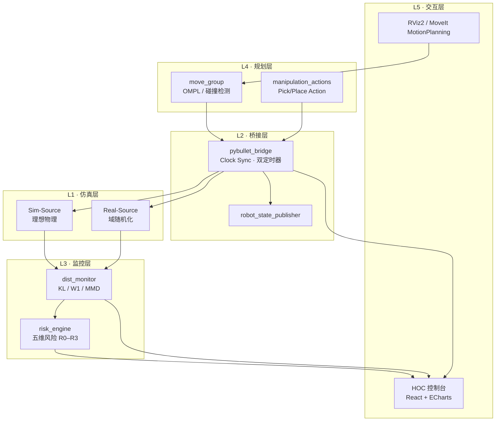
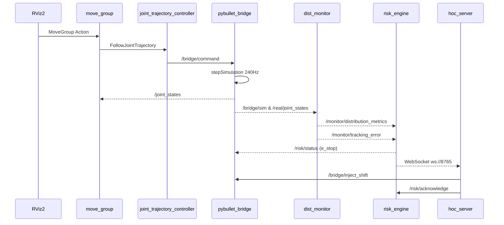
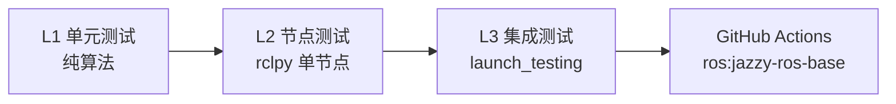

# ros2-moveit-pybullet-bridge · 系统设计说明书

**面向集成交付工程师 · 作品集交付版**

| 项目 | 内容 |
|------|------|
| 文档版本 | v1.0 |
| 日期 | 2026-06-20 |
| 仓库 | https://github.com/inayina/ros2-moveit-pybullet-bridge |
| 技术栈 | ROS 2 Jazzy · MoveIt 2 · PyBullet · React HOC |
| 依据文档 | `docs/design/01`–`09` |
| License | Apache-2.0 |

---

## 版本记录

| 版本 | 日期 | 变更摘要 |
|------|------|----------|
| v1.0 | 2026-06-20 | 初版：整合 design/01–09，交付视角 13 页结构 |
| v0.7 | 2026-06-20 | 风险监控补全（五维风险 / R2 降级 / 看门狗） |
| v0.1 | 2026-06-19 | 架构 / 接口 / 算法 / HOC 四篇初稿 |

**交付定位（一句话）**  
本系统提供**可脚本化验收**的 Sim2Real 预集成环境：核心 launch、CI 配置、测试/verify 脚本与 HOC 可审计报告，降低「无真机条件下的交付不确定性」。当前工作区已完成本机复验；推送后仍以 GitHub Actions 绿勾为公开交付记录。

---

## 1. 项目背景与目标

### 1.1 解决什么问题（Sim2Real Gap）

| 痛点 | 交付后果 | 本系统应对 |
|------|----------|------------|
| MoveIt 规划与物理仿真脱节 | 集成问题只能在实机暴露 | `/bridge/command` ↔ PyBullet 闭环 |
| Sim/Real 偏移不可量化 | 验收标准模糊 | KL / W1 / MMD 在线监控 + Ground Truth 注入 |
| 监控数据分散在 CLI | 故障排查慢、无法留痕 | HOC 一屏态势 + HTML/CSV 实验报告 |

### 1.2 适用场景

- **机械臂预集成验证**：MoveIt 轨迹在 PyBullet 中可重复执行
- **Sim2Real 迁移前评估**：双源仿真构造可控分布偏移，标定监控阈值
- **演示 / 验收 / CI 冒烟**：无硬件条件下的端到端链路证明
- **跨仓库数据联动**（可选）：与 `robot-arm-episode-data-lab` 的 LeRobot 导出对接

### 1.3 设计约束

- 无真实硬件 → 双源 PyBullet 代理 Real 侧
- 单命令 Demo → `portfolio_demo.launch.py`
- 可复现 → 随机种子、rosbag、实验报告含 git hash
- 可迁移 → 预留 `ros2_control` / 真机驱动接入点

---

## 2. 系统整体架构

### 2.1 分层模块图



**图示建议**：导出时使用 `docs/assets/portfolio-overview.png` 或上述 Mermaid 渲染图。

### 2.2 ROS 2 包对照（交付清单）

| 包 | 节点 | 交付职责 |
|----|------|----------|
| `pybullet_bridge` | `bridge_node` | 物理仿真核心、双源调度 |
| `dist_monitor` | `monitor_node` | 分布偏移量化 |
| `risk_engine` | `risk_node` | 风险聚合、急停联动 |
| `hoc_console` | `hoc_server` | Web 运维、报告导出 |
| `moveit_config` | `move_group` 等 | MoveIt 2 配置 |
| `manipulation_actions` | `manipulation_node` | 高层动作库 |
| `bridge_monitor_msgs` | — | 接口契约（msg/srv/action） |

**交付要点**

- 7 个 ROS 包边界清晰，可**分包编译、分包验收**
- `planar_2dof` 用于 CI 快速冒烟；`iiwa7` 用于交付演示主线
- 验收脚本映射：`verify_m1.sh` → M1，`verify_portfolio.sh` → 全链路

### 2.3 数据流图（控制 + 监控）



### 2.4 关键接口速查

| 类型 | 名称 | 用途 |
|------|------|------|
| Topic | `/bridge/command` | 轨迹入口 |
| Topic | `/joint_states` | MoveIt 状态反馈 |
| Topic | `/bridge/sim/joint_states` · `/bridge/real/joint_states` | 双源监控输入 |
| Topic | `/monitor/distribution_metrics` | KL / W1 / MMD |
| Topic | `/risk/status` | R0–R3 风险等级 |
| Service | `/bridge/inject_shift` | 验收：注入已知偏移 |
| Service | `/risk/force_e_stop` | 验收：熔断测试 |
| WebSocket | `ws://localhost:8765` | HOC 实时仪表盘 |

> 完整规格：[docs/design/05-ros2-node-interface-and-dataflow-spec.md](../design/05-ros2-node-interface-and-dataflow-spec.md)

---

## 3. 核心模块说明

### 3.1 MoveIt 2 桥接器（pybullet_bridge）

**职责**：规划与仿真的交付枢纽，建立 ROS 2 控制节点 ↔ PyBullet 双向通信。

| 模块 | 实现 | 交付价值 |
|------|------|----------|
| `SimSource` / `RealSource` | 双 PyBullet 实例 | 无真机构造 Sim2Real Ground Truth |
| `TrajectoryExecutor` | JointTrajectory 时间插值 | 与 MoveIt 输出格式对齐 |
| Clock Sync | 双定时器 240 Hz / 100 Hz | 物理步进不阻塞 DDS 回调 |
| 域随机化 | `changeDynamics` + 噪声 | 可控、可复现的偏移注入 |

**控制闭环数据流**

```
MoveIt → FollowJointTrajectory → /bridge/command
    → TrajectoryExecutor.sample(t_sim)
    → POSITION_CONTROL + stepSimulation()
    → /joint_states → robot_state_publisher → /tf
    → MoveIt PlanningSceneMonitor（闭环）
```

**交付验收检查项**

- [ ] `./scripts/verify_m1.sh` PASS
- [ ] `python3 scripts/check_iiwa_joint_consistency.py` PASS
- [ ] RViz Plan & Execute 后 PyBullet GUI 同步运动
- [ ] E_STOP 时 `/bridge/system_state` 为 `E_STOP`

**已知限制**：当前以 trajectory relay 替代完整 `ros2_control` 栈（MoveIt 闭环已通）；接触动力学精度弱于 Gazebo，通过参数随机化覆盖不确定性。

**图示建议**：`docs/assets/m2-iiwa-pipeline.svg`

---

### 3.2 Sim/Real 分布监控器（dist_monitor）

**职责**：对 Sim 与 Real 双源关节流进行在线统计检验，量化分布偏移。

| 指标 | 对象 | 交付意义 |
|------|------|----------|
| **KL 散度** | 逐关节误差分布 | 快速、可解释，定位偏移关节 |
| **Wasserstein-1** | 平移型分布偏移 | 对均值漂移敏感 |
| **MMD（RBF 核）** | 多维联合分布 | 非参数，对非高斯噪声鲁棒 |

**处理流水线**

```
/bridge/sim/joint_states ─┐
                          ├─ 时间对齐 (±50ms) ─→ ε = q_sim - q_real
/bridge/real/joint_states ┘
                          └─ 5s 滑窗 ─→ KL/W1/MMD ─→ shift_detected
```

**阈值配置**

| 文件 | 内容 |
|------|------|
| `dist_monitor/config/thresholds.yaml` | KL/W1/MMD 告警阈值 |
| `dist_monitor/config/calibration.yaml` | 基线标定 |
| `dist_monitor/config/joint_limits.yaml` | 软限位参考 |

标定命令：`python3 scripts/calibrate_monitor_thresholds.py --write`

**验收场景（Ground Truth 可复现）**

1. 基线运行 30 s → R0，`shift_detected=false`
2. 调用 `/bridge/inject_shift` → 5 s 内 `shift_detected=true`
3. 导出指标写入 HOC 实验报告

**交付要点**：验收看 **`shift_detected` + 指标时序**，而非单点 RMSE。支持 `real_source:=lerobot` 与 episode-data-lab 对齐。

**图示建议**：`docs/assets/m4-monitor-metrics.png`

---

### 3.3 风险引擎（risk_engine）

**职责**：聚合五维风险，驱动分级处置与 Fail-Safe 熔断。

| 维度 | 来源 | 等级处置 |
|------|------|----------|
| D1 分布偏移 | `/monitor/distribution_metrics` | R1 告警 |
| D2 跟踪误差 | `/monitor/tracking_error` | R2 降级运行 |
| D3 动力学异常 | bridge 力矩 hint | R2 |
| D4 通信健康 | `/monitor/comm_health` | R2 |
| D5 规划失败 | `/risk/planning_stats` | R1 |

**Fail-Safe 主链**

```
R3 → e_stop_active → bridge 停步 → MoveGroup cancel → HOC Acknowledge → 恢复
```

验收脚本：`./scripts/verify_risk_complete.sh`

---

### 3.4 运维控制台（hoc_console）

**职责**：一屏态势感知、实验控制与验收留痕。

| 层级 | 技术 | 端口 |
|------|------|------|
| 前端 | React + ECharts + Ant Design | dev `:5173` / prod `:8080` |
| 后端 | `hoc_server` (rclpy + asyncio) | WebSocket `:8765` |

**核心能力**

- 风险雷达、Sim/Real 分布对比、KL/MMD 时序
- 域随机化 / 偏移注入、急停与 Acknowledge
- rosbag 录制、HTML/CSV 实验报告导出（含 git hash）

**交付要点**

- HOC 是**验收留痕**入口，报告可归档
- 开发模式 `hoc.launch.py` 适合调试；录屏建议 `hoc_prod.launch.py`
- R3 急停必须演示「熔断 → 人工确认 → 恢复」

**图示建议**：`docs/assets/m5-hoc-console.svg` + `m5-hoc-dashboard.png`

---

## 4. 部署与运维

### 4.1 部署路径对比

| 路径 | 适用 | 风险 |
|------|------|------|
| **Docker**（推荐） | CI、新环境快速验收 | GUI 需宿主机 X11 |
| **源码编译** | 开发调试、RViz 录屏 | conda 与 ROS Python 冲突 |

### 4.2 Docker 冒烟入口

```bash
export EPISODE_DATA_LAB_ROOT=~/robot-sim-lab/robot-arm-episode-data-lab
docker compose build
docker compose run --rm verify          # URDF + offline_compare + portfolio 15s
docker compose run --rm portfolio-demo  # headless 交互演示
```

`verify` 服务实际运行 `scripts/verify_portfolio.sh`；该脚本会清理 ROS 进程并启动 DIRECT smoke，适合干净环境复验，不建议在已有演示进程运行时直接执行。

详见 [docker/README.md](../../docker/README.md)。

### 4.3 依赖矩阵

| 组件 | 版本 | 备注 |
|------|------|------|
| Ubuntu | 24.04 | 与 Jazzy 原生匹配 |
| ROS 2 | Jazzy | LTS 至 2029 |
| MoveIt 2 | 2.9.x | iiwa7 主线 |
| Python | 3.12 | **必须用系统 Python**，非 conda |
| PyBullet | ≥ 3.2.5 | DIRECT 模式支持 CI |
| Node.js | 18+ | 仅 HOC 前端 |

### 4.4 环境变量与配置清单

| 变量 / 参数 | 默认 | 说明 |
|-------------|------|------|
| `EPISODE_DATA_LAB_ROOT` | 自动解析 | LeRobot 联动时必填 |
| `LEROBOT_EXPORT` | `$ROOT/dataset/v1/lerobot_export` | `real_source:=lerobot` |
| `HOC_FRONTEND_DIR` | 自动解析 `frontend/dist` | HOC 生产模式 |
| `websocket_port` | `8765` | HOC WebSocket |
| `http_port` | `8080` | HOC HTTP |
| `real_source` | `topic` | `topic` / `lerobot` |

完整配置：[docs/SETUP.md](../SETUP.md)

### 4.5 交付风险清单

| 风险 | 现象 | 缓解 |
|------|------|------|
| conda 污染 | `UnsupportedTypeSupport` | `unset CONDA_PREFIX`，用 `/usr/bin/python3` |
| 未 colcon build | `package not found` | build 后 `source install/setup.bash` |
| HOC 前端缺失 | 404 | `npm install && npm run build` |
| 双 launch 冲突 | echo 无输出 | `pkill -f bridge_node`，单实例运行 |

### 4.6 标准交付启动流程

```bash
# 1. 环境
source setup.sh && source ~/ros2_ws/install/setup.bash

# 2. 预检（交付前必跑）
./scripts/verify_portfolio.sh

# 3. 主系统
ros2 launch pybullet_bridge portfolio_demo.launch.py sim_mode:=GUI

# 4. HOC（第二终端）
ros2 launch hoc_console hoc.launch.py
# → http://localhost:5173

# 5. MoveIt 闭环（可选第三终端）
ros2 launch moveit_config m2_iiwa_demo.launch.py sim_mode:=GUI
```

### 4.7 5 分钟验收演示脚本

| 顺序 | 操作 | 验收标准 |
|------|------|----------|
| 1 | 观察双 PyBullet + HOC 雷达 | WS 连接，R0 稳定 |
| 2 | 查看 KL/MMD 时序 | 曲线刷新 |
| 3 | 注入偏移 | R0→R2，`shift_detected=true` |
| 4 | 急停 → Acknowledge | 运动停止后恢复 |
| 5 | 导出 HTML/CSV 报告 | 文件生成，含指标摘要 |

---

## 5. 测试策略与 CI/CD

### 5.1 三层测试体系



| 层级 | 包 | 验证内容 |
|------|-----|---------|
| 单元 | 全部 Python 包 | KL/MMD、风险聚合、轨迹插值 |
| 节点 | 全部 Python 包 | Topic 发布/订阅、WS 广播 |
| 集成 | `pybullet_bridge` | M1 demo、bridge→monitor→risk 全链路 |

### 5.2 命令

```bash
./scripts/run_tests.sh                              # 全量
cd dist_monitor && pytest test/ -m "not launch_test" # 快速
cd pybullet_bridge && pytest test/ -m launch_test    # 集成
```

### 5.3 CI 流水线

```
checkout → apt 依赖 → pip requirements → colcon build (7 packages)
    → run_tests.sh → generate_milestone_assets.py (smoke)
```

[](https://github.com/inayina/ros2-moveit-pybullet-bridge/actions/workflows/ci.yml)

**交付要点**：CI 绿勾 = 最低交付门槛；交付前本地复现 CI 环境（系统 Python 3.12）。2026-06-20 本机已通过 `run_tests.sh`、`verify_portfolio.sh`、`verify_risk_complete.sh` 与 iiwa joint consistency 检查。

---

## 6. 已知问题与后续规划

### 6.1 当前完成度

| 范围 | 完成度 | 交付状态 |
|------|--------|----------|
| M1–M5 核心功能 | ~98% | ✅ 可 Live Demo |
| S5 五维风险补全 | ~98% | 本机 `verify_risk_complete.sh` 已通过 |
| M6 展示材料 | ~70% | ⚠️ 待真实录屏替换合成图 |
| 双仓库一体验收 | ~60% | ⚠️ LeRobot 联调需双方就绪 |

### 6.2 已知限制（写入验收说明）

| 项 | 现状 | 对交付影响 |
|----|------|------------|
| 完整 `ros2_control` | trajectory relay 替代 | MoveIt 闭环已通，非阻塞 |
| 真机 `real_source:=ros2` | 未实现 | 当前仅仿真验收 |
| `/clock` + `use_sim_time` | 参数预留 | rosbag 严格同步待 Phase-2 |
| HOC Settings 调阈值 | 服务已有，UI 未做 | 改 YAML 即可 |
| `portfolio_demo.launch.py` 自动启动 HOC | 未集成 | 演示时另开 `hoc.launch.py`，非核心链路阻塞 |
| Docker GUI | 需 X11 或宿主机 | 录屏用源码路径 |

### 6.3 后续规划（Phase-2+）

| 优先级 | 项 | 目标 |
|--------|-----|------|
| P1 | 真实 RViz/PyBullet 录屏 | 提升验收材料专业度 |
| P2 | episode-data-lab 双仓库联调 | offline + online 一体叙事 |
| P3 | 真机 HAL / `real_source:=ros2` | 生产迁移 |
| P3 | NavigateToPose、独立 virtual_camera | 扩展动作库 |

**交付边界**：本版本交付范围 = **仿真预集成 + 监控 + HOC**；Phase-2 项不阻塞当前里程碑签收。

详设跟踪：[docs/PORTFOLIO_REMAINING.md](../PORTFOLIO_REMAINING.md)

---

## 附录 A · 接口清单

### Topics

| 话题 | 类型 | 发布者 |
|------|------|--------|
| `/bridge/command` | `JointTrajectory` | controller / demo |
| `/joint_states` | `JointState` | bridge |
| `/bridge/sim/joint_states` | `JointState` | bridge |
| `/bridge/real/joint_states` | `JointState` | bridge |
| `/monitor/distribution_metrics` | `DistributionMetrics` | dist_monitor |
| `/monitor/tracking_error` | `JointState` | dist_monitor |
| `/monitor/comm_health` | `DiagnosticArray` | dist_monitor |
| `/risk/status` | `RiskStatus` | risk_engine |
| `/risk/alerts` | `String` | risk_engine |
| `/bridge/system_state` | `String` | bridge |

### Services / Actions

| 名称 | 类型 | 用途 |
|------|------|------|
| `/bridge/set_randomization` | `SetRandomization` | 域随机化 |
| `/bridge/inject_shift` | `InjectShift` | 验收注入 |
| `/bridge/reset_simulation` | `Trigger` | 重置 |
| `/monitor/reset_baseline` | `Trigger` | 重置监控基线 |
| `/risk/acknowledge` | `AcknowledgeRisk` | 急停确认 |
| `/risk/force_e_stop` | `Trigger` | 强制急停 |
| `/hoc/export_experiment` | `ExportExperiment` | 报告导出 |
| `/move_action` | `MoveGroup` | MoveIt 规划 |
| `/manipulation/pick` · `/manipulation/place` | Action | 高层 manipulation |

> 完整字段：[docs/design/02-interface-design.md](../design/02-interface-design.md)

---

## 附录 B · 配置文件示例

**`dist_monitor/config/thresholds.yaml`（片段）**

```yaml
kl:
  per_joint_threshold: 0.15
  mean_threshold: 0.10
wasserstein:
  mean_threshold: 0.05
mmd:
  statistic_threshold: 0.08
  p_value_threshold: 0.05
baseline:
  warmup_sec: 30.0
  window_duration_sec: 5.0
```

**`hoc_console/config/hoc_config.yaml`（片段）**

```yaml
hoc_server:
  ros__parameters:
    websocket_port: 8765
    http_port: 8080
    push_frequency_hz: 5.0
    rosbag_output_dir: "~/ros2_ws/bags"
    report_output_dir: "~/ros2_ws/reports"
```

**`pybullet_bridge/config/bridge_config.yaml`（片段）**

```yaml
physics_frequency: 240.0
publish_frequency: 100.0
watchdog_timeout_ms: 500.0
enable_dual_source: true
```

---

## 附录 C · 参考文档索引

| 文档 | 路径 |
|------|------|
| 系统架构与需求 | [01-system-architecture-and-requirements.md](../design/01-system-architecture-and-requirements.md) |
| 接口设计 | [02-interface-design.md](../design/02-interface-design.md) |
| 分布监控算法 | [03-distribution-monitoring-algorithm.md](../design/03-distribution-monitoring-algorithm.md) |
| HOC 设计 | [04-hoc-console-design.md](../design/04-hoc-console-design.md) |
| 节点与数据流 | [05-ros2-node-interface-and-dataflow-spec.md](../design/05-ros2-node-interface-and-dataflow-spec.md) |
| 双仓库集成 | [08-dual-repo-portfolio-integration-spec.md](../design/08-dual-repo-portfolio-integration-spec.md) |
| 风险监控补全 | [09-risk-monitoring-completion-spec.md](../design/09-risk-monitoring-completion-spec.md) |
| 环境搭建 | [SETUP.md](../SETUP.md) |
| 导出说明 | [portfolio/README.md](./README.md) |

---

*文档结束 · v1.0 · 2026-06-20*
