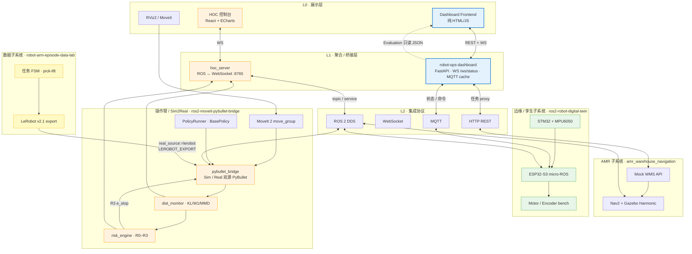
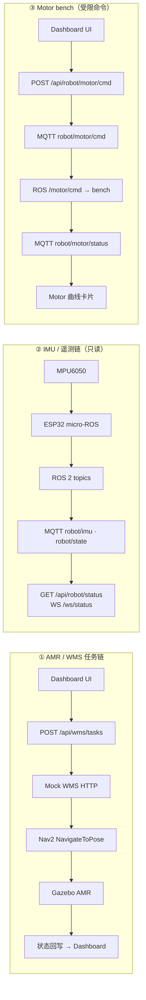
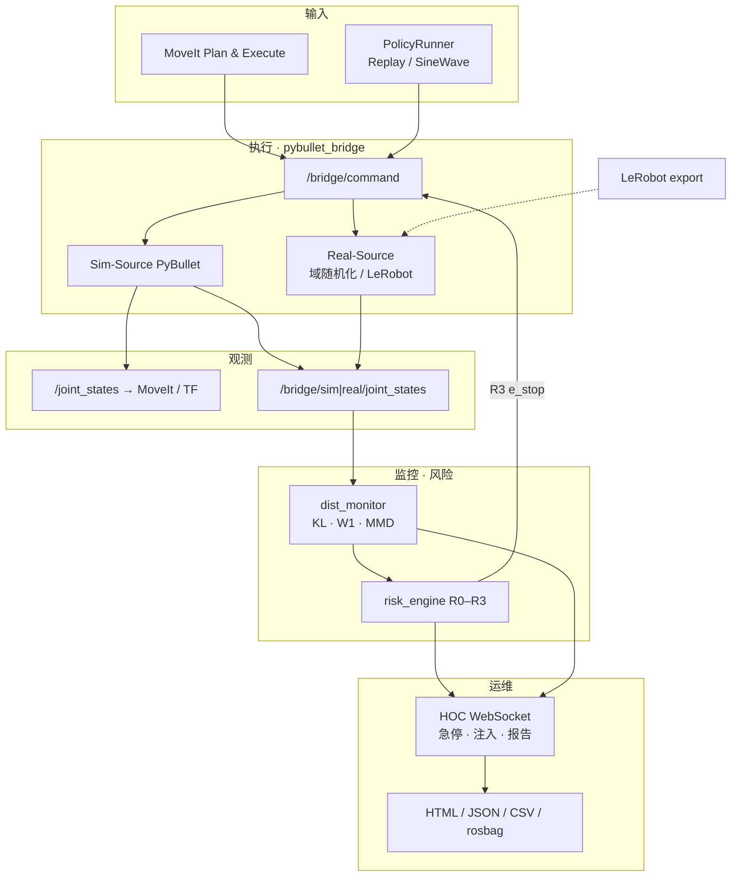

# 五仓统一架构总图

**项目**：机器人系统集成与验证平台  
**更新**：2026-06-21  
**用途**：作品集主图、README、幻灯片、面试白板  

> 图源文件：本页 Mermaid 可直接粘贴到 GitHub README；导出 PNG 见文末命令。

---

## 1. 总览（五仓 + 协议）



**读图口诀**

1. **左半（Dashboard 生态）**：浏览器 → FastAPI → HTTP/MQTT → AMR 或边缘 bench  
2. **右半（Bridge 生态）**：MoveIt/Policy → PyBullet 双源 → 监控/风险 → HOC  
3. **数据仓**自底向上喂 LeRobot 给 Bridge，不经过 Dashboard  
4. **Dashboard 不直连 ROS 2**；Bridge 不替代 Nav2  

---

## 2. Dashboard 三条数据链（细节）



---

## 3. Bridge 操作臂闭环（细节）



---

## 4. 仓库 ↔ 层级对照

| 仓库 | 架构层 | 对外协议 | Demo 入口 |
|------|--------|----------|-----------|
| `robot-ops-dashboard` | L0–L1 主展示 | REST · WS · MQTT | `uvicorn` + 静态前端 |
| `amr_warehouse_navigation` | AMR 执行 | HTTP WMS · ROS Nav2 | Mock WMS + Gazebo |
| `ros2-robot-digital-twin` | 边缘 L4 | micro-ROS · MQTT | IMU / motor bench |
| `robot-arm-episode-data-lab` | 离线数据 | 文件 LeRobot | `batch_collect` + export |
| `ros2-moveit-pybullet-bridge` | 臂验证 L4–L5 | ROS 2 · HOC WS | `portfolio_demo` + HOC |

---

## 5. 边界（主图配套口径）

| 组件 | 是 | 不是 |
|------|-----|------|
| Dashboard | 运维驾驶舱、任务/遥测聚合 | Nav2 控制台、底盘 PID |
| MQTT motor cmd | 低频 bench 探针 | 完整运动控制平面 |
| Evaluation 层 | mock/baseline/reserved 验收展示 | VLA/RL 训练结果 |
| Bridge Real-Source | 双 PyBullet / LeRobot 回放 | 真机驱动（Phase-2+） |
| MoveIt 路径 | FollowJointTrajectory relay | 完整 ros2_control HW 接口 |

---

## 6. 导出 PNG（可选）

```bash
# 需安装 @mermaid-js/mermaid-cli
npm install -g @mmdc/mermaid-cli

cd docs/portfolio
mmdc -i unified-architecture-overview.mmd -o ../assets/unified-architecture-overview.png -b transparent
```

也可从 [Mermaid Live Editor](https://mermaid.live) 粘贴 §1 代码导出 SVG/PNG，保存为：

- bridge：`docs/assets/unified-architecture-overview.png`
- dashboard：`artifacts/screenshots/unified-architecture-overview.png`

---

## 7. 相关文档

- [MASTER_PORTFOLIO_PLAN.md](./MASTER_PORTFOLIO_PLAN.md)
- [INTERVIEW_PREP.md](./INTERVIEW_PREP.md)
- dashboard：[portfolio_demo_summary.md](https://github.com/inayina/robot-ops-dashboard/blob/main/docs/portfolio_demo_summary.md)
